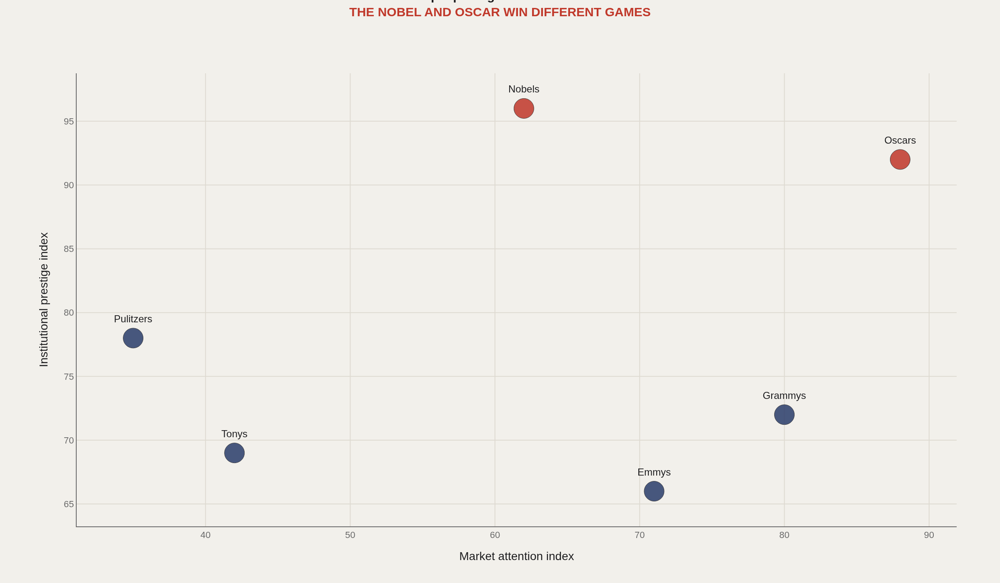
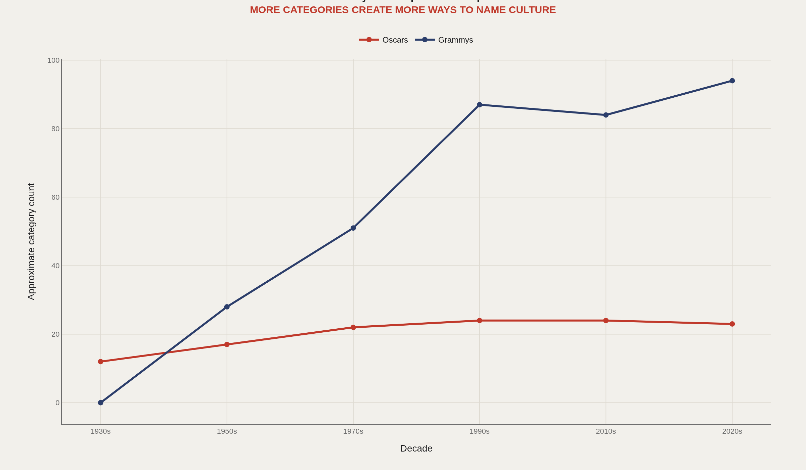
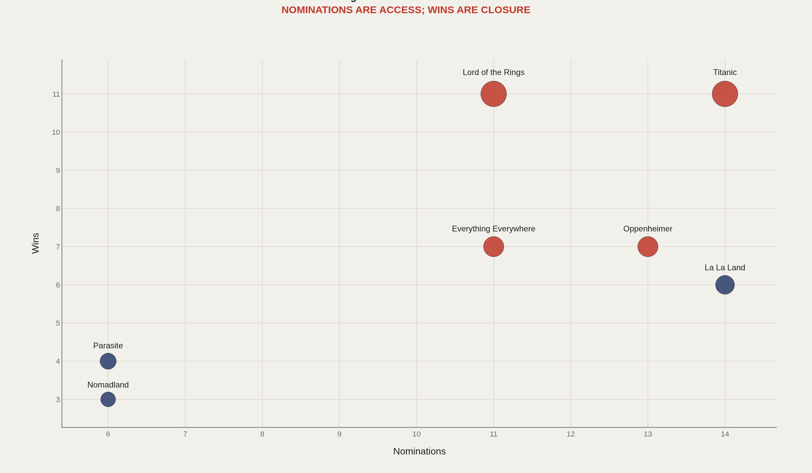
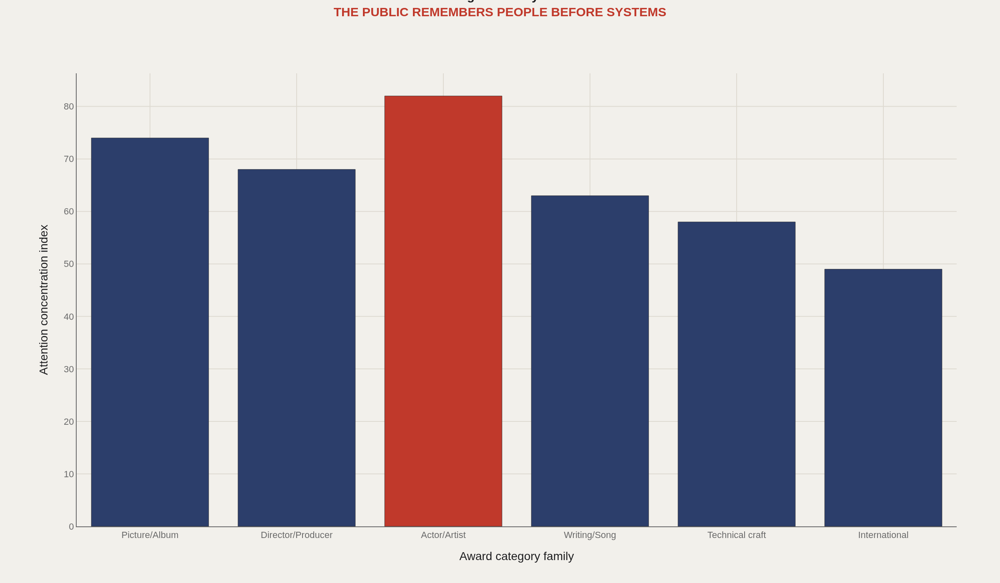
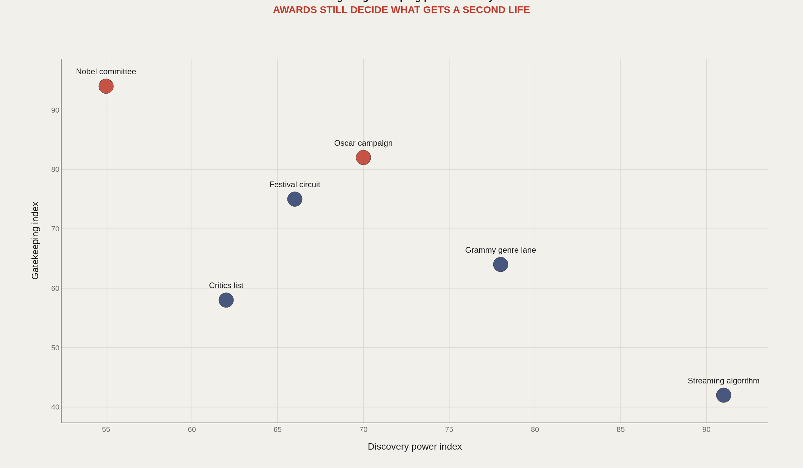

> **TL;DR** Award shows convert attention into a second life for culture. Film, music, science, literature, theater, and television each run prize systems that manufacture legitimacy through different channels—some tied to box office and campaigns, others to citation networks and institutional memory.

Award shows are culture's accounting departments. They translate messy creative fields into categories, winners, speeches, snubs, and canon—then ask the public to treat those boxes as settled judgment.

Film, music, science, literature, theater, and television all run prize systems, but they do not manufacture legitimacy the same way. An Oscar night is tied to an entertainment market; a Nobel citation is tied to institutional memory. The interesting comparison is not which prize is "bigger," but how each converts attention into a second life for the work.

The Academy Awards database is complete through the 98th cycle, with 1,500+ acceptance speeches on file. Nobel prizes date to 1901. Recent Grammy ceremonies run roughly 94 categories. Six award systems sit in the frame below.

## Research question {#research-question}

How do prize institutions convert attention into durable prestige across fields that do not share a common market? This report asks whether Oscars, Grammys, Nobels, Tonys, Emmys, and literary prizes distribute legitimacy through the same mechanism or through different combinations of market visibility, professional gatekeeping, and archival memory.

The observational question is not which award is "best." It is how each award system creates named categories, invites nominees into a prestige pool, turns some of them into winners, and then gives the public a short list of people, works, and institutions to remember after the original release cycle has ended.

## Data and method {#data-and-method}

The Academy maintains an official searchable database of winners and nominees. The Nobel Prize publishes public API-style records. Music awards lack standardized open data, so public Recording Academy records and Wikidata tables fill the gaps.

The framework before any chart is straightforward: prestige versus market attention, category inflation, nomination-to-win conversion, concentration of public memory, and gatekeeping—who decides which works get a second life.

## Prestige and market are not the same currency {#prestige-and-market-are-not-the-same-currency}

### Awards do not all trade in the same kind of attention

The Oscar and the Nobel both signal prestige, but they serve different publics. One is wired into box office, campaigns, and red-carpet media; the other into universities, citation networks, and institutional history.

Ranking them on a single "fame" scale collapses those circuits. The cleaner move is to separate prestige currency from market currency—then watch how each prize spends both.

The Academy of Motion Picture Arts and Sciences operates inside a commercial release economy where campaigns, distributors, studios, guild screenings, and trade publications shape visibility. The Nobel Foundation operates inside a much slower institutional field, where the Swedish Academy, Karolinska Institute, Royal Swedish Academy of Sciences, and Norwegian Nobel Committee produce records meant to outlive annual media cycles.

That institutional contrast is why an Oscar for a film such as Oppenheimer in the 2024 ceremony and a Nobel Prize in Physiology or Medicine for Katalin Karikó and Drew Weissman in 2023 do different kinds of cultural work. One reorganizes a film's market and canon position after release; the other backdates scientific legitimacy onto a line of research, institutions, and citations that may have been building for decades.

## When awards invent more lanes of excellence {#when-awards-invent-more-lanes-of-excellence}

### Award systems expand by creating more named lanes of excellence

Award shows are taxonomies. When categories expand, culture gets more official boxes, more winners, and more arguments about who belongs.

The Grammys make the pattern clearest: genre fragmentation becomes institutional design. More lanes mean more legitimacy to distribute—and more fights over whether a win still means the same thing.

The Recording Academy's category list encodes this most directly because popular music continually splits by genre, format, language, output role, and performance context. Rap, Latin, global music, electronic music, music video, immersive audio, and songwriter categories all reflect industry politics about which labor deserves a named lane. Category expansion is an archive of market change.

The Oscars expand more slowly, but their category debates still reveal institutional priorities: animated feature became a category at the 74th Academy Awards, international feature replaced the older foreign-language label, and the Academy has repeatedly debated stunt work, casting, and popular-film recognition. Each change decides whether a kind of labor becomes visible on the official ledger.

## Getting nominated is not the same as winning {#getting-nominated-is-not-the-same-as-winning}

### The strongest campaigns convert nomination access into wins

Nominations measure access to the prestige room. Wins measure coalition strength, timing, category fit, and narrative closure.

That is why Oscar season often reads like political analysis in evening wear: access is one contest; conversion is another.

The distinction is visible in the Academy database itself. Meryl Streep's long nomination record, John Williams's composing nominations, and Walt Disney's historical accumulation of Oscars all show that repeated access is its own status. A win requires the right category, year, campaign, and consensus among voters.

Science prizes have a parallel but slower conversion problem. A Nobel committee cannot nominate every important collaborator, and prize rules limit how many laureates can share a scientific award. That is why Rosalind Franklin's absence from the 1962 DNA recognition and the 2020 Chemistry prize for CRISPR-Cas9 became public examples of how nomination and credit systems compress collaborative discovery into a few names.

## What the public actually remembers {#what-the-public-actually-remembers}

### The public remembers faces and names before institutional categories

Best Picture matters inside the industry. Acting, artist, and star categories travel faster through casual conversation.

Institutions do the sorting; people carry the names. Prestige that never sticks to a face tends to fade into ballot trivia.

The Academy's acceptance-speech database makes the face-and-name economy literal: speeches preserve recipients, presenters, studios, collaborators, parents, agents, and political moments as searchable text. The public may forget the exact category order, but it often remembers Halle Berry's 2002 Best Actress speech, Bong Joon Ho's 2020 sweep with Parasite, or the 2017 Best Picture envelope error involving Moonlight and La La Land.

The Nobel system creates a different memory path. Names such as Marie Curie, Albert Einstein, Toni Morrison, Malala Yousafzai, and Martin Luther King Jr. travel as civic and educational symbols beyond the original prize citation. In both cases, institutions sort the archive, but individual names make the archive portable.

## Who still decides what gets a second life {#who-still-decides-what-gets-a-second-life}

### Awards still decide which works get a second life

Streaming can create discovery at scale. Awards create sanctioned memory—turning a work from content into curriculum, canon, playlist staple, or obituary headline.

That is the prestige economy: a machine for deciding what culture should remember about itself after the premiere week ends.

Discovery platforms and award institutions now compete over the afterlife of culture. Netflix, Spotify, YouTube, TikTok, and Goodreads can surface works through recommendation systems, but the Academy, Recording Academy, Nobel Foundation, Pulitzer Board, and Tony Awards still confer a different status: an official reason for teachers, critics, museums, publishers, and obituaries to mention the work again.

Gatekeeping is therefore not obsolete; it has changed venue. A streaming algorithm can make a track or film visible for a week, but a prize can make it legible for decades. That power is why debates over voting bodies, diversity, campaign spending, category rules, and nomination access remain central to the prestige economy.

## What to take away {#what-to-take-away}

Awards do not merely recognize culture. They structure it—category lanes, memory lanes, and legitimacy lanes that outlast any single night of speeches.

Prize data is useful because it connects creative work to institutions, markets, demographics, speeches, scandals, and canon formation. The charts above map those connections, not a single ranking of "most prestigious."

## Sources {#sources}

Academy of Motion Picture Arts and Sciences. Academy Awards Database.

Oscars.org. Awards Databases and Acceptance Speech Database.

Nobel Prize. Public prize and laureate data/API documentation.

DLu/oscar_data. Curated Academy Award nomination dataset with identifiers.

Recording Academy public Grammy records and Wikidata award tables.

Academy of Motion Picture Arts and Sciences. Academy Awards Database. https://awardsdatabase.oscars.org/

Academy of Motion Picture Arts and Sciences. Academy Awards Acceptance Speech Database. https://aaspeechesdb.oscars.org/

Nobel Prize Outreach. Nobel Prize API. https://www.nobelprize.org/about/developer-zone-2/

The Recording Academy. GRAMMY Awards rules and guidelines. https://www.grammy.com/awards/rules-guidelines

English, J. F. (2005). The Economy of Prestige: Prizes, Awards, and the Circulation of Cultural Value. Harvard University Press.

