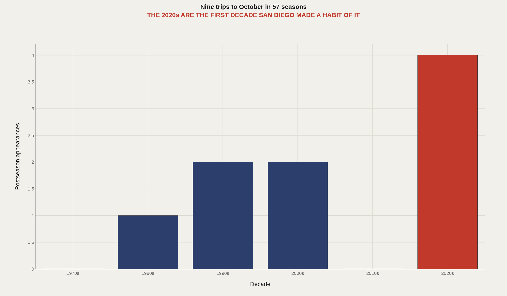
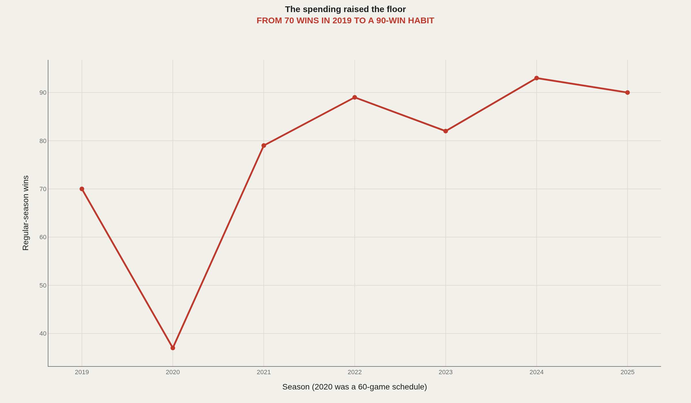
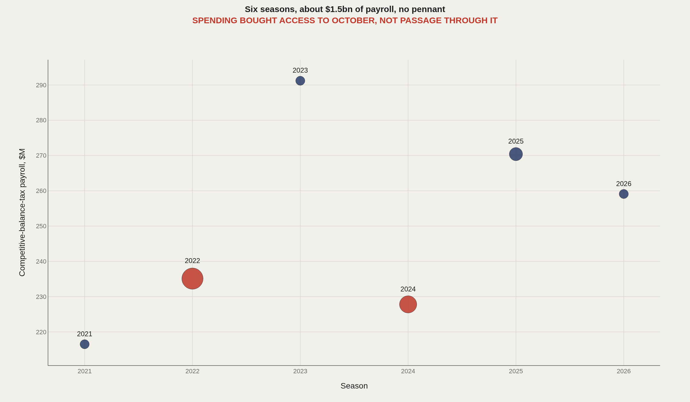
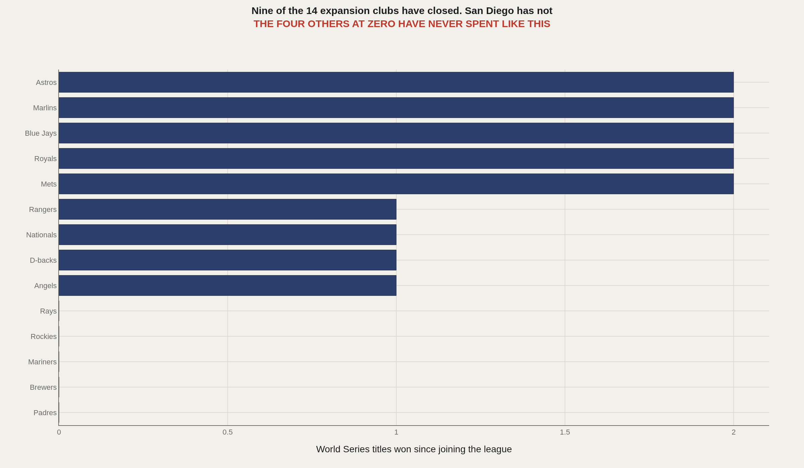
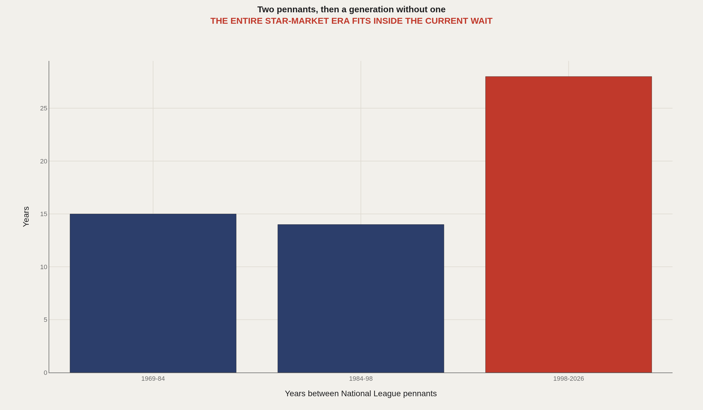

> **TL;DR** San Diego sold in May 2026 for $3.9bn, the largest price ever paid for a baseball club. The franchise has played 57 seasons without a World Series title, committed $1.5bn to payroll since 2021, and lost consecutive winner-take-all games scoring five runs across three October contests. The record valuation prices demand, not championships.

San Diego sold for $3.9bn in May 2026, a record for a Major League Baseball club. The franchise has played 57 seasons and won none of them.

On the evening of October 2nd 2025, Fernando Tatis Jr. stood at his locker inside Wrigley Field, red-eyed, accounting for a season that had ended in a 3-1 defeat. He had gone 0-for-4 with three strikeouts. The Padres, who had won 90 games and spent like a superpower, had scored five runs in three games. "It sucks," Manny Machado said afterwards. "We wanted to be holding up the trophy at the end of the year. We fell short."

Seven months later the Seidler family signed an agreement to hand the franchise to José E. Feliciano, a co-founder of Clearlake Capital, and his wife, Kwanza Jones, at a valuation of $3.9bn. The price is $1.48bn more than Steve Cohen paid for the Mets in 2020, and nearly five times the $800m a group including the late Peter Seidler paid John Moores for the Padres in 2012.

The two events are filed separately — one a sporting disappointment, the other a financial triumph. They are the same story. San Diego has built an extraordinarily valuable business out of the pursuit of a championship, and the pursuit is easier to monetise than the championship itself.

The Padres are the most expensive franchise in the history of the sport never to have won anything, and the record price is not in spite of that fact. It is priced around it.

## The numbers behind the story {#fast-facts}

- **$3.9bn** — Agreed sale price, a record for a Major League club

  0World Series titles in 57 seasons
  2National League pennants, in 1984 and 1998
  28Years since the most recent pennant
  $259M2026 tax payroll, seventh-largest in baseball
  30thFarm system rank of 30 clubs, July 2026

## Fifty-seven seasons, nine trips to October {#october-scarcity}

San Diego joined the National League in 1969 and by 1974 had been sold to a buyer who intended to move it to Washington. Topps had already printed baseball cards listing the players as Washington when Ray Kroc, of McDonald's, bought the franchise and kept it in San Diego.

What followed was not a franchise so much as a sequence of unconnected good years. The 1984 team, built around Tony Gwynn, Steve Garvey and Goose Gossage, came back from 0-2 against the Cubs to win the pennant, then lost the World Series to Detroit in five games. The 1998 team won 98 games, beat Atlanta, and was swept by a Yankees club that had won 114. The division titles of 2005 and 2006 arrived with 82 and 88 wins, the thinnest credentials the modern West has sent to October.

Nine postseason appearances in 57 seasons, four of them since 2020. That late cluster is not a dynasty forming — it is the first sustained October habit the franchise has ever had, and it arrived only once the club began paying like the teams it was chasing.

## The Preller doctrine: buy now, always {#preller-doctrine}

A.J. Preller has run baseball operations in San Diego since 2014, and his method has remained consistent: convert the future into the present, at a premium, repeatedly. The first attempt — the 2015 winter of Matt Kemp, Justin Upton, Wil Myers and James Shields — returned 74 wins and a teardown. The second attempt worked better because it targeted stars.

Manny Machado signed for 10 years and $300m in 2019, then re-signed for 11 years and $350m in 2023. Fernando Tatis Jr. signed for 14 years and $340m in 2021, the longest contract in the sport at the time. Xander Bogaerts signed for 11 years and $280m. In 2022 Preller sent six players to Washington — a package including James Wood, MacKenzie Gore and CJ Abrams — for Juan Soto, who was two years from free agency, then traded Soto to the Yankees sixteen months later.

In the narrow sense, it worked. San Diego went from 70 wins in 2019 to 89 in 2022, 93 in 2024 and 90 in 2025. The floor rose and stayed up. What never arrived was the thing the spending was supposed to buy.

## What $1.5bn of payroll bought {#payroll-conversion}

Add the past six years of Padres payroll and the total is roughly $1.5bn in salary, a top-ten number every season and top-six in three of them. Set that against the October return and the pattern is legible.

2021: a $216m payroll and a September collapse that missed the playoffs. 2022: an upset of a 111-win Dodgers team in the division series, then five games and out against Philadelphia. 2023: the largest payroll in club history, $291m, and an 82-80 finish. 2024: 93 wins, a Game 5 loss to Los Angeles in which the offense was shut out over the final two games. 2025: 90 wins, and three games at Wrigley Field in which the team scored five runs.

This is the specific way the Padres lose. San Diego has bought its way into the highest-variance rounds of a tournament and has failed, in consecutive seasons, to score in the games that decide them.

Two straight seasons have ended in a winner-take-all game the offense never turned up for: shut out over the last two games of 2024, five runs across three games in 2025.

## The company San Diego keeps {#expansion-peer-gap}

Fourteen clubs have joined the major leagues since 1961. Nine have won a World Series. The five that have not are the Padres, Brewers, Mariners, Rockies and Rays.

The other four have an alibi. Tampa Bay and Milwaukee have spent most of their existence in the bottom third of payrolls — the Brewers are 67-40 this season on a $124m Opening Day payroll. Seattle and Colorado have been indifferent or poor for long stretches. San Diego has no such defense. It has the seventh-largest tax payroll in baseball at $259m, three consecutive franchise attendance records, and an empty trophy case.

Not a small-market club that cannot compete, and not a badly run club that wastes money — a club that has solved demand, solved payroll, and never solved conversion.

## The Seidler decade, and the bill that came with it {#seidler-decade}

Peter Seidler became control person after the 2020 season and behaved like a man working against a clock, which he was. He authorized the Tatis, Machado and Bogaerts contracts, absorbed the luxury-tax bills, and told anyone who asked that the point of all of it was a first title. He died in November 2023.

What followed was less romantic. Seidler's widow, Sheel, sued his brothers Bob and Matt in Texas probate court over their conduct as trustees; most of the claims were dropped by February. In November 2025 the family retained BDT & MSD to explore a sale. By spring the field was four bidders — Feliciano and Jones, Dan Friedkin, Joe Lacob and Tom Gores — with three bids of at least $3.5bn. Feliciano and Jones won at $3.9bn, and the transfer now waits on 22 of the other 29 owners.

The buyer inherits three things. First, the best-supported baseball audience outside Los Angeles: 3.4m admissions in 2025, second only to the Dodgers; about 42,000 a game this season; 25,000 full-season memberships with a wait list three years old; and 70,000 direct-to-consumer streaming subscribers, more than any club under the league's local-media umbrella.

Second, $858m of guaranteed money owed after this season to five players — Tatis through 2034, Machado and Bogaerts through 2033, Jackson Merrill through 2034, Jake Cronenworth through 2030. Third, the emptiest farm system in the sport: last of 30 in FanGraphs' July ranking, and last again in the assessment of evaluators consulted by the San Diego Union-Tribune, after the 2025 deadline trade that sent Leo De Vries — then among the three or four best prospects in baseball — to the Athletics for closer Mason Miller.

The franchise's two pennants are 1984 and 1998. Fourteen years separated them. Twenty-eight years and counting have followed, the longest wait in club history, and the entire modern spending era fits inside it.

The 2026 team is the same argument in miniature. It is 55-53 and third in the West, thirteen games behind a Dodgers club that has won the past two World Series. It has been outscored by 18 runs. Against opponents at .500 or better it is 25-38. It is also, as of this week, on a five-game winning streak and a game and a half out of a wild card — precisely the position San Diego has learned to occupy. Close enough to justify buying. Never close enough to be safe.

## What the buyer is actually buying {#conclusion}

The Padres are the best-attended unfinished business in American sport. Everything sellable in San Diego has been sold: tickets, sponsorship, streaming subscriptions, and now the franchise itself, at a price no baseball club has ever commanded.

What has not been sold is the outcome. The $3.9bn is a wager that the final piece is available, and that the version of this team which eventually scores in October is worth materially more than the version that keeps not doing so. Nothing in 57 seasons says that is a bad bet. Nothing in it says the bet is safe.

The companion memo to this report takes the other side of the desk: what the incoming owners inherit, where the balance sheet breaks, and the six moves that would actually buy San Diego a first title.

## Data and method {#dataset-context}

Season records, win totals and player value figures come from Baseball Reference and are current through games of July 29th 2026. Payroll figures are competitive-balance-tax payrolls as compiled by Spotrac. Sale terms, bidder detail and the approval timetable come from MLB.com, Sportico, Sports Business Journal and the San Diego Union-Tribune. Attendance, membership and subscription figures come from the club and SBJ. Farm-system ranks are FanGraphs and Baseball America, July 2026.

The 60-game 2020 season is shown unadjusted and read separately in the prose. Each qualifying season counts as one postseason appearance. Expansion-club counts cover the 14 franchises added to the National and American Leagues since 1961.

## References {#references}

Baseball Reference. San Diego Padres Franchise History; 2025 and 2026 season pages.

MLB.com. Padres agree to sell team to Kwanza Jones, José E. Feliciano, May 2026.

Sportico. San Diego Padres Sale: Feliciano, Jones to Pay MLB-Record $3.9 Billion, 2026.

Forbes. Baseball's Most Valuable Teams 2026, March 2026.

Sports Business Journal. Padres have 70,000 DTC subscribers in record-breaking year, October 2025.

FanGraphs and Baseball America farm-system rankings, July 2026; Spotrac payroll tables.

Related Artometrics reports: The Padres Cost $3.9 Billion. Winning Will Cost More. · Dodgers · Giants · Yankees.

## Editor's note {#editors-note}

Payroll figures are tax payrolls rather than Opening Day totals; the two series differ by tens of millions of dollars in some seasons. Records and player value figures are current through July 29th 2026, and the 2026 season is unfinished. The sale remains subject to approval by 22 of the other 29 club owners.

