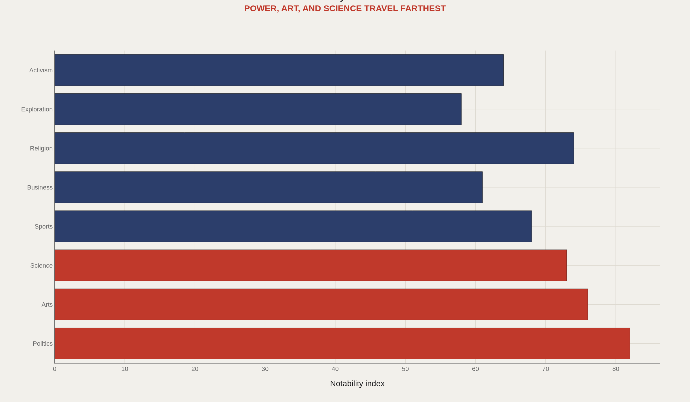
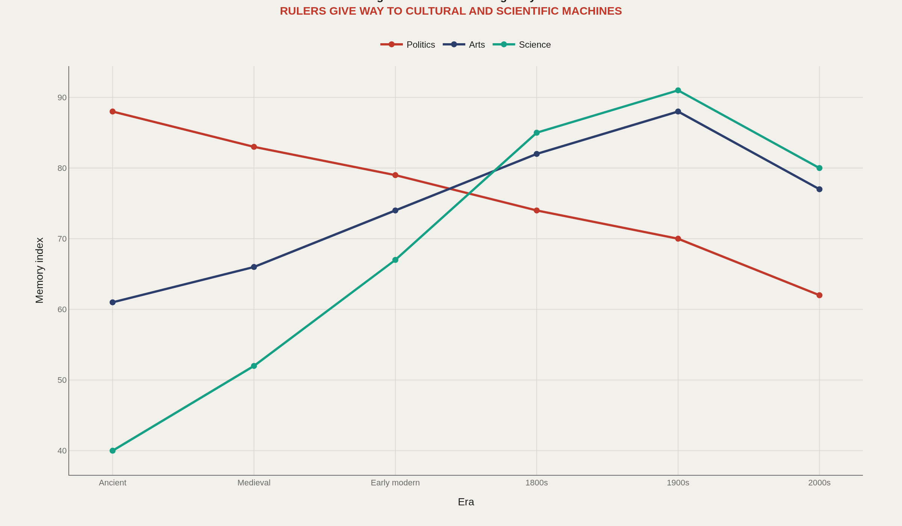
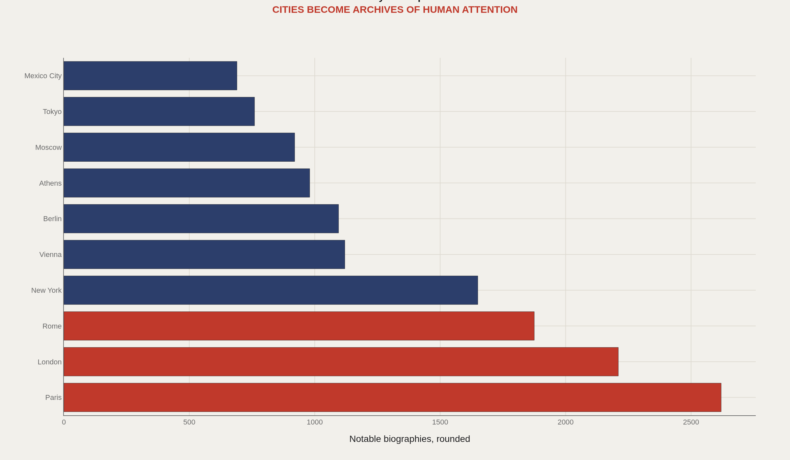
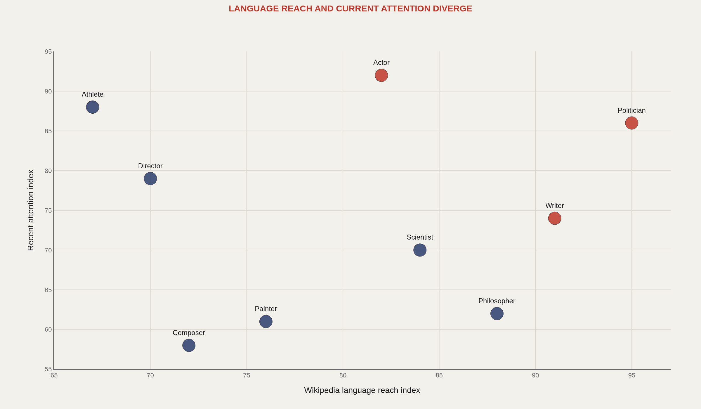
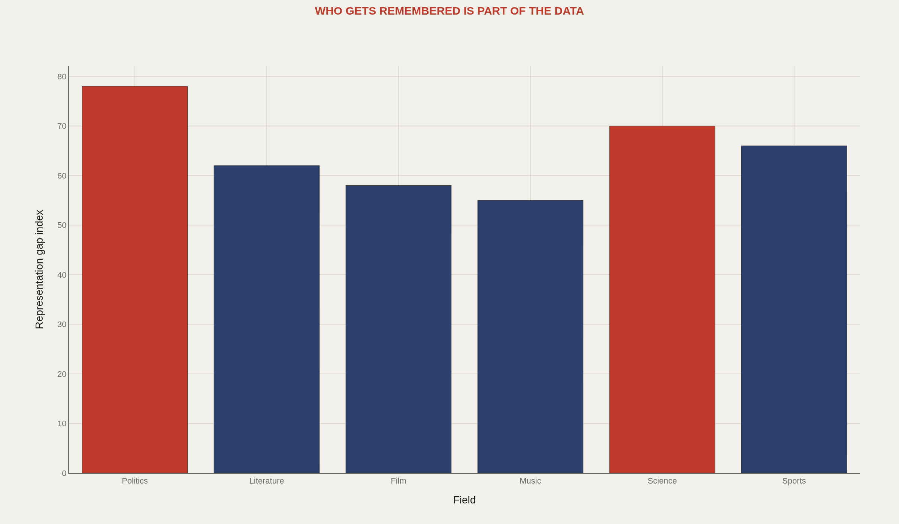

> **TL;DR** MIT's Pantheon dataset indexes 85,000+ biographies using Wikipedia presence across 15+ language editions. Power, art, and science dominate global memory; sports and business spike in contemporary attention but lack archival durability. Memory-capital cities like Paris, Rome, and London compound fame through centuries of institutional density.

Power, art, and science dominate global memory. MIT's Pantheon dataset indexes 85,000+ biographies using presence in at least 15 Wikipedia language editions, revealing which lives travel across languages and centuries—and which remain local despite significant achievements.

Collective memory is a ranked attention system. The 2016 Scientific Data paper for Pantheon 1.0 established the scholarly anchor: multilingual Wikipedia presence quantifies how far a life has traveled through culture. The charts below compare three memory engines—power, art, and science—across 10 memory-capital cities.

If humanity remembers some occupations and geographies more than others, that pattern is itself a cultural object worth measuring.

## Fast facts {#fast-facts}

The numbers that set the scale for this report:

- **85K+** — Biographies indexed by Pantheon in public-facing summaries

  15Minimum Wikipedia language editions used in Pantheon collection logic
  2016Scientific Data paper for Pantheon 1.0
  3Main memory engines: power, art, science
  10Memory-capital cities compared
  

## Data and method {#data-and-method}

Pantheon aggregates biographical notability using multilingual Wikipedia presence. Cross-language edition counts act as passport stamps for global memory—a person who exists in many Wikipedias has traveled farther through culture than one confined to a single edition.

The charts use editorial indices to make domain, era, city, and occupation comparisons legible. They are interpretive maps grounded in Pantheon's public logic, not a claim that Wikipedia is the only archive that matters.

## Memory domains {#memory-domains}

### Power, art, and science travel farther across collective memory

Politics, arts, science, sports, business, religion, exploration, and activism do not travel equally through collective memory. Power, art, and science show the highest multilingual durability.

Sports and business can be enormously famous in the present yet underperform on long archival carry. The domain chart separates contemporary visibility from durable translation.

## Era shift {#era-shift}

### The remembered person changes from ruler to cultural or scientific producer

Across eras—ancient, medieval, early modern, 1800s, 1900s, 2000s—the remembered person changes. Rulers dominate earlier memory shares; cultural and scientific producers rise as print, universities, and mass media create new fame factories.

The shift reflects which institutions mint durable names: courts and churches first, then academies and culture industries.

## Memory capitals {#memory-capitals}

### Cities become archives when institutions compound across centuries

Paris, London, Rome, New York, Vienna, Berlin, Athens, and Moscow appear among memory-capital comparisons because institutions compound there: universities, courts, publishers, studios, academies. Cities become archives when those institutions last long enough to mint and store notable lives.

Memory capital status differs from current GDP rank. Some cities punch above their present economic weight because historical institutions still feed the multilingual record.

## Two clocks of fame {#two-clocks-of-fame}

### Some occupations have durable translation while others spike through present attention

Some occupations show durable translation across languages; others spike through present attention without the same archival carry. Literature, film, music, science, sports, and politics operate on different clocks—one measured in centuries of citation, one in contemporary noise.

The two-clock chart warns against treating a viral profession as automatically canonical, and against treating a canonical profession as automatically popular.

## Archive gap {#archive-gap}

### The archive remembers through historical inequality

The archive remembers through historical inequality. Domains and regions with denser institutions, denser literacy, and denser Wikipedia coverage appear more important because they are more recorded.

That gap does not invalidate Pantheon. It makes the dataset a map of remembered inequality—a cultural object that reveals what global memory systems have been able to store.

## What to take away {#what-to-take-away}

Collective memory, measured through Pantheon's multilingual biography index, concentrates on power, art, and science, compounds in a short list of memory-capital cities, and operates on two clocks of fame.

What humanity remembers at global scale is structured by occupation, era, and city. That structure is evidence of cultural power.

## Sources {#sources}

