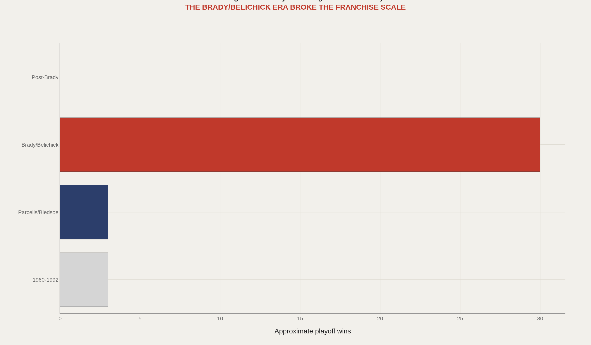
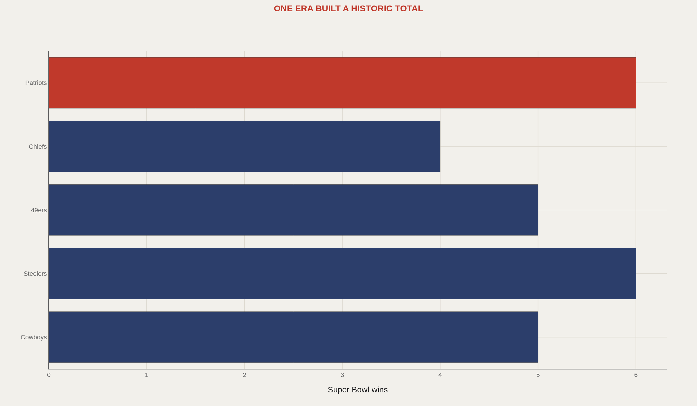
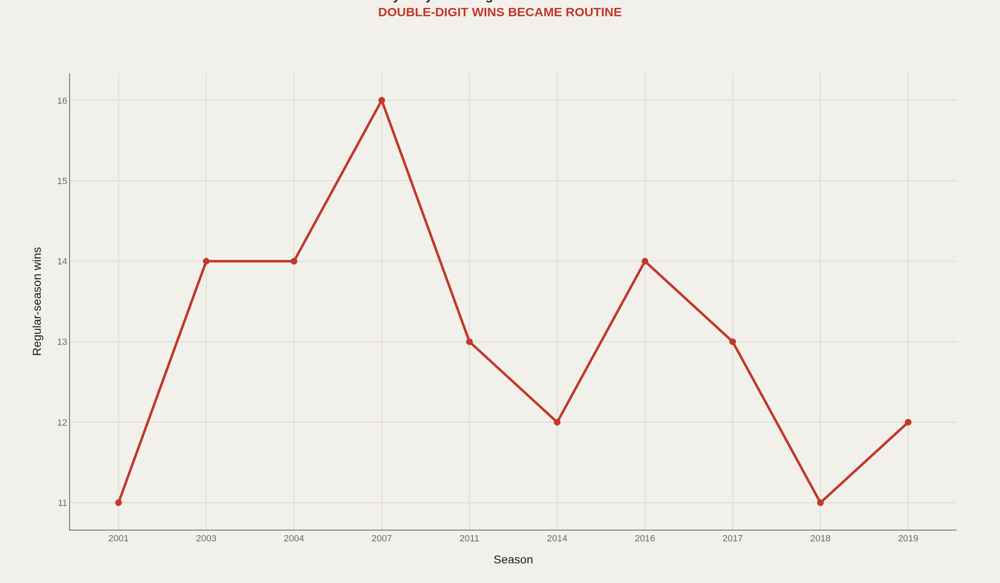
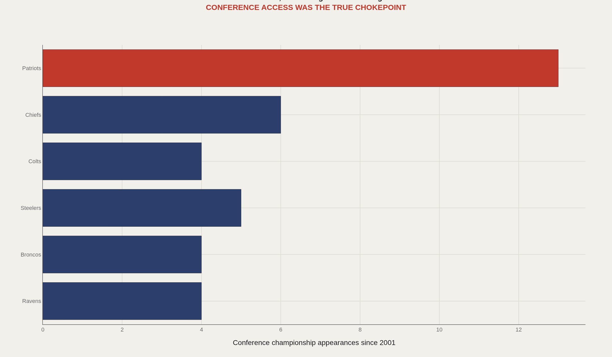
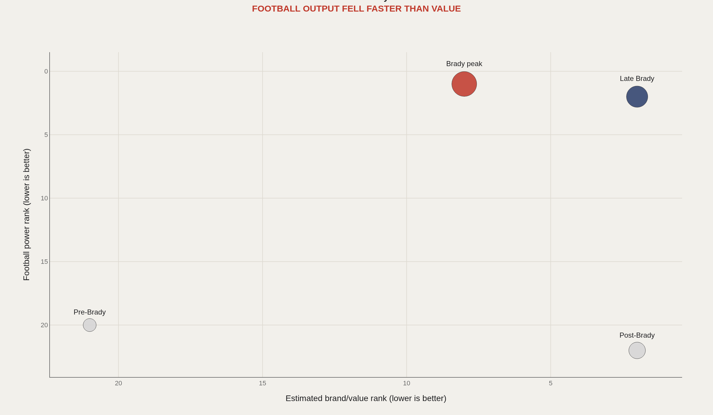

> **TL;DR** The New England Patriots won six Super Bowls and reached nine Super Bowl appearances from 2001 through 2019. That concentration was not normal franchise building—it was a system shock that compressed what other clubs take generations to claim, then left the question of whether the infrastructure survives the system.

Six Super Bowl championships in 19 seasons compressed what other NFL franchises take generations to claim—then ended, leaving the question of whether the infrastructure survives the system.

The Patriots won six titles and reached nine Super Bowls from 2001 through 2019. Approximately 30 playoff wins, 13 AFC championship appearances, and a perfect 16–0 regular season in 2007 arrived not as accumulation but as discontinuity. The 2020 season—the first without Tom Brady—marked the hinge: brand capital remained; football output did not automatically follow.

The charts treat the Brady–Belichick era as a system shock, measure its concentration against franchise history, then test what remains after the system ends.

## One era overwhelms the rest of the archive {#system-shock}

Playoff wins cluster so tightly in the Brady–Belichick period that earlier Patriots football looks like a different organization. One era produced more postseason victories than all previous decades combined.

The dynasty was not incremental improvement—it was a system shock that rewrote what the franchise means in the historical record.

## New England compressed a summit climb into two decades {#superbowl-tier}

Six championships tie the Patriots with the Steelers for most in NFL history. The Steelers accumulated titles across four decades; New England built the same total in 19 seasons.

That compression is the mechanism: the franchise acquired century-scale legacy during one coaching–quarterback partnership.

## Excellence became routine before it became legend {#regular-season-machine}

Twelve- and thirteen-win seasons stopped registering as exceptional. The 16–0 regular season in 2007 was the extreme expression of a baseline that had already risen—a floor, not a ceiling.

Sustained high performance announces itself through monotony: excellence stops surprising before it becomes historical.

## They controlled access to the AFC's final room {#afc-gate}

Thirteen AFC championship appearances since 2001 show more than postseason success—they show gatekeeping. The Patriots controlled conference access for nearly two decades, appearing in the title game more often than not.

Rivals experienced the dynasty not as a team but as a recurring structural barrier to the Super Bowl.

## After Brady, brand capital outran football output {#after-the-system}

The post-Brady years expose the separation between brand value and on-field performance. Franchise valuation remains high while competitive output declines—2020 delivered the first losing season since 2000.

Legacy persists longer in the market than on the scoreboard.

## Legacy is secure; rebuild is not {#conclusion}

The Patriots dynasty compressed a century of NFL history into 19 seasons. Six championships, nine Super Bowl appearances, and 13 conference title games built a resume that rivals franchises with five times the operational history.

The open test is whether the institution can produce without the system that made it exceptional—the harder challenge for any franchise that built identity on a discontinuity, not a tradition.

## Data and method {#dataset-context}

Pro Football Reference franchise records, NFL postseason archives, and Forbes franchise valuations supply the underlying data. Period groupings are editorial constructs designed to isolate the Brady–Belichick era from pre- and post-dynasty performance.

Analysts debate quarterback versus system; fans debate whether the brand survives the roster. Both hinge on the same question: whether one era was the franchise or merely its peak.

## References {#references}

Pro Football Reference. New England Patriots Franchise Encyclopedia.

NFL historical postseason records.

Forbes. NFL Team Valuations, recent estimates.

Sports Reference team season summaries.

Related Artometrics reports: Cowboys.

## Editor's note {#editors-note}

Playoff win totals from 2001 through 2019 are approximate franchise summaries. Period buckets are editorial groupings for chart legibility, not official NFL designations.

