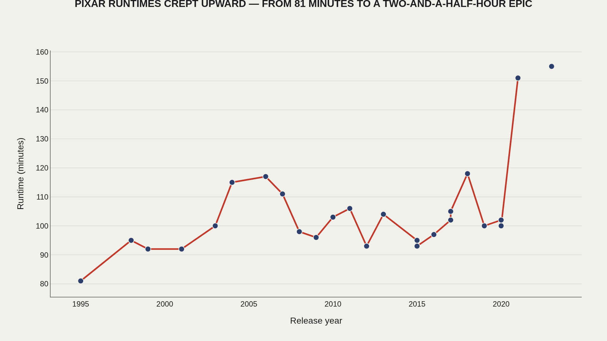
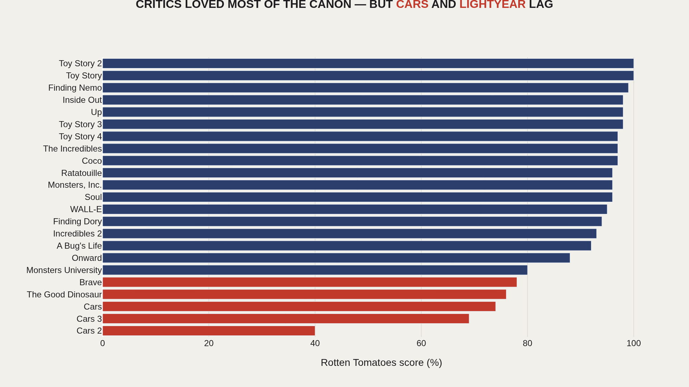
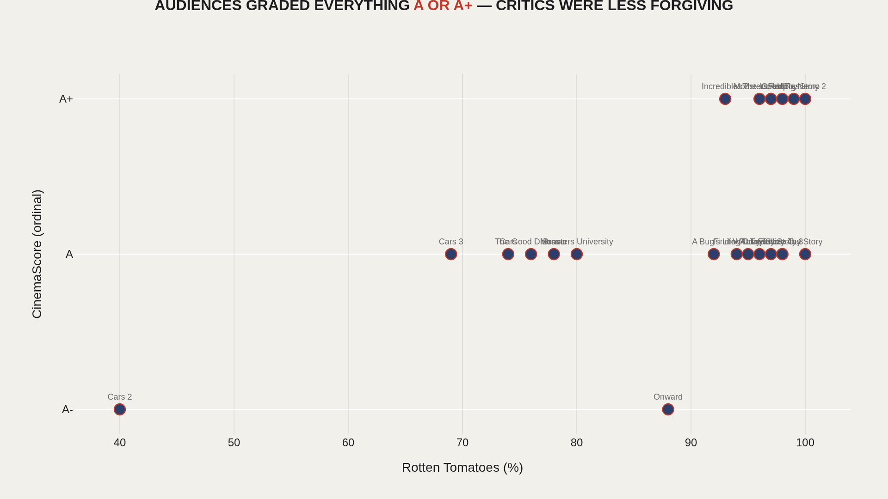
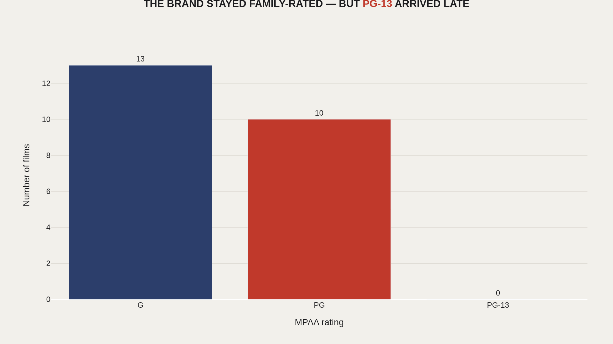
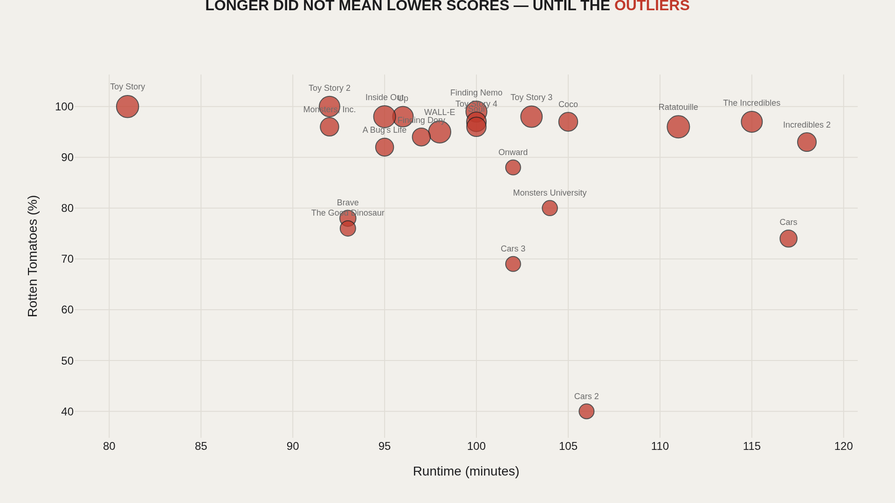

> **TL;DR** Pixar maintained a 96% median Rotten Tomatoes score across 24 rated theatrical releases, but two films—Cars 2 (40%) and Lightyear—broke the streak. Runtimes climbed 17 minutes between early and recent eras, while CinemaScore grades stayed at A+. TidyTuesday 2025-03-11 data shows 27 features, audience affection remained stable even as critic scores split.

Pixar holds a 96% median Rotten Tomatoes score across 24 rated theatrical releases, but two films broke the streak: Cars 2 at 40% and Lightyear. The studio stretched runtimes by 17 minutes between early and recent eras while CinemaScore grades held at A+—audiences stayed loyal even when critics split.

This analysis joins TidyTuesday 2025-03-11 Pixar films data with public_response scores: 27 theatrical features, 24 with critic and audience metrics attached. Five charts trace runtime creep, critic floors, audience-critic gaps, rating mix, and the relationship between length and reception.

Calibration points: a 96% median Rotten Tomatoes score; Cars 2 at 40%; +17 minutes added to median runtime from early to recent eras; CinemaScore grades clustering at A+; a longest runtime of 155 minutes; Toy Story's 81-minute floor; and zero PG-13 ratings in the theatrical set.

## Fast facts {#fast-facts}

The numbers that set the scale for this report:

- **96%** — Median Rotten Tomatoes score — Pixar's critical baseline across rated theatrical releases

  40%Cars 2's Rotten Tomatoes floor — the studio's lowest critic mark
  +17Median runtime gain from early era to 2017–present — structural shift in feature length
  A+Most common CinemaScore grade — opening-weekend audiences rarely graded below A
  155Longest runtime in the dataset — 81 minutes was Toy Story's floor
  0PG-13 ratings in this theatrical set — Pixar held the all-ages lane

## Data and method {#data-and-method}

The core file pixar_films.csv lists theatrical features with release date, runtime, and MPAA rating. The companion public_response.csv adds Rotten Tomatoes, Metacritic, CinemaScore, and Critics' Choice scores. Three recent releases lack complete reception fields—treat absent values as missing data, not zero-quality signals.

This is not box-office data. The TidyTuesday readme points to a separate box_office extract in the {pixarfilms} R package for revenue analysis. Reception and runtime are the focus here because they are complete in-repo.

## Runtime Creep {#runtime-creep}

### Runtime Over Time

Pixar's theatrical releases did not stay the compact 81-minute package of Toy Story. Median runtime climbed from 98 minutes (through 2006) to 116 minutes for films since 2017—a structural shift in what a Pixar feature is allowed to be.

The longest entry runs 155 minutes. Early films clustered around 98 minutes; recent releases expanded by 17 minutes at the median. The change is not noise—it is embedded in the studio's evolving production model.

## Critic Scores {#critic-scores}

### Rotten Tomatoes Ranking

The median Rotten Tomatoes score across rated films is 96%—elite by any studio standard. Pixar built a reputation on consistency, not occasional brilliance.

Cars 2 sits at 40%, the critic floor. Toy Story and several sequels hit 100%. The spread is narrow by Hollywood standards, but the low end clusters around mid-2000s franchise experiments and later IP-forward releases.

## Audience vs Critics {#audience-vs-critics}

### Critics vs CinemaScore

CinemaScore grades cluster at A and A+ across the board. Audiences who showed up opening weekend were rarely disappointed—or at least rarely admitted it on exit polls.

Critics were the discriminating layer. Films that earned A+ crowd grades still span a 74–100% Rotten Tomatoes range. Pixar optimized for mass affection first, prestige second.

## Rating Mix {#rating-mix}

### MPAA Rating Mix

Thirteen films carry a G rating; ten are PG. The brand's family positioning is embedded in the rating structure—zero titles in this file carry PG-13.

Pixar expanded runtime and thematic weight without abandoning the all-ages lane in the theatrical set on hand.

## Runtime vs Reception {#runtime-vs-reception}

### Runtime vs Rotten Tomatoes

Longer films do not automatically score worse—Up, Wall-E, and Inside Out combine runtimes above 95 minutes with scores above 95%.

The outliers sit in the lower-right and upper-left: Cars 2 (shorter, weaker Rotten Tomatoes) versus epics that tested patience and still won. Bubble size tracks Metacritic where available—the reception stack is consistent across review systems.

## What this file cannot tell you {#what-this-file-cannot-tell-you}

Reception scores are snapshots from Wikipedia-curated tables, not live API pulls. Rotten Tomatoes percentages can shift as reviews are added. CinemaScore is ordinal, not interval—treat cross-film comparisons as directional.

The dataset ends with the films included in the March 2025 TidyTuesday release. It does not include Disney+ exclusives or shorts. Runtime and rating analysis covers theatrical features only.

## What to take away {#what-to-take-away}

Pixar's measurable story is stability with drift: critics stayed harsh at the margins (Cars 2 at 40%), audiences stayed generous (A+ CinemaScores), and runtimes marched upward (+17 minutes at the median between eras). The brand did not break—it stretched.

The myth is magic; the data is a studio learning it could ask for more minutes, more sequels, and still keep the crowd on its side.

## Sources {#sources}

Data Science Learning Community. (2025). TidyTuesday: Pixar Films. pixar_films.csv; public_response.csv. Original pixarfilms R package by Eric Leung.

## Editor's note {#editor-s-note}

This report replaces the initial batch-generated Pixar draft with a hand-tuned analysis joining both TidyTuesday files. Charts use Artometrics styling and Plotly JSON exports.

Source archive (GitHub)

