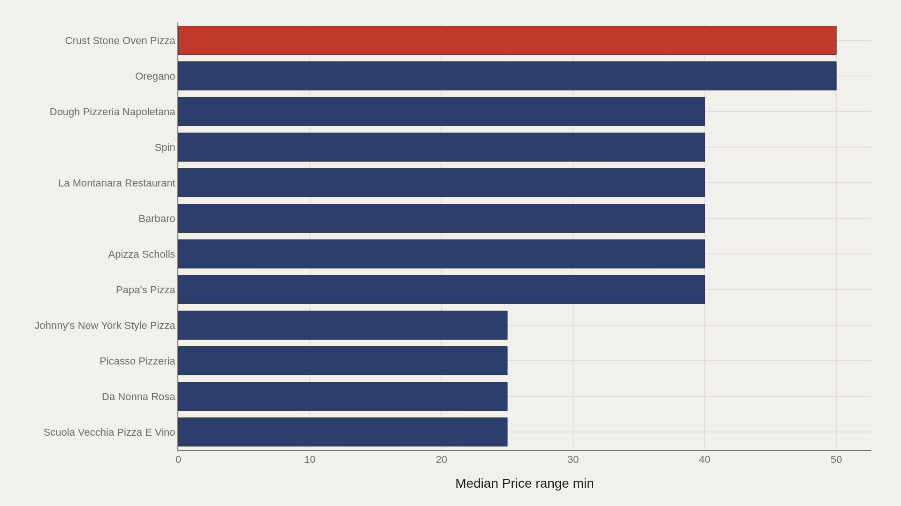
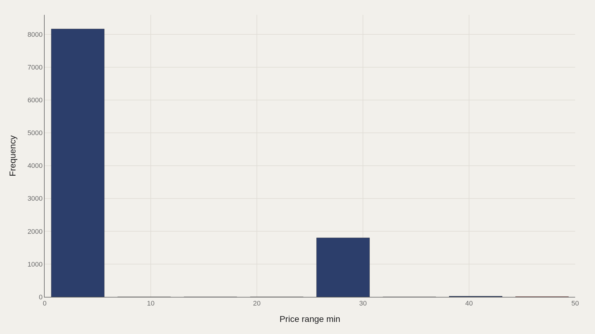
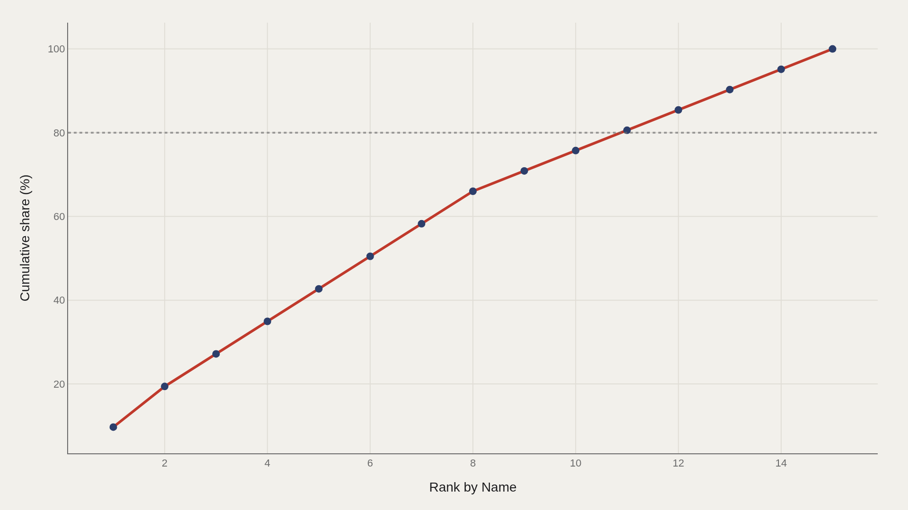
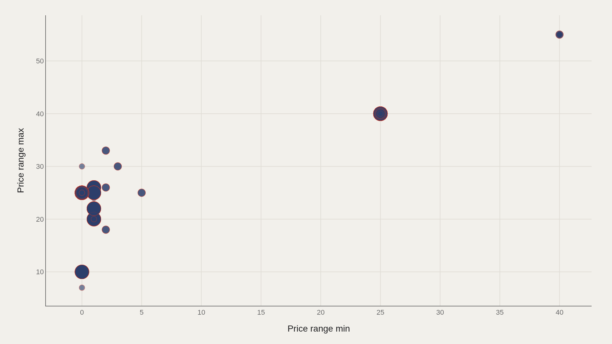

> **TL;DR** A TidyTuesday pizza extract of 10,000 menu records reveals a median price-range minimum of 0.00 and a premium tier at 50.0. The mass of listings sits at zero or missing values, while a thin tail of destination pizzerias cluster at 40–50, requiring separate citation strategies for market claims.

Pizza prices appear simple until you compare 10,000 menu rows. The Datafiniti pizza extract in TidyTuesday (released 2019-10-01) does exactly that: restaurant-level records with price-range fields revealing how "a slice" and "a specialty pie" occupy different economic tiers. The dataset contains 10,000 rows, with a median price-range minimum of 0.00 and a premium peak at 50.0.

The median price-range minimum of 0.00 signals that most listings encode missing or zero price floors rather than free pizza. The highest observed price-range minimum is 50.0, shared by Oregano and Crust Stone Oven Pizza. That ceiling marks where tasting-menu and destination pizzerias sit — a tier separated by economics and intent from the mass market below.

## Data and method {#data-and-method}

The source is the TidyTuesday release from 2019-10-01 (pizza_datafiniti.csv). The analysis frame contains 10,000 records after cleaning.

Price-range minimum is the ranked metric across all charts. Medians are used because the distribution clusters heavily at low values. Charts are Plotly JSON with PNG fallbacks.

## Price Floors Separate Everyday Shops From Destination Pies {#price-floors-separate-everyday-shops-from-destination-pies}

### Price range min by Name

At the top of the price-range-minimum ranking, Oregano and Crust Stone Oven Pizza both reach 50.0. Just below, a cluster of shops—Papa's Pizza, Apizza Scholls, Barbaro, La Montanara, Spin, Dough Pizzeria Napoletana—sits at 40.0.

These are not typical delivery-store price floors. They mark the upper edge of how this dataset encodes premium positioning. Most of the 10,000-row catalog never approaches that band.

## The Top Dozen Is a Premium Plateau {#the-top-dozen-is-a-premium-plateau}

### Crust Stone Oven Pizza leads at 50.0 — 40.0 marks the median among the top dozen

Crust Stone Oven Pizza leads at 50.0, and the median among the top dozen is 40.0. Inside the premium tier, the story is less about a single outlier than about a shared price floor.

That plateau is useful for citation: when asked what "expensive pizza" looks like in this file, the answer is a top-dozen median of 40—not the global median of 0.

## Almost Everything Sits in the Low Bins {#almost-everything-sits-in-the-low-bins}

### Price range min Distribution

The distribution is extreme. Roughly 8,167 rows fall in the lowest price-range-minimum bin, with about 1,801 in the next populated band. Only a few dozen observations occupy the high bins near 40–50.

This is why the median of 0.00 is technically correct yet narratively incomplete. The market's mass is coded at zero or missing; the cultural story lives in the thin right tail.

## Premium Names Concentrate Quickly {#premium-names-concentrate-quickly}

### Cumulative Price range min

The Pareto view of price-range minimum among leading names climbs steeply: the first five entries hold roughly 43% of the plotted aggregate, and the curve reaches the full total by the fifteenth name.

Concentration here measures how high price-floor labels cluster among a short list of restaurant names, not sales volume or market share.

## Minimum and Maximum Ranges Move Together — Until They Don't {#minimum-and-maximum-ranges-move-together-until-they-don-t}

### Price range min vs Price range max

Scatter points of price-range minimum against price-range maximum show the expected diagonal: shops with higher floors also list higher ceilings, with some pairs reaching from 40 up toward 55.

The mismatches are instructive—low floors with wide ceilings, or compressed ranges signaling a single-price menu. Those are the places where "pizza" stops being one product and becomes a price architecture.

## What this file cannot tell you {#what-this-file-cannot-tell-you}

Datafiniti restaurant scrapes are not audited menus. Zero price-range values may indicate missing data rather than free food. Name collisions and chain-versus-independent ambiguity persist.

The extract cannot address ingredient costs, tip culture, or city-level rent. It measures listed price-range fields in a 2019 community snapshot.

## What to take away {#what-to-take-away}

In 10,000 pizza rows, the market's mass sits at a median price-range minimum of 0.00, while a thin premium tier reaches 50.0.

Cite the top-dozen median of 40 when discussing destination pizza; cite the global median when discussing typical listings. They describe different economies.

## Sources {#sources}

Data Science Learning Community. (2019). TidyTuesday: All The Pizza. https://raw.githubusercontent.com/rfordatascience/tidytuesday/main/data/2019/2019-10-01/pizza_datafiniti.csv

