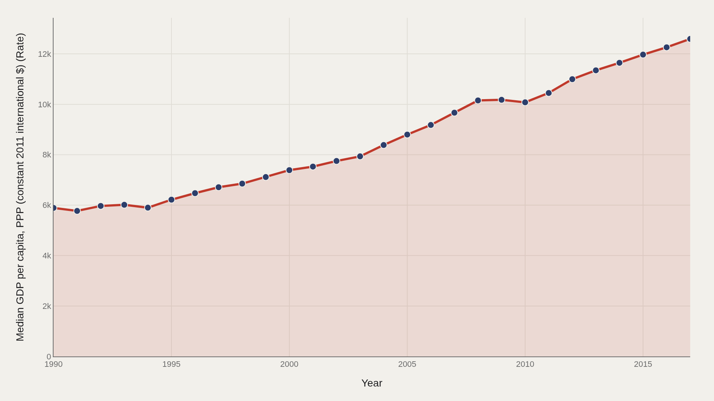
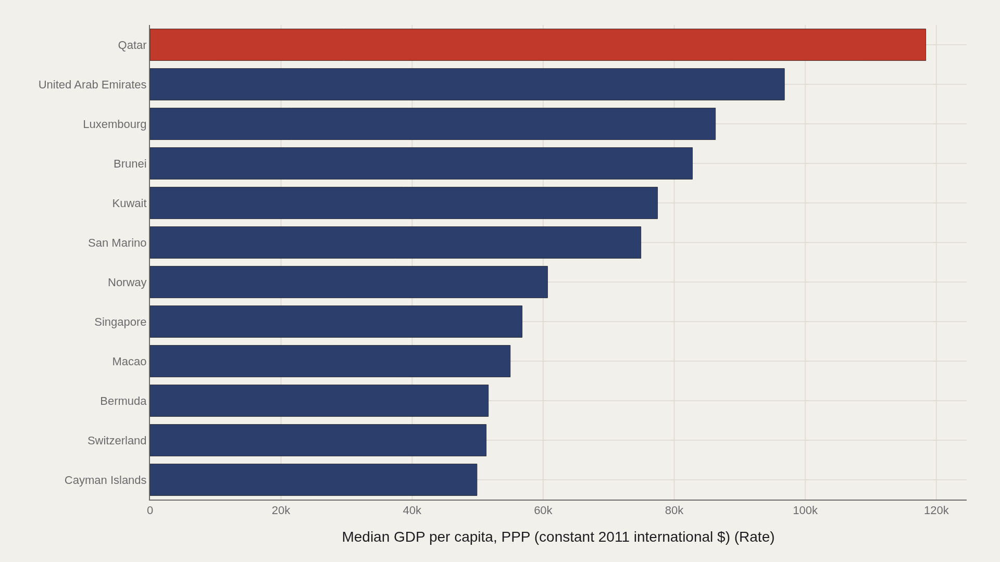
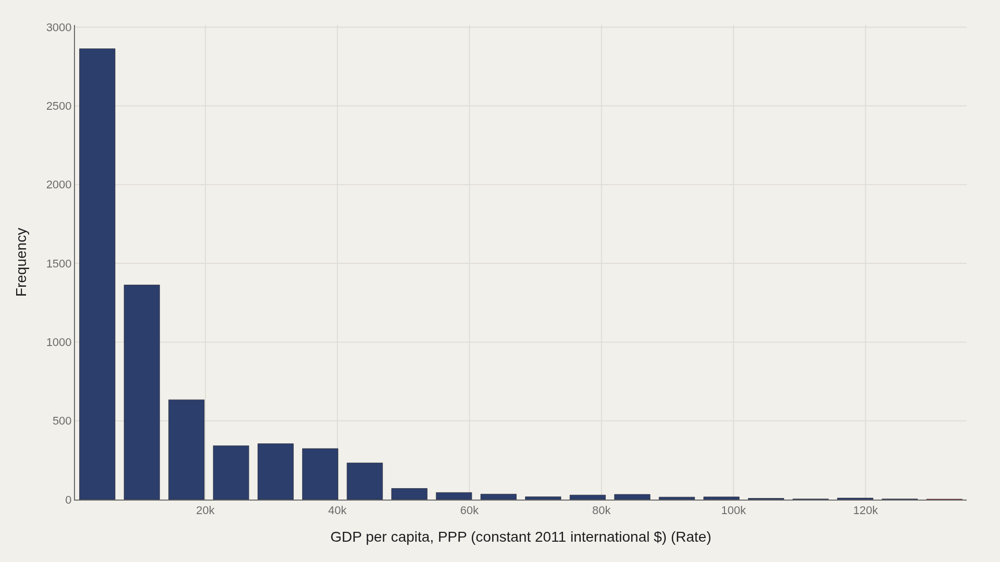
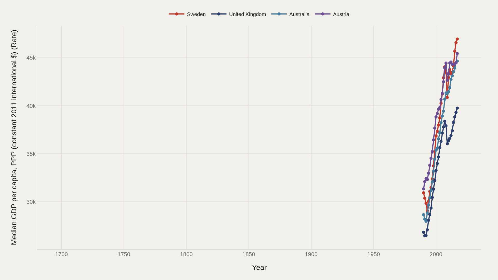
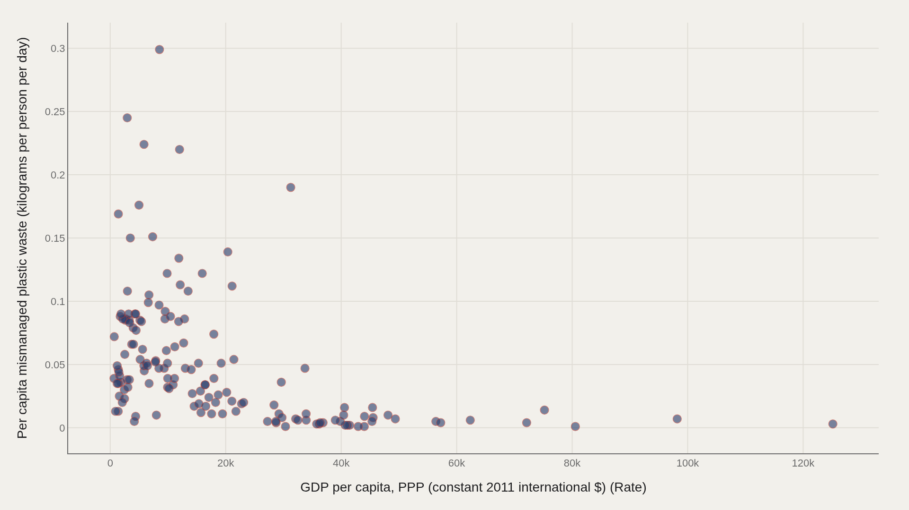

> **TL;DR** Median GDP per capita rose from 5,891 to 12,592 between 1700 and 2017, but mismanaged plastic waste remains geographically concentrated. High income correlates with collection capacity, not automatic cleanliness; lower-income coastal economies show elevated leakage even at modest per-capita generation rates.

Median GDP per capita rose from 5,891 to 12,592 between 1700 and 2017, yet mismanaged plastic waste remains geographically concentrated — high income funds collection capacity but does not guarantee low leakage.

A TidyTuesday compilation of country-year records delivers 22,204 rows spanning three centuries. Median GDP per capita sits at 8,447 (PPP, constant 2011 international dollars); the highest observed rate reaches 135,319 in Macao. The year range runs 1700 to 2017 — long enough to track the arrival of modern prosperity and modern waste in tandem.

Income alone does not settle the mismanagement question. Rich economies can fund collection systems; lower-income coastal economies can become leakage hotspots even at modest per-person generation. The charts below separate those layers.

## Data and method {#data-and-method}

The source is the TidyTuesday release from 2019-05-21 (R for Data Science community). The working file contains 22,204 rows and 7 columns after assembling the week's tables — including GDP per capita (PPP) and per-capita mismanaged plastic waste in kilograms per person per day.

Medians are used where distributions skew. Charts export as Plotly JSON with PNG fallbacks. Country names, missing years, and sparse early coverage mean the long historical span is denser for income than for waste metrics; early centuries provide context for prosperity, not a continuous waste census.

## How prosperity moved over time {#how-the-pattern-changed-over-time}

### Median GDP per capita, PPP (constant 2011 international $) (Rate) Over Time

Median GDP per capita rises from roughly 5,891 in the opening period to about 12,592 at the close. That climb is the backdrop for plastic: mass polymers are a late-twentieth-century material arriving inside an income distribution that was already diverging for centuries.

The time chart is not a plastic-generation curve. It is the economic stage on which generation and mismanagement later play out — and it shows that global medians hide enormous cross-country gaps in the same year.

## Who sits at the top of income {#who-sits-at-the-top}

### Qatar leads at 118,396 — 67,799 marks the median among the top dozen

Among the highest GDP-per-capita observations, Qatar leads near 118,396. The median among the top dozen sits around 67,799 — still eight times the file-wide median of 8,447. Macao, Singapore, Switzerland, and other high-income city-states and petro-economies fill the same thin upper band.

These leaders matter for plastic debates because high income correlates with high consumption — but not automatically with high mismanagement. Collection infrastructure can rise with prosperity even as packaging intensity rises with it.

## How income is spread {#how-the-field-is-spread}

### GDP per capita, PPP (constant 2011 international $) (Rate) Distribution

The distribution is right-skewed: median 8,447 versus mean 14,926. The top decile begins near 37,969. That tail is where high-income cases live — and where mean-based storytelling will overstate how typical prosperity feels.

Most country-year observations sit far below the headline petro-state and city-state peaks. Any claim about the world and plastic that starts from the mean income will describe a richer planet than the median resident actually inhabits.

## Leader trends {#leader-trends}

### Top Entity Over Time

The leading names do not move in lockstep. Some high-income series fade as others surge; oil-price cycles and small-population city economies can reshuffle the top of a PPP ranking without changing the deeper structure of global waste.

Tracking leaders over time separates sustained dominance from one-off spikes. For plastic policy, sustained high-income systems with strong waste services are a different object than briefly elevated GDP readings in small jurisdictions.

## Income versus mismanaged plastic {#what-moves-together}

### GDP per capita, PPP (constant 2011 international $) (Rate) vs Per capita mismanaged plastic waste (kilograms per person per day)

Plotting GDP per capita against per-capita mismanaged plastic waste shows clusters that averages erase. Some rich economies sit low on mismanagement — consumption with collection. Some lower-income coastal economies sit high on mismanagement even when generation per person is modest.

That scatter is the core policy map. Generation without management becomes ocean-bound leakage; management without reduced generation becomes an expensive success. The file cannot settle every causal claim, but it stops the false equation that wealth alone explains visible plastic pollution.

## What this file cannot tell you {#what-this-file-cannot-tell-you}

Community-cleaned TidyTuesday snapshots are not live APIs. Missing values, spelling variants, and week-of-export coverage limits apply. Early historical GDP rows are not paired with modern waste instrumentation.

Mismanaged waste estimates depend on modeling assumptions about litter, dumping, and collection coverage. Treat the relationship charts as structural signals about income and leakage risk — not as a courtroom inventory of every country's shoreline.

## What to take away {#what-to-take-away}

Plastic waste sits at the intersection of prosperity and infrastructure. Median incomes in the file roughly doubled over the long span, while mismanagement risk remained geographically uneven.

The citable lesson: high GDP per capita identifies capacity, not automatic cleanliness, and low GDP per capita identifies constraint, not automatic innocence. The scatter of income against mismanagement is where those two truths become visible at once.

## Sources {#sources}

