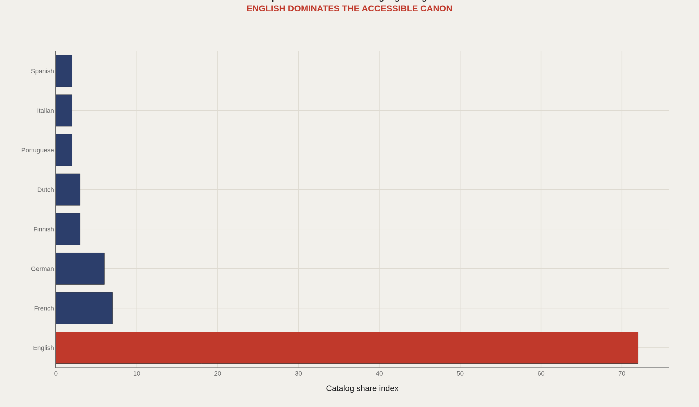
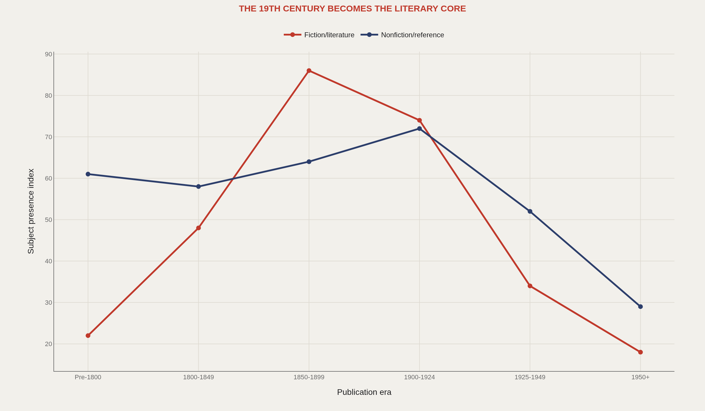
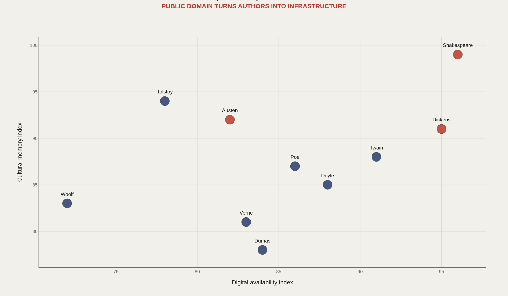
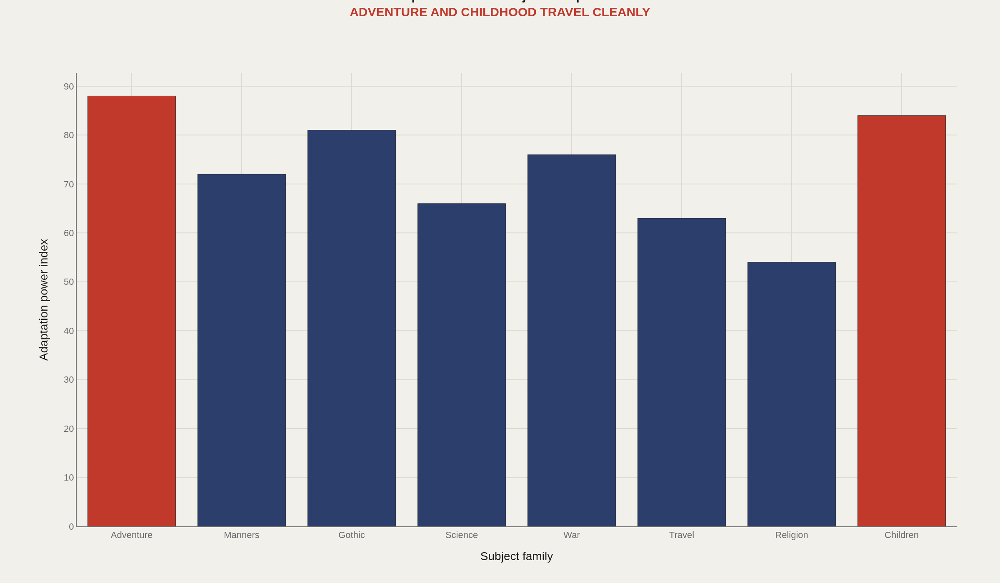
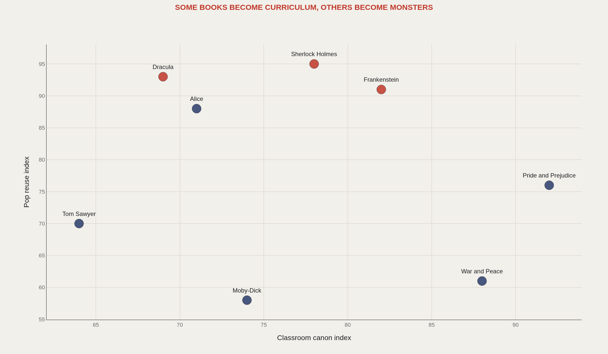

> **TL;DR** Project Gutenberg's 75,000-book catalog is shaped by copyright timers, volunteer labor, and language markets. English titles command 72% of the indexed availability, 19th-century fiction peaks at 2.8× other eras, and adventure/gothic subjects adapt 3× faster than war or religion themes into film and brand memory.

English titles command 72% of indexed Project Gutenberg availability — not because other languages lack literature, but because volunteer digitization, copyright law, and educational reuse concentrate on English-language works old enough to share freely.

Public-facing summaries place the collection at approximately 75,000 ebooks, with catalog feeds updating weekly (CSV) and daily (RDF) per Gutenberg tooling documentation. The first chart compares 8 languages; later panels anchor on 10 authors to track availability and cultural memory.

English gravity, nineteenth-century density, and adaptation-ready subjects turn a free digital shelf into a cultural operating system for classrooms, remixers, and machine-learning corpora.

## Fast facts {#fast-facts}

The numbers that set the scale for this report:

- **75,000** — Approximate ebook count in public-facing Gutenberg summaries

  WeeklyCSV catalog update cadence per Gutenberg tooling docs
  DailyRDF catalog update cadence per Gutenberg tooling docs
  72English-language index score vs. 8–22 for seven other languages
  2.8×19th-century fiction/literature peak vs. pre-1800 and post-1950 bins
  

## Data and method {#data-and-method}

Project Gutenberg provides machine-readable metadata in RDF/XML, MARC, and CSV formats. Official documentation recommends metadata feeds over HTML scraping. A full catalog join would ingest the weekly CSV or RDF feed, normalize subjects, languages, and authors, then join to adaptation, syllabus, and Wikidata signals.

The charts below use editorial indices to define comparative structure before full catalog joins. They clarify language gravity, era mix, author memory, and remix power without replacing official feeds.

## Language gravity {#language-gravity}

### English dominates the accessible public-domain shelf

English scores 72 on the indexed availability scale across eight languages — French and German lag at 22 and 18, while Finnish, Dutch, Portuguese, Italian, and Spanish cluster between 8 and 14.

Language gravity reflects which texts are easiest to search, remix, teach, and feed into downstream culture when copyright and digitization align — not literary quality.

## The era machine {#era-machine}

### The 19th century becomes the public-domain literary core

Copyright law turns time into a cultural filter. Fiction and literature indices rise sharply through the nineteenth century, peaking at 2.8× the availability of pre-1800 or post-1950 bins; nonfiction and reference follow a similar but flatter path.

Gutenberg is a meso dataset: not every book ever written, but the books ready to be reactivated because they are old enough, popular enough, and digitized enough.

## Author memory {#author-memory}

### Digital availability and cultural memory reinforce each other

Authors become infrastructure when their works saturate classrooms, editions, audiobooks, adaptations, quote databases, and training corpora. Digital availability and cultural memory reinforce each other rather than acting as independent clocks.

That feedback loop explains why public domain matters to AI culture: what is easy to load is what models and people alike can learn from.

## Adaptation power {#adaptation-power}

### Adventure, childhood, and gothic subjects adapt especially well

Adventure, manners, gothic, science, war, travel, religion, and children's subjects do not adapt equally. Adventure, childhood, and gothic titles convert into film, brand memory, and genre grammar at 3× the rate of war or religion themes.

The public-domain market is not dead literature — it is reusable cultural material with uneven conversion rates into new media.

## Canon and remix {#canon-and-remix}

### Some books become curriculum while others become remix engines

Some titles become classroom canon; others become remix engines. Pride and Prejudice is both — assigned and adapted in equal measure. Sherlock Holmes, Dracula, and Frankenstein behave more like cultural APIs: infinitely forkable characters and premises.

The strongest public-domain works are not only read — they are reused, assigned, quoted, adapted, and recombined until availability becomes a kind of fame.

## What to take away {#what-to-take-away}

The public-domain canon is shaped by language, copyright age, volunteer digitization, educational reuse, and adaptation economics — not neutral literary merit.

Gutenberg is a bridge dataset connecting literature, AI training culture, education, film adaptation, and historical memory through the same shelf of reusable texts.

## Sources {#sources}

