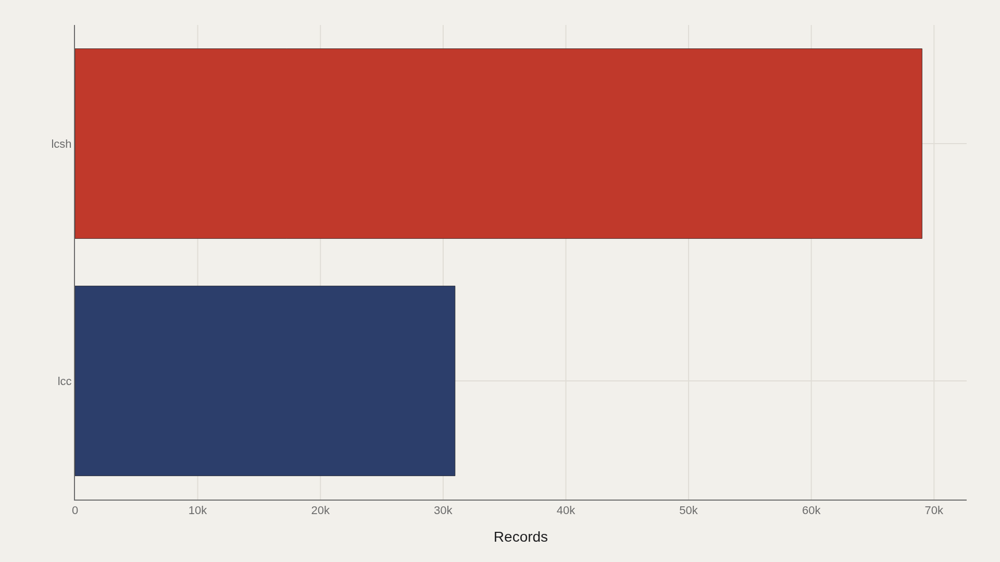
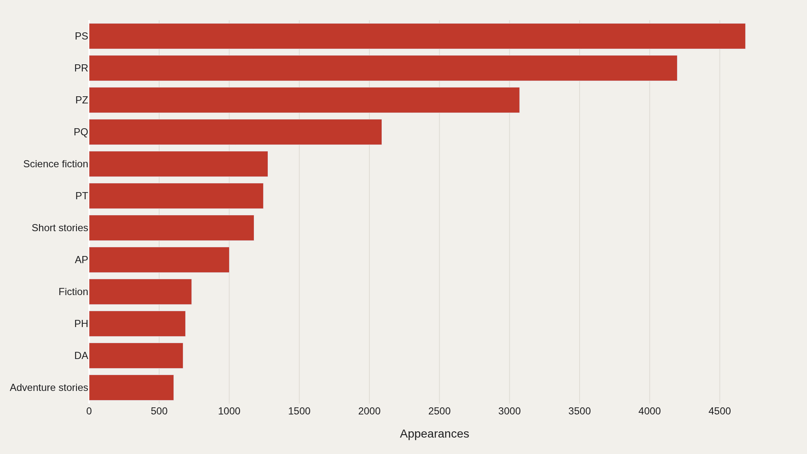
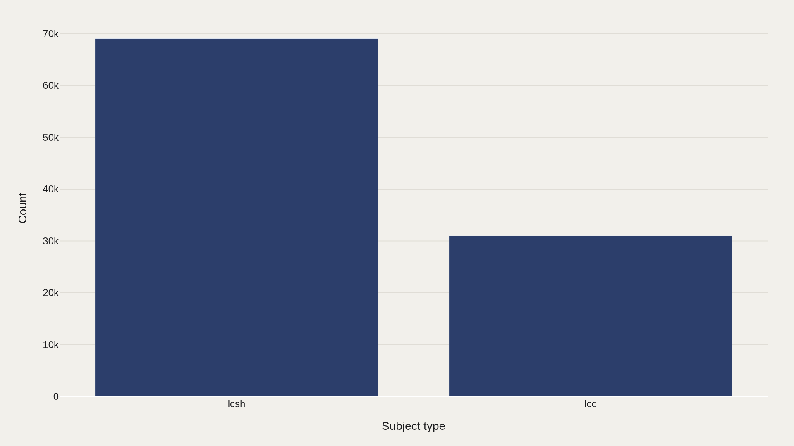
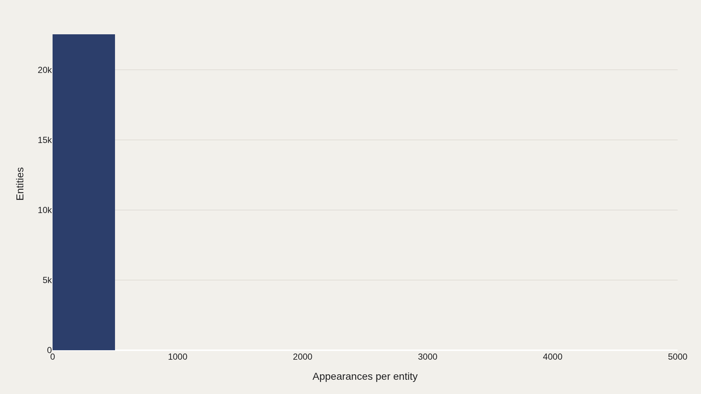
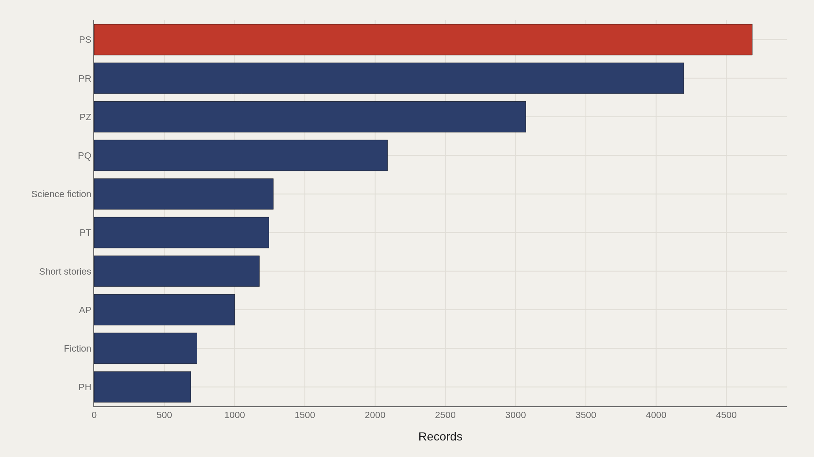

> **TL;DR** A 100,000-record TidyTuesday extract shows Library of Congress Subject Headings (lcsh) accounting for 69,027 entries — 69% of all subjects. A small set of codes — PS at 4,684 instances — recurs thousands of times while most labels appear once, revealing which public-domain works volunteers digitized and classified at scale.

Library of Congress Subject Headings (lcsh) account for 69,027 records in a 100,000-row TidyTuesday extract of Project Gutenberg — 69% of all subject entries. The catalog is not a popularity contest; it is a map of which public-domain books volunteers could digitize and classify at scale.

Subject code PS — American literature — recurs 4,684 times, leading all labels. A short head of repeated classifications anchors the catalog while most subject entities appear once. The pattern is typical of library metadata: a reusable canon of headings, and a long inventory of singleton assignments.

Reading Gutenberg as a concentration map of reusable works is where the data help.

## Fast facts {#fast-facts}

The numbers that set the scale for this report:

- **100,000** — Records in the working dataset

  lcshMost common Subject type

## Data and method {#data-and-method}

The source is the TidyTuesday Project Gutenberg release from the R for Data Science community. The working file contains 100,000 rows after assembly — subject types, subject labels, and related catalog metadata.

Because many fields are categorical, the analysis leans on counts and repetition rather than a single quality score. Charts export as Plotly JSON with PNG fallbacks. Subject headings are librarian infrastructure, not reader reviews.

## Public-domain books cluster by subject type {#landscape}

### Public-domain books cluster by subject type

lcsh dominates with 69,027 records, far ahead of thinner subject-type buckets. The main classification family carries the story; this field does not split into many equal long-tail types.

That concentration means most navigational claims about what Gutenberg contains are really claims about how LCSH-style headings organize the digitized shelf.

## A small set of subjects anchors the catalog {#who-sits-at-the-top}

### A small set of subjects anchors the catalog

PS appears 4,684 times — the most recurring subject name in the file. The top dozen account for a visible share of all 100,000 rows even though most subject entities appear only once.

American literature codes, fiction labels, and related headings form a reusable core. They are the catalog's gravitational center for teachers, scrapers, and adaptation hunters.

## Subject families show the catalog center of gravity {#category}

### Subject families show the catalog's center of gravity

lcsh is again the largest bucket on the category chart. Subject families show where editorial attention should focus first if the goal is to understand the shelf's center of gravity rather than its exotic edges.

The edges still matter for discovery. They do not define the statistical middle of a 100,000-row extract.

## Repeated subjects reveal the reusable canon {#frequency}

### Repeated subjects reveal the reusable canon

Most subject entities appear only once; a small head recurs repeatedly. That power-law shape is typical of catalog tables: a reusable canon of headings, and a long inventory of singleton classifications.

Repeated subjects are the ones most likely to support classroom packs, themed collections, and machine-learning corpora. Frequency is a reuse forecast as much as a shelf description.

## Subject labels become the map of the shelf {#names}

### Subject labels become the map of the shelf

PS and related labels become the map of the shelf when numeric scores are sparse. Frequency leaders reveal franchise depth in literature the way studio logos reveal franchise depth in film.

The practical claim for cultural analytics is simple: if you can only afford to study a slice of Gutenberg, the repeated subject head is where coverage of the reusable public-domain canon begins.

## What this file cannot tell you {#what-this-file-cannot-tell-you}

Community-cleaned TidyTuesday snapshots are not live APIs. Missing values, spelling variants, and sampling limits apply. Subject headings are not sales, downloads, or reading-time proof.

Findings describe structural signals about Project Gutenberg subject metadata — not a complete history of world literature, and not a ranking of artistic merit.

## What to take away {#what-to-take-away}

Gutenberg's subject catalog is concentrated: lcsh dominates subject type, a short head of codes such as PS recurs thousands of times, and most labels appear once.

The citable lesson is about reusable canon. Public-domain literature becomes infrastructure when classification and digitization make the same subjects easy to find again and again.

## Sources {#sources}

