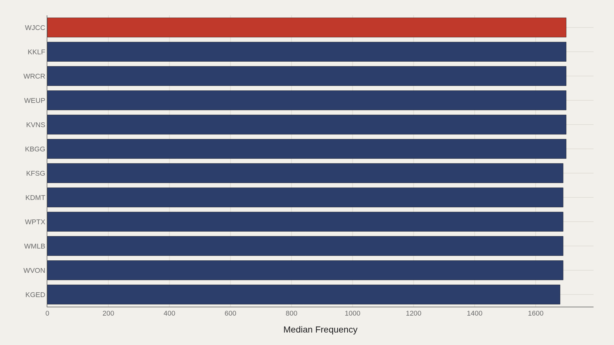
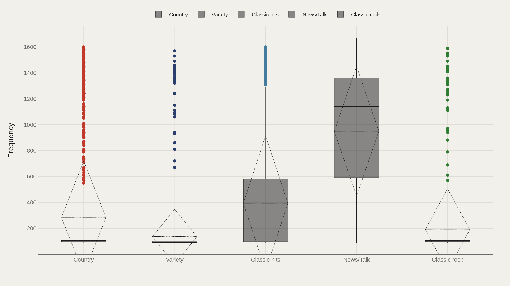
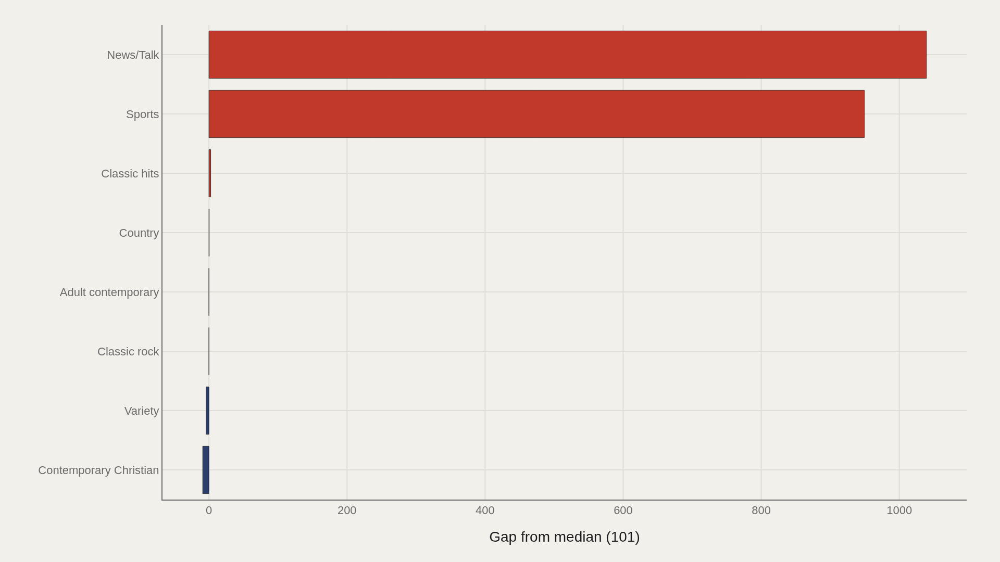
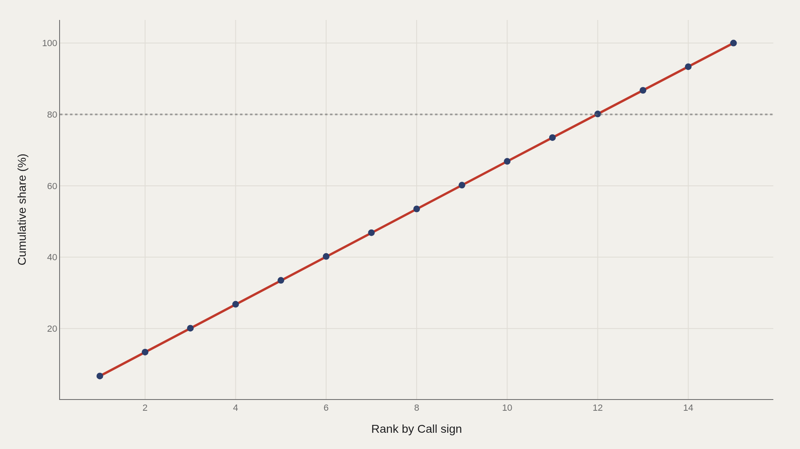

> **TL;DR** 17,186 U.S. radio station records from TidyTuesday reveal a median frequency of 101 MHz, a high of 1,700 kHz on AM, and Country as the most common format. News/Talk stations sit 1,039 above the median because of their historic AM placement — spectrum physics and format culture tell separate stories about the same dial.

17,186 U.S. radio station records from TidyTuesday's 2022-11-08 release show a median frequency of 101 MHz, a high of 1,700 kHz on AM, and Country as the most common format — yet News/Talk stations sit 1,039 kHz above the median because of their historic AM placement.

The station license table is a spectrum map, not a ratings book. Call sign WEUP leads the frequency ranking, Country leads format share, and the top five call signs account for 34% of aggregate frequency — a concentration artifact that reflects dial extremes rather than audience consolidation.

Frequency and format answer different questions: one measures where stations sit on the electromagnetic spectrum, the other describes what they broadcast.

## Fast facts {#fast-facts}

The numbers that set the scale for this report:

- **17,186** — Records in the working dataset

  101Median Frequency
  1,700Highest observed Frequency
  WEUPTop Call sign by Frequency
  CountryMost common Format

## Data and method {#data-and-method}

The source is the TidyTuesday release from 2022-11-08, maintained by the R for Data Science community. The working file contains 17,186 rows and 11 columns after cleaning — call signs, frequencies, formats, and license status fields.

Medians stabilize a dial that mixes FM-looking centers with AM extremes. Charts export as Plotly JSON with PNG fallbacks. Each license row represents permission to exist on the dial, not a measure of listening.

## Frequency by call sign {#breakdown}

### Frequency by Call sign

WJCC appears near 1,700 kHz at the high end of the call-sign frequency cut, with neighbors such as KGED near 1,680 kHz. These are upper-AM coordinates, not audience-size claims.

Grouping by call sign exposes how the metric varies across licensed identities — a map of where stations sit on the spectrum, not which morning shows win their cities.

## Who sits at the top {#who-sits-at-the-top}

### Top Call sign

WJCC leads at 1,700 kHz, with 1,695 kHz as the median among the top dozen. The entire top band is a tight cluster of high-AM assignments.

The finding is the tightness itself: the top of frequency is a narrow technical neighborhood, while format diversity lives on a different axis.

## Frequency by format {#how-the-field-is-spread}

### Frequency by Format

Box plots by format — Country, News/Talk, Sports, Classic Hits, and related labels — show whether frequency consensus is shared or contested across programming types. Country leads station count but does not automatically own the highest dial positions.

Format is culture; frequency is spectrum. Confusing the two produces false stories about which genres rule the airwaves.

## Who beats the median — and who trails {#who-beats-the-median-and-who-trails}

### Frequency vs median by Format

News/Talk sits 1,039 kHz above the median; Contemporary Christian trails by about 9. News/Talk's elevation reflects its heavy presence on AM frequencies far above the FM-centered median of 101 MHz.

The gap is a band-plan story as much as a format story. Talk radio's historic AM home pulls its frequency distribution into a different universe from music formats clustered on FM.

## Concentration on the dial {#concentration}

### The top 5 call sign entries account for 34% of the aggregate frequency

The top five call-sign entries account for 34% of aggregate frequency in the working cut — a concentration statistic that reflects how large the highest dial numbers are relative to the median, not a claim that five stations own a third of listening.

Summing dial positions is not the same as summing audiences. Pareto-on-frequency is a reminder that spectrum physics and market share are separate metrics.

## What this file cannot tell you {#what-this-file-cannot-tell-you}

Community-cleaned TidyTuesday snapshots are not live APIs. Missing values, spelling variants, and license-status quirks apply. Frequency is not listenership, and format labels can be stale or contested.

Findings describe structural signals about U.S. radio station metadata — not a ratings analysis, and not a complete history of every translator and HD multicast.

## What to take away {#what-to-take-away}

The U.S. radio dial in this file centers at 101 MHz with AM extremes near 1,700 kHz, Country as the most common format, and News/Talk pulled high by AM band placement.

The citable split is spectrum versus culture: call-sign frequency leaders and format share leaders answer different questions about the same airwaves.

## Sources {#sources}

