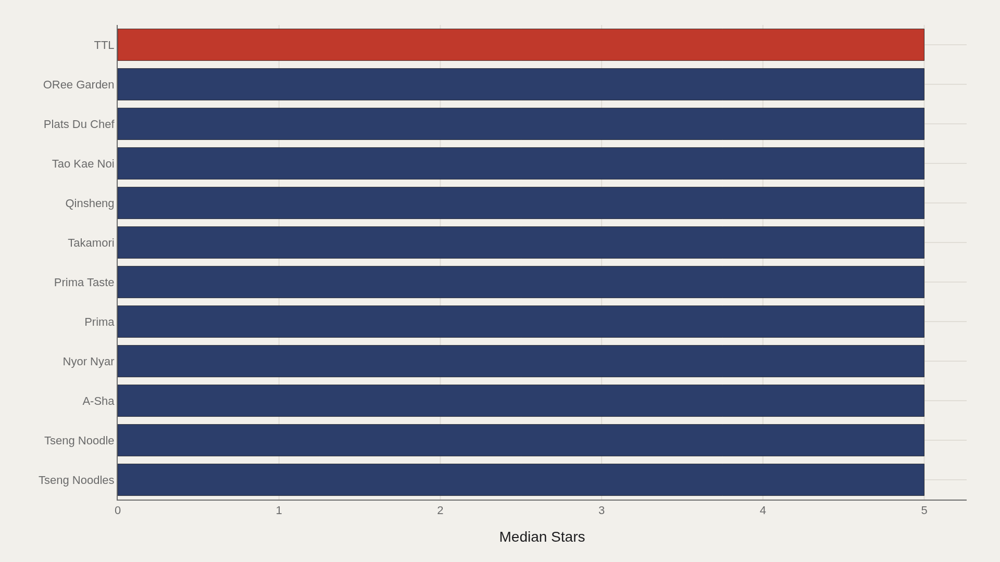
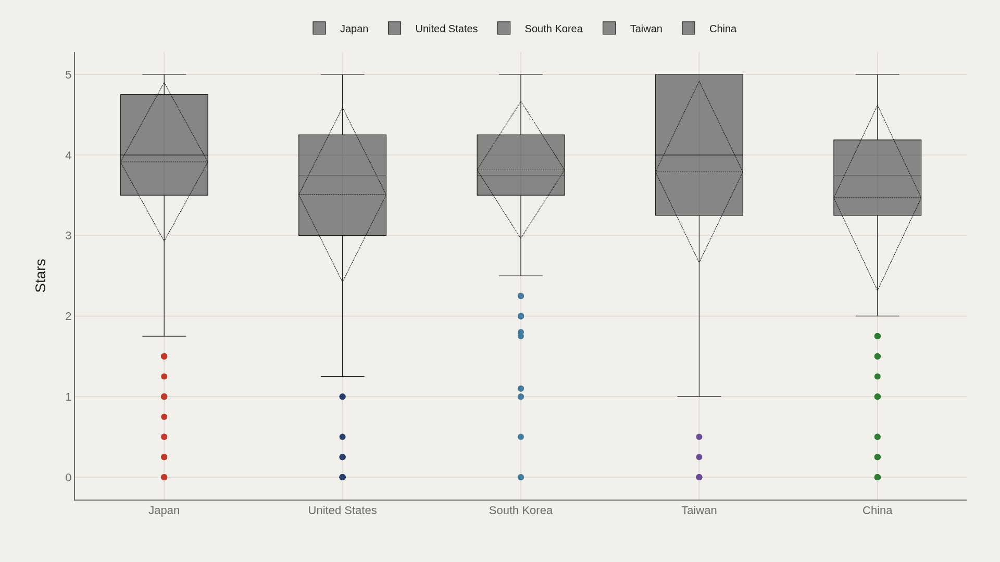
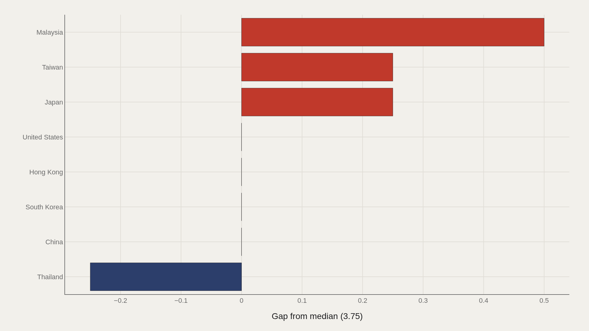
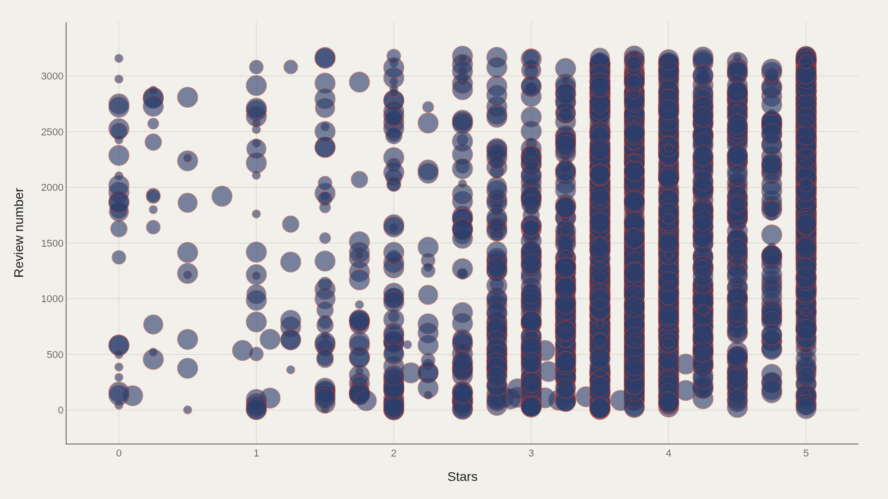

> **TL;DR** A 3,180-record TidyTuesday dataset from June 2019 places the median instant-ramen rating at 3.75 stars on a 5.00 scale. Dozens of brands share the perfect score, compressing the top into a plateau. Malaysia sits 0.50 stars above the median; Thailand trails by 0.25. The meaningful story lives in mid-range country gaps and review volume behind elite scores.

The median instant-ramen rating in a 3,180-record TidyTuesday sample is 3.75 stars on a five-point scale, but dozens of brands share the 5.00 ceiling — compressing the top into a plateau where Malaysia's 0.50-star lead above the median becomes the most meaningful country gap.

Star ratings collapse broth clarity, noodle chew, spice balance, and packaging nostalgia into a single number. A TidyTuesday working file from June 2019 shows 3,180 reviews with a median of 3.75 and a maximum of 5.00. Nongshim leads the brand ranking in the fact box, and Japan is the most common country label by product count — though output volume and rating leadership do not align.

When perfect scores are common, the useful story lives below the ceiling: which countries sit above the median, and whether high ratings rest on thin or thick review support.

## Fast facts {#fast-facts}

The numbers that set the scale for this report:

- **3,180** — Records in the working dataset

  3.75Median Stars
  5.00Highest observed Stars
  NongshimTop Brand by Stars
  JapanMost common Country

## Data and method {#data-and-method}

The source is the TidyTuesday release from 2019-06-04, maintained by the R for Data Science community. The working file contains 3,180 rows and six columns after cleaning: brand, variety, style, country, stars, and review number.

Medians handle a distribution piled against the 5.00 ceiling. Charts export as Plotly JSON with PNG fallbacks. Stars are community review scores, not laboratory nutrition assays.

## Stars by brand {#breakdown}

### Stars by Brand

Brand rollups at the top of the chart crowd the 5.00 ceiling. TTL, Tseng Noodles, A-Sha, Prima Taste, and other specialists occupy the perfect-score band. When the top saturates, discrimination shifts to consistency across varieties and the number of reviews behind the mean.

Nongshim's fact-box lead can coexist with a chart full of smaller perfect-score brands because aggregation choices — mean across varieties, review weighting, or maximum score — change the ranking order.

## Who sits at the top {#who-sits-at-the-top}

### TTL leads at 5.00 — 5.00 marks the median among the top dozen

TTL leads at 5.00, and the median among the top dozen is also 5.00. The elite band is a plateau, not a ladder. Perfect scores are common enough that first place is a crowded room.

Tiny rank differences among five-star brands carry little information. The useful comparisons appear in the middle of the distribution and across countries.

## Stars by country {#how-the-field-is-spread}

### Stars by Country

Country box plots show whether star consensus is shared or contested across producing nations. Japan leads by product count; Malaysia, Thailand, South Korea, and Singapore compete on rating location rather than volume.

A country can dominate shelf presence without dominating the upper quartile of stars. The spread chart separates industrial scale from taste prestige.

## Who beats the median — and who trails {#who-beats-the-median-and-who-trails}

### Stars vs median by Country

Malaysia sits 0.50 stars above the median; Thailand trails by 0.25. Those gaps look small until you remember the scale runs to 5.00 and the median is already 3.75.

Half a star above center is a material national reputation effect in a compressed rating system. It is also narrow enough that a few legendary varieties can move a country's summary.

## Stars and review number {#what-moves-together}

### Stars vs Review number

Plotting stars against review number reveals clusters that averages hide. Some high-rated varieties have thin review support; some heavily reviewed products sit nearer the middle. Attention and admiration are related, not identical.

Review-number fields in the source can behave as identifiers as much as popularity counts. The scatter prevents readers from equating a perfect score with a broadly tested consensus.

## What this file cannot tell you {#what-this-file-cannot-tell-you}

Community-cleaned TidyTuesday snapshots are not live APIs. Missing values, spelling variants, and brand-name duplicates apply. Stars are not sales, and country labels do not always indicate where a variety is consumed most.

Findings describe structural signals in ramen rating metadata, not a definitive world championship of instant noodles.

## What to take away {#what-to-take-away}

Instant ramen ratings in this file center near 3.75 stars, with a crowded perfect-score ceiling at 5.00 and country gaps of 0.25 to 0.50 stars around the median.

When the top is a plateau of five-star brands, the meaningful geography is which countries sit above the middle and how much review support stands behind the praise. Malaysia's 0.50-star lead and Thailand's 0.25-star deficit matter more than first-place ties at the ceiling.

## Sources {#sources}

