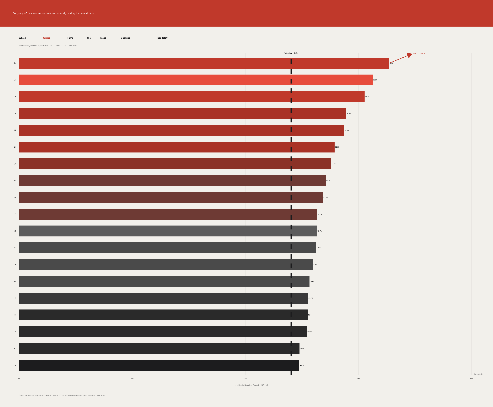
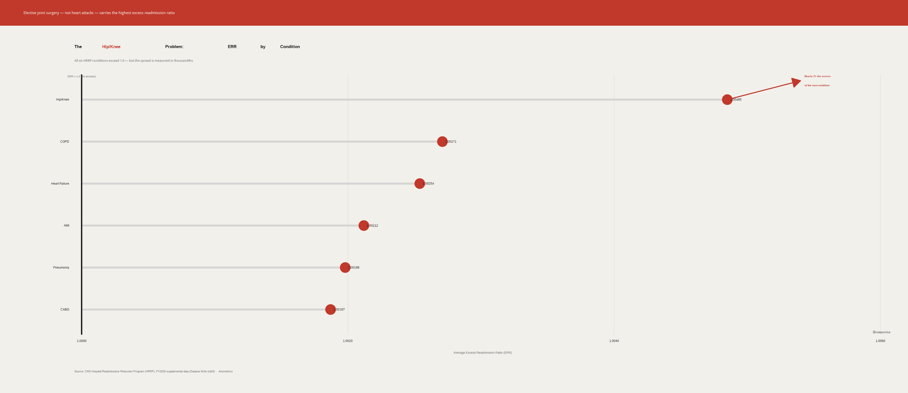
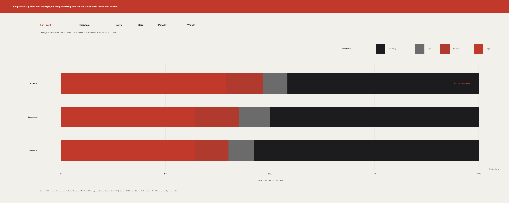

::: {.magazine-cover style="background:#1C1C1E;color:#F2F0EB;padding:4rem 2rem;text-align:center;margin-bottom:3rem;"}
# READMITTED

## How America's Hospitals Are Failing the 30-Day Standard

*Artometrics Power desk · CMS HRRP analysis*
:::

::: {.facts-grid style="display:grid;grid-template-columns:repeat(3,1fr);gap:16px;margin:2rem 0;"}
::: {.fact-box style="background:#F2F0EB;border-left:4px solid #C0392B;padding:18px;"}
**48.1%**  
Hospital-condition pairs above ERR 1.0
:::
::: {.fact-box style="background:#F2F0EB;border-left:4px solid #C0392B;padding:18px;"}
**65.4%**  
New Jersey — highest penalized state share
:::
::: {.fact-box style="background:#F2F0EB;border-left:4px solid #C0392B;padding:18px;"}
**~2×**  
Hip/Knee ERR gap vs next condition
:::
:::

> The penalty caps at 3% of all Medicare payments — not just the condition being measured. A hospital with too many heart failure readmissions loses 3% of everything.

## The geography of failure

New Jersey, Massachusetts, and Mississippi lead a list that cuts across market type — dense Northeastern systems beside rural Southern states. The penalty is geographic but not geographically simple.

## The condition nobody is solving

Hip and knee replacement sits nearly twice the excess of the next closest condition — a gap visible only when ERR is read at five decimal places.

## Ownership and who pays

For-profit hospitals carry modestly more medium and high penalty weight. All three ownership types remain majority no-penalty — the stick is concentrated, not universal.

---

*Full methodology, code, and interactive charts: [artometrics.com/readmitted/](https://artometrics.com/readmitted/) · [GitHub](https://github.com/Artometrics/readmitted)*
