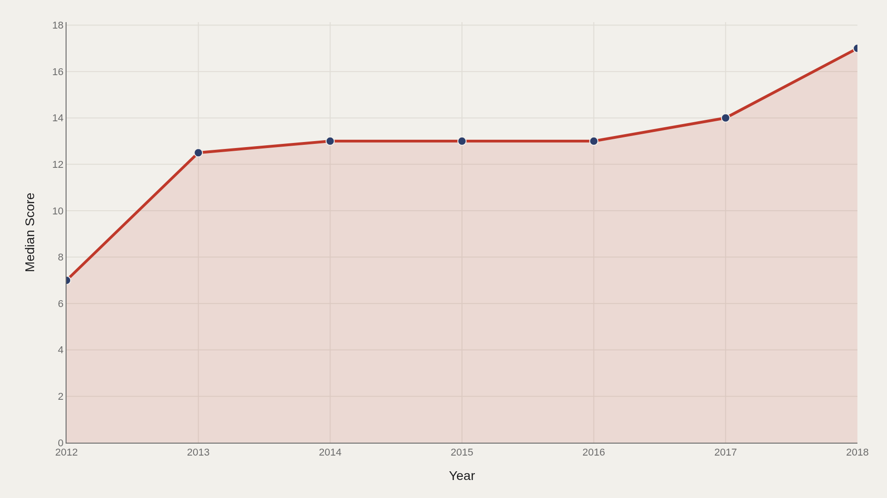
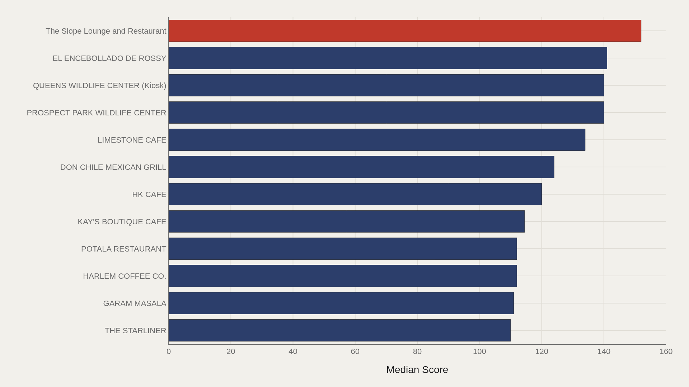
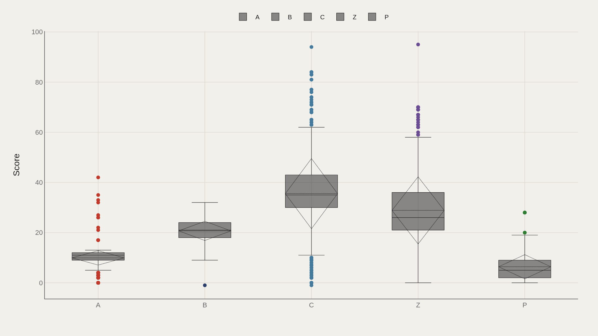
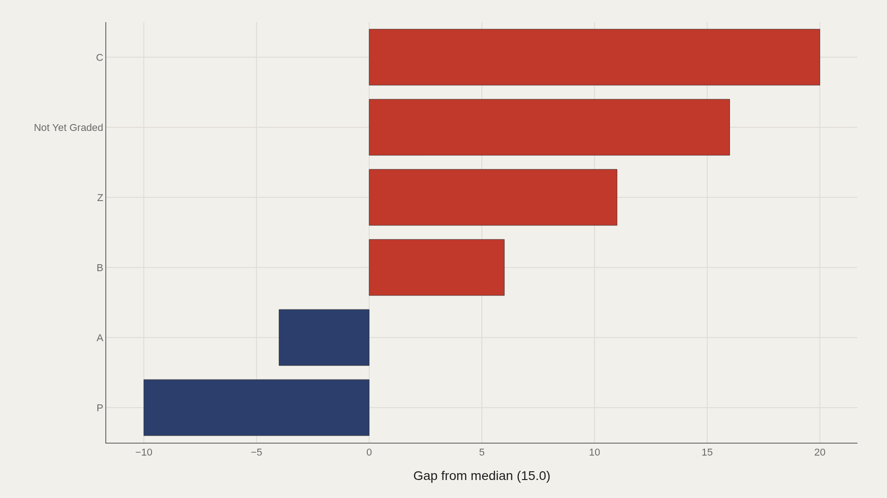
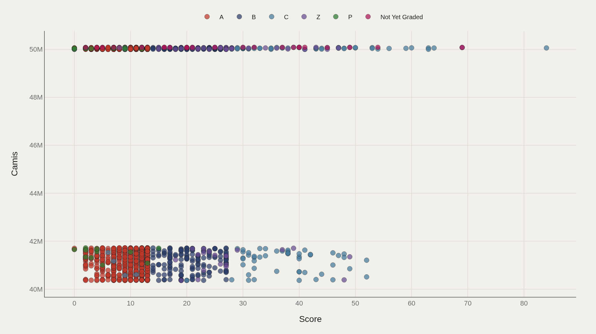

> **TL;DR** NYC restaurant inspection scores cluster at a median of 15.0 violation points, but the highest recorded score reaches 156 in a 100,000-record TidyTuesday extract covering 1900–2018. Grade A dominates the distribution, while the numeric scoring system reveals a long tail of extreme violations hidden behind letter grades.

NYC restaurant inspection scores cluster at a median of 15.0 violation points, but the distribution stretches to 156 in a 100,000-record TidyTuesday extract — a span that letter grades compress into A, B, and C stickers.

The highest-scoring establishment in this extract, The Slope Lounge and Restaurant, logged 152 points. The top dozen violators post a median of 122. Grade A remains the most common public label, while the year span runs from placeholder 1900 through 2018, with inspection density concentrated in the 2010s.

Higher scores mean more violations, not better food — an inversion easy to forget once letter grades take over.

## Data and method {#data-and-method}

The source is the TidyTuesday release built from NYC restaurant inspection open data via the R for Data Science community. The working file contains 100,000 rows sampled from the full dataset, with fields including DBA names, boroughs, scores, grades, and inspection dates.

Medians matter because a thin tail of high-violation restaurants pulls means upward. Charts export as Plotly JSON with PNG fallbacks. Grades derive from scores under city rules; treating them as independent categories misses the underlying point system.

## How scores moved over time {#how-the-pattern-changed-over-time}

### Median Score Over Time

Median score over time tracks whether the typical inspected restaurant became cleaner, worse, or remained stable as the program matured. Flat stretches can signal stable compliance or consistent scoring practice.

Early placeholder years carry little weight; most interpretive signal sits in the dense 2010–2018 window.

## Who sits at the top of violation scores {#who-sits-at-the-top}

### The Slope Lounge and Restaurant leads at 152 — 122 marks the median among the top dozen

The Slope Lounge and Restaurant posts 152 points, with a median of 122 among the top dozen violators. These scores sit at the extreme end of a distribution where the overall median is 15.

The head of the distribution is where enforcement drama concentrates. Single bad inspections can define a DBA's ranking even if later visits improve.

## Scores by grade {#how-the-field-is-spread}

### Score by Grade

Box plots by grade show the numeric ranges that map onto A, B, C, and related labels. Grade A dominates the count; higher-letter grades occupy the upper score territory where violation points accumulate.

The chart makes the letter system's compression visible: many different numeric outcomes share an A, while public debate concentrates on rarer worse grades.

## Who beats the median — and who trails {#who-beats-the-median-and-who-trails}

### Score vs median by Grade

The gap chart ranks grades above or below the median score. Worse letter grades sit far above the median by design; A sits at or below it. The geometry is the grading rule made visual.

What remains notable is the within-grade spread on the previous chart: even A is a band, not a point, and policy arguments often happen inside that band.

## Scores and identifiers {#what-moves-together}

### Score vs Camis

Plotting score against CAMIS identifiers is mostly a diagnostic scatter: restaurant IDs are not a substantive X-axis, but the cloud shows how scores disperse across the universe of establishments rather than clustering on a few names.

When substantive covariates are thin, an ID scatter refuses to invent a prettier relationship than the table supports.

## What this file cannot tell you {#what-this-file-cannot-tell-you}

Community-cleaned TidyTuesday snapshots are not live APIs. Missing values, spelling variants, and sampling to 100,000 rows apply. Scores are inspection outcomes, not taste ratings.

Findings describe structural patterns in NYC inspection scoring — not a complete health study, and not a recommendation about where to eat without checking current grades.

## What to take away {#what-to-take-away}

NYC restaurant inspections cluster at a median of 15 violation points, with a long tail extending past 150. Grade A dominates the public display; extreme scores are rare but visible in the data.

The inversion remains: higher numbers are worse, letter grades compress a wide numeric band, and the window sticker is only the headline of a point system running underneath.

## Sources {#sources}

