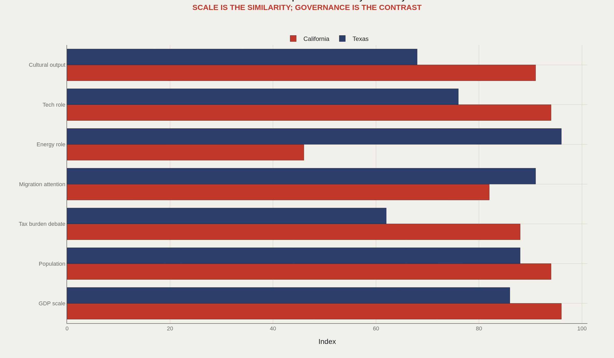
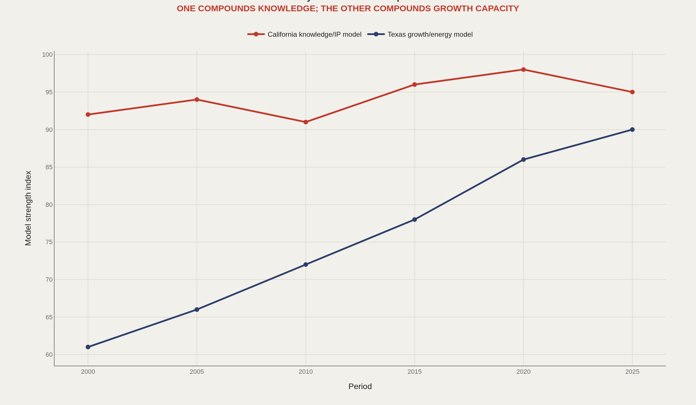
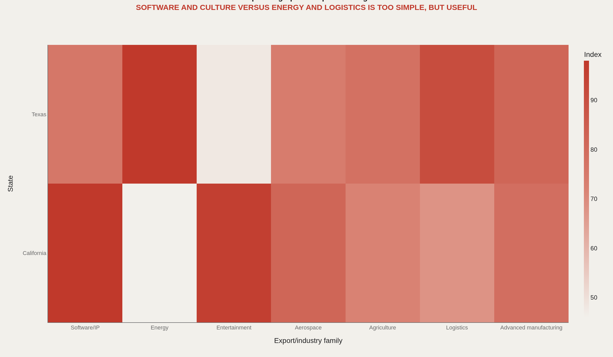
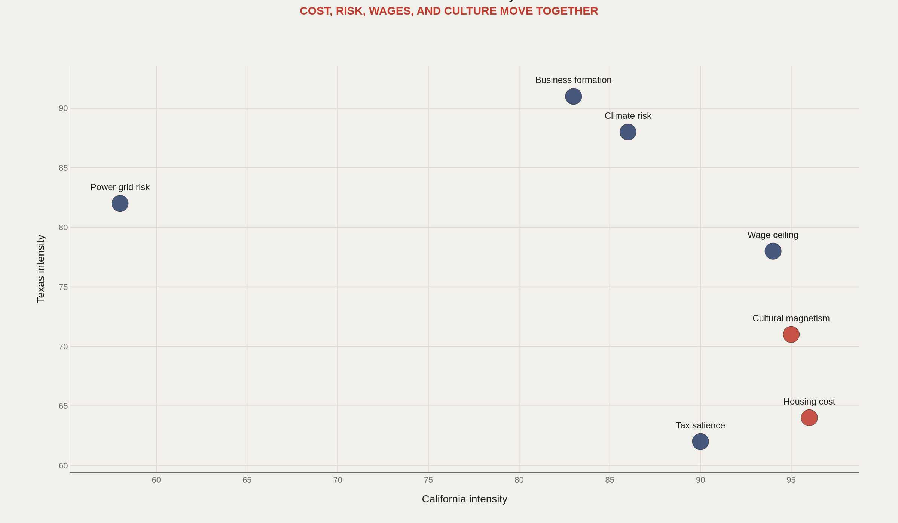
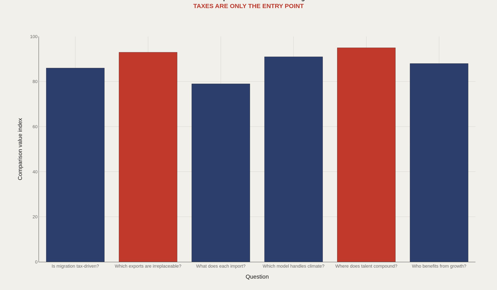

> **TL;DR** California scores 96 on GDP scale, 94 on tech role, and 91 on cultural output. Texas scores 96 on energy, 91 on migration attention, and 86 on GDP. The rivalry persists because each state represents a distinct governance model, export system, and labor market—not because they are interchangeable.

California scores 96 on GDP scale, 94 on tech role, and 91 on cultural output. Texas scores 96 on energy, 91 on migration attention, and 86 on GDP. The rivalry persists because each state represents a distinct governance model, export system, and labor market—not because they are interchangeable.

The charts score 2 state systems across 7 rivalry dimensions and 7 export families. They are designed to stop the comparison from collapsing into a single tax talking point and to surface the six questions worth asking next.

## Data and method {#data-and-method}

The comparison draws on BEA state GDP by industry, Census ACS population and migration, IRS migration summaries, BLS employment, state tax and budget documents, OEC/ITA export tables, and climate/energy series.

Values in the figures are editorial indices that organize the rivalry into comparable dimensions. They should be read as a structured hypothesis map, then replaced with source aggregates before formal rankings.

## Why They Are Compared {#why-they-are-compared}

### California and Texas are rival systems because both are big enough to feel like countries

California scores 96 on GDP scale, 94 on population, 94 on tech role, and 91 on cultural output, with a tax-burden debate score of 88 and an energy-role score of 46. Texas scores 96 on energy, 91 on migration attention, 88 on population, and 86 on GDP scale, while cultural output sits at 68.

They are competing governance models, labor markets, export systems, and migration symbols—not interchangeable states with different logos.

## Growth Model {#growth-model}

### California compounds knowledge while Texas compounds growth capacity

California's knowledge/IP model index remains high across the timeline—from the low 90s in 2000–2010 to a peak near 98 in 2020. Texas's growth/energy model climbs from 61 in 2000 to 90 by 2025.

One compounds intellectual property, entertainment, venture networks, and universities. The other compounds energy, land, logistics, and relocation capacity. The rivalry persists because the models are not substitutes.

## Export Fingerprint {#export-fingerprint}

### The states overlap in scale but diverge in what they export to the world

The export fingerprint contrasts software/IP, entertainment, and related strengths on the California side with energy and logistics weight on the Texas side. Agriculture, aerospace, and other families overlap in more complicated ways than slogan versions admit.

Same-scale GDP conversations hide different machinery. What each state sells to the world is the cleanest way to keep the comparison honest.

## Hidden Tradeoffs {#hidden-tradeoffs}

### The rivalry is about cost, climate, wages, culture, and risk, not taxes alone

Cost, climate risk, wages, culture, and business formation do not move as a single tax variable. The tradeoff scatter keeps multiple dimensions in view at once—high-cost magnetism on one side, capacity and exposure on the other.

California's wage ceiling and cultural pull are real; Texas's formation and logistics advantages are real; energy and climate risk are real. A serious comparison refuses to delete any of those axes.

## What to Ask Next {#what-to-ask-next}

### The useful California-Texas questions are about irreplaceable exports, talent, climate, and who benefits

The ranked questions elevate talent compounding (95), irreplaceable exports (93), climate handling (91), who benefits from growth (88), whether migration is tax-driven (86), and what each state must import (79).

The useful prompt is not "which state is better?" It is which capabilities each system cannot copy from the other—the starting point for migration, housing, export, and culture follow-ups.

## What this file cannot tell you {#what-this-file-cannot-tell-you}

Editorial indices are scaffolding, not BEA or Census tabulations. They must be replaced with source aggregates before anyone treats the scores as official rankings.

State borders hide metro heterogeneity: coastal California is not inland California; Houston is not the Rio Grande Valley. Intra-state variance can exceed the interstate gap on many metrics.

## What to take away {#what-to-take-away}

California and Texas remain comparable because they are two large answers to how America organizes scale, talent, land, energy, and culture.

Taxes are the entry point; export identity, climate risk, talent compounding, and cultural magnetism are where the comparison becomes specific enough to measure.

## Sources {#sources}

BEA. State GDP by industry.

U.S. Census ACS and population estimates.

IRS migration data summaries.

BLS state employment statistics.

International Trade Administration and OEC export references.

State budget and tax agency documents.

## Editor's note {#editor-s-note}

Values are editorial indices intended to structure a later direct-data output pass. They should be replaced with source aggregates before making formal rankings.

