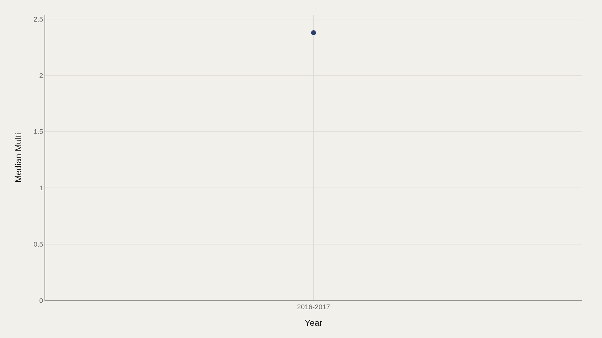
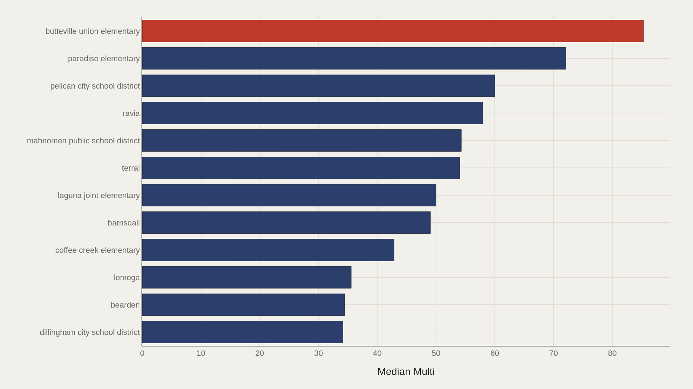
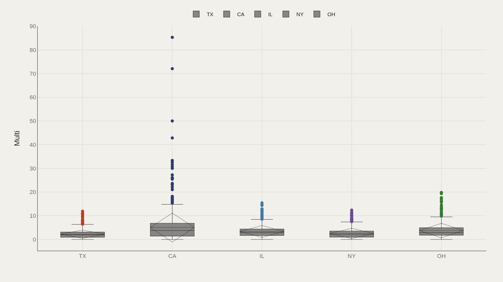
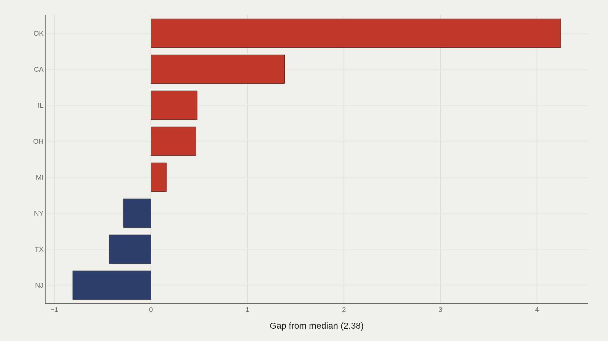
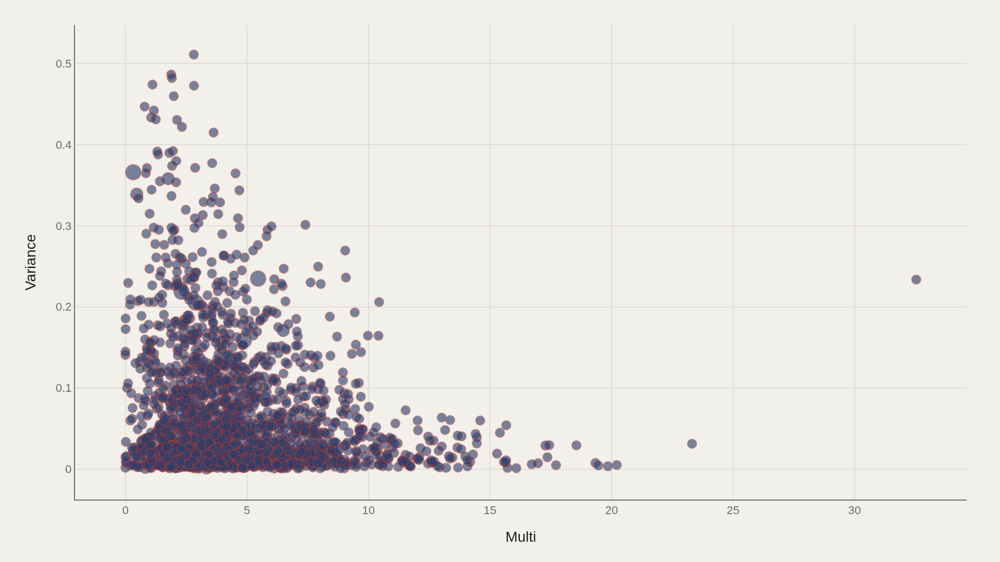

> **TL;DR** Across 27,944 U.S. local education agencies, the median Multi diversity score is 2.38, while Butteville Union Elementary leads at 85.3. Oklahoma sits 4.25 above the national median; New Jersey trails by 0.81. A flat center coexists with extreme upper-tail values.

Butteville Union Elementary scores 85.3 on the Multi diversity index while the national median sits at 2.38 across 27,944 local education agencies. The 35-fold gap between the top district and the median defines the shape of U.S. school diversity: a flat center and an extreme upper tail.

Texas is the most common state in the file by record count, but frequency does not equal high diversity scores. Oklahoma sits 4.25 above the median; New Jersey trails by 0.81. The Multi–Variance scatter reveals that schools cluster rather than form a smooth cloud, indicating that composition patterns vary independently of overall diversity level.

## Research question {#research-question}

Where does student-body diversity concentrate when the unit of analysis is the local education agency rather than the nation as a whole? This report asks whether the Multi metric behaves like a broad national baseline or a long-tailed distribution in which a few LEAs and states sit far above the typical row.

The observational question is constrained to the source file: how stable is the median, which LEA names define the upper tail, how do state abbreviations structure the spread, and how does Multi relate to Variance? It does not treat one diversity metric as the full moral or demographic story of American education.

## Data and method {#data-and-method}

The source is the TidyTuesday release from 2019-09-24 (R for Data Science community). The working file contains 27,944 rows and 15 columns after merging available tables in the week folder. Multi is the primary observed metric used for ranking and distribution charts; Variance appears alongside it in the scatter.

Medians are used because school-level diversity metrics skew. Index-style fields are excluded from metric selection. State codes (ST) and LEA names are categorical axes for comparing how Multi sits across geography and district identity.

## A flat median hides how extreme the upper tail is {#a-flat-median-hides-how-extreme-the-upper-tail-is}

### Median Multi Over Time

The median Multi sits at 2.38 in the opening period and 2.38 at the close — a flat line at the center of the distribution. Stability at the median does not mean stability everywhere; it means the typical school's Multi did not move in this snapshot window.

That flat center is the baseline against which the leaderboard should be read. The action in school diversity here is not a national median march — it is how far individual LEAs sit above that center.

U.S. school diversity is often narrated through landmark legal periods: Brown v. Board of Education in 1954, the busing and desegregation orders of the 1960s and 1970s, the release from court supervision in later decades, and contemporary residential segregation. Those histories are real, but this chart is not a long legal history; it is a snapshot-style metric view where the center does not move.

A stable center can coexist with sharp local change because public education is geographically partitioned. District boundaries, housing markets, charter growth, school assignment rules, and private-school exit can all alter individual LEAs without moving the national median much. The chart tells readers to look for distributional extremes rather than assume a single national trend.

## Butteville Union Elementary leads a steep LEA ladder {#butteville-union-elementary-leads-a-steep-lea-ladder}

### Top LEA NAME

Butteville Union Elementary leads at 85.3 Multi. Among the top dozen LEAs, the median is 52.0 — still many times the file-wide median of 2.38. The leaderboard is an upper-tail map of districts whose composition scores sit far from the typical school.

LEA names on this chart carry the highest observed Multi values in the file. They are not a random sample of American schooling; they are the extreme cases the metric surfaces first.

Butteville Union Elementary is a named local education agency rather than a state system, which is exactly why the scale warning matters. A small district can produce an extreme composition metric if its enrollment mix is unusual, if denominators are small, or if categories split more evenly than in larger systems. The top of the ladder is a place to investigate, not a national template.

The top-dozen median of 52.0 confirms that the upper tail is not one data-entry spike. Several LEAs sit in a high-Multi band that is many times the file-wide center. In education data, that kind of gap often reflects the interaction of neighborhood demography, district boundaries, grade configuration, and reporting categories.

## State boxes show how Multi spreads geographically {#state-boxes-show-how-multi-spreads-geographically}

### Multi by ST

Splitting Multi by state (ST) produces category boxes that reveal whether diversity scores are shared or contested across jurisdictions. Texas appears most often in the file, but frequency of rows is not the same as high Multi; volume and score must be read separately.

The state axis is useful because education policy and demography both vary geographically. The boxes show the within-state spread that a single national median erases.

Texas appearing most often is not surprising in a school file: it is a large state with many districts, fast-growing metropolitan regions, and substantial racial and ethnic diversity across Houston, Dallas-Fort Worth, San Antonio, Austin, the Rio Grande Valley, and rural counties. But row frequency mainly measures how much Texas appears in the extract, not whether every Texas LEA scores high on Multi.

State boxes are also institutional boxes. School finance rules, district consolidation, county governance, accountability systems, and enrollment reporting vary by state education agencies. A state-level spread therefore mixes demography with administrative design, which is why the box plot is more informative than a single state average.

## Oklahoma clears the median; New Jersey trails {#oklahoma-clears-the-median-new-jersey-trails}

### Multi vs median by ST

Relative to the median, Oklahoma sits 4.25 above; New Jersey trails by 0.81. That gap chart converts state boxes into signed distance from the file center — a quick way to see who systematically lands higher or lower on Multi.

These are structural offsets in the working extract, not causal claims about state policy. They locate where the distribution's weight sits once the national median is the reference line.

Oklahoma's positive gap and New Jersey's negative gap should be read against the metric definition and the units in the file. Oklahoma contains urban districts, rural districts, and tribal-nation contexts that can produce different student-body compositions across local agencies. New Jersey contains highly diverse metropolitan areas as well, but district boundaries and within-state sorting can produce lower values on this particular Multi summary.

The signed-distance format resists a common error in education debate: assuming that states with diverse populations automatically have diverse schools. Residential segregation, municipal fragmentation, selective programs, and district borders can separate population diversity from school-level diversity.

## Multi and Variance move together in clusters {#multi-and-variance-move-together-in-clusters}

### Multi vs Variance

Plotting Multi against Variance shows joint structure that averages erase: schools and districts form clusters rather than a single smooth cloud. High Multi with different Variance profiles is a different composition story from moderate Multi with tight Variance.

The scatter's job is relational. It does not crown a winner; it shows which combinations of diversity level and dispersion appear together in the 27,944-row file.

Variance adds a second lens because two LEAs can have similar Multi values while distributing students across categories differently. One district may be broadly balanced across several groups; another may be split sharply between two groups; a third may have a small high-Multi subgroup inside a mostly homogeneous system. Multi alone cannot distinguish those patterns.

This is where school diversity connects to the measurement literature on segregation and exposure. Researchers often use dissimilarity, isolation, entropy, and exposure indices because no single measure captures both representation and distribution. The scatter does not replace those indices, but it shows why a one-column metric needs a dispersion companion.

## What this file cannot tell you {#what-this-file-cannot-tell-you}

Community-cleaned TidyTuesday snapshots are not live federal education APIs. Missing values, spelling variants in LEA names, and week-of-export coverage limits apply. Merged tables may fan out or duplicate rows when join keys are imperfect.

Multi is the metric as defined in the source file. Findings describe this schools extract — not a complete census of every U.S. school in every year.

## What to take away {#what-to-take-away}

The national median Multi of 2.38 is stable in the available trend window, while individual LEAs such as Butteville Union Elementary reach 85.3. Diversity here is a long-tailed property: the center barely moves, and the extremes define the drama.

State gaps (Oklahoma above the median, New Jersey below) and the Multi–Variance scatter add geography and joint structure. Together they show where student-body diversity concentrates without pretending one number explains the whole map.

## Sources {#sources}

Data Science Learning Community. (2019). TidyTuesday: School Diversity. https://raw.githubusercontent.com/rfordatascience/tidytuesday/main/data/2019/2019-09-24/school_diversity.csv

Data Science Learning Community. (2019). TidyTuesday School Diversity source folder. https://github.com/rfordatascience/tidytuesday/tree/main/data/2019/2019-09-24

National Center for Education Statistics. Common Core of Data. https://nces.ed.gov/ccd/

Reardon, S. F., & Owens, A. (2014). 60 years after Brown: Trends and consequences of school segregation. Annual Review of Sociology, 40, 199–218. https://doi.org/10.1146/annurev-soc-071913-043152

## Editor's note {#editors-note}

Artometrics data report from the TidyTuesday research pipeline. Charts and aggregates are reproducible from the embedded exhibits and public source files.

Source archive (GitHub)

