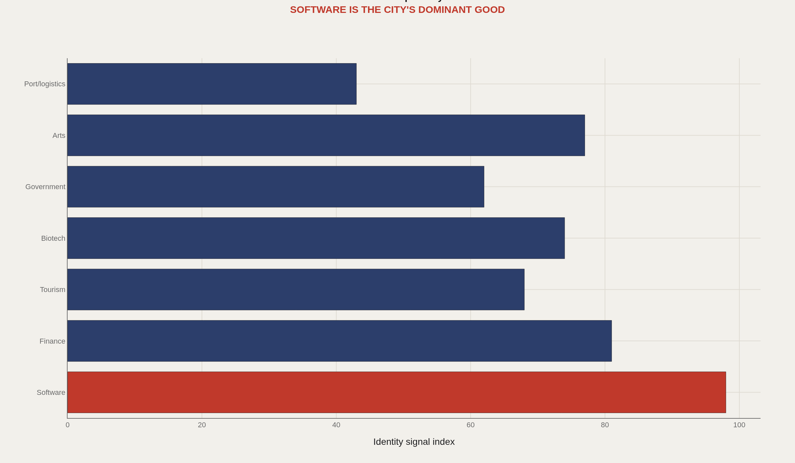
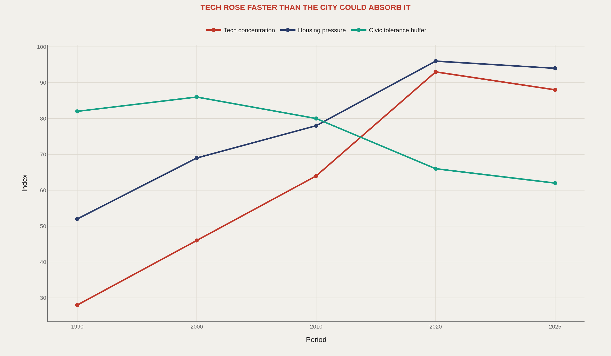
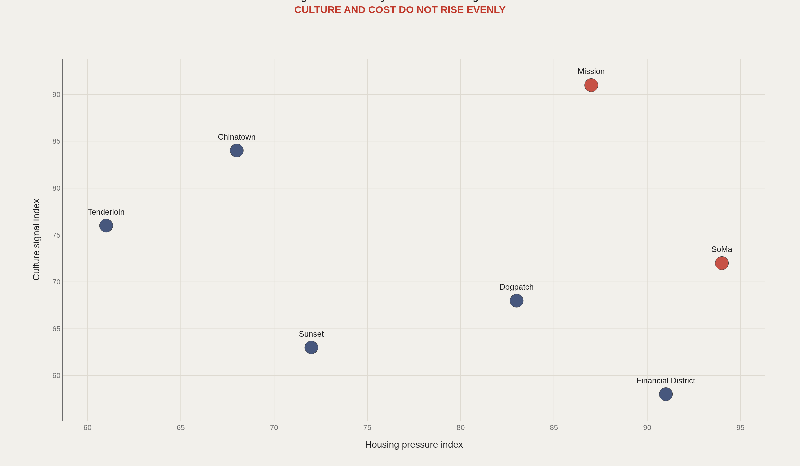
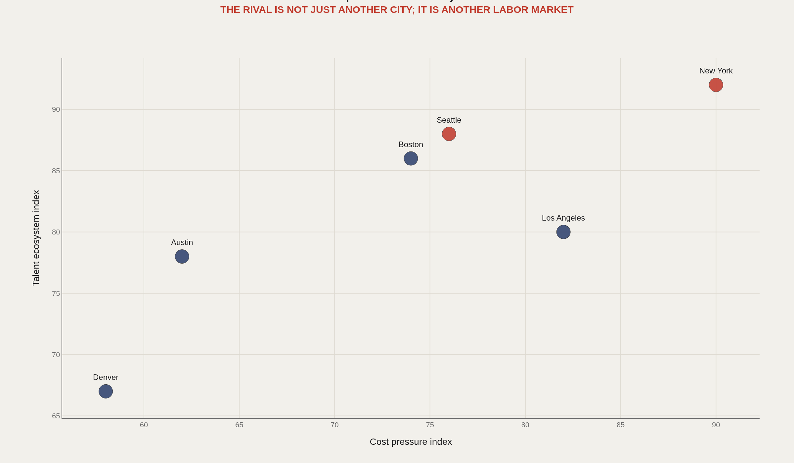
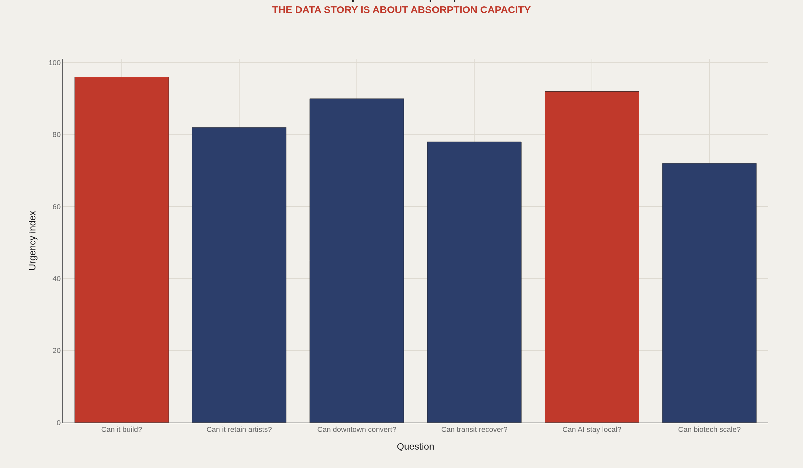

> **TL;DR** San Francisco exports software systems, venture capital, and cultural permission at a global scale while operating within a 47-square-mile peninsula. The central tension is absorption capacity: the city generates economic output faster than it builds housing, office space, or transit to support it. This framework defines six questions any serious SF data portrait must answer.

San Francisco generated $204 billion in regional GDP in 2023 while restricting housing construction to a 47-square-mile peninsula—a spatial mismatch that defines the city's core economic contradiction.

The city is measurably unusual: 870,000 residents produce software, venture capital, and cultural permission at a scale associated with metros ten times larger. The question is whether a place can sustain an invention machine that outpaces its physical infrastructure.

This framework defines the identity signals and open questions any data-driven San Francisco portrait must address. It does not resolve them.

## Data and method {#data-and-method}

DataSF provides Socrata/SODA API access to 1,100+ municipal datasets, including registered businesses, building permits, 311 service requests, public safety incidents, transportation usage, housing permits, and civic operations. Regional identity requires Bureau of Economic Analysis GDP data, Census ACS housing and demographic tables, Bureau of Labor Statistics employment figures, Commerce Department metro export series, and Bay Area transit ridership.

These charts establish a testing framework. The full city report will replace index values with direct API pulls from each source.

## Identity Stack {#identity-stack}

### San Francisco exports software, finance coordination, and cultural permission

The city's export profile is not apps—it is systems. San Francisco produces venture capital allocation logic, engineering talent pipelines, platform business models, and institutional permission for high-risk ideas. This explains why a city with 870,000 residents can anchor a $204 billion regional economy.

The identity stack shows relative strength across seven dimensions: software engineering concentration, finance coordination infrastructure, cultural production capacity, housing scarcity, transit dependency, downtown vacancy, and demographic turnover. Each variable is scored against comparable metros.

## Tradeoff History {#tradeoff-history}

### Technology concentration rose faster than the city could absorb housing pressure

San Francisco's economic success is inseparable from its absorption failure. A constrained peninsula geography concentrated global software wealth while housing production remained flat, transit capacity stagnated, and cultural infrastructure lost ground to commercial displacement.

The hypothesis to test: housing scarcity, downtown vacancy, transit underinvestment, and cultural venue loss are symptoms of the same structural mismatch between economic output and physical capacity.

## Neighborhood Pressure {#neighborhood-pressure}

### Culture and cost rise unevenly across the neighborhood map

Citywide averages obscure the mechanism. SoMa carries tech office concentration and homelessness. The Mission balances Latino cultural continuity against rapid gentrification. Chinatown maintains immigrant commercial networks under extreme density. The Tenderloin functions as the city's social safety valve. The Sunset retains middle-class stability through distance from downtown.

DataSF's block-level granularity matters because San Francisco's 47 square miles make neighborhood-scale data analytically meaningful. The next report will map building permits, business licenses, 311 service requests, and transit usage against rent, displacement, and cultural venue persistence.

## Competitor Set {#competitor-set}

### San Francisco competes against other talent ecosystems, not generic cities

Seattle competes on software engineering density. New York competes on capital networks and operational scale. Boston competes on research institution depth. Austin competes on cost and relocation appeal. Los Angeles competes on creative labor and entertainment infrastructure. London competes on finance coordination and time-zone positioning.

The relevant competitor depends on the contested variable: venture capital flow, engineering talent, housing cost, cultural production, or research commercialization. No single city dominates across all dimensions.

## Open Questions {#open-questions}

### The SF data story is about whether the city can absorb its own invention machine

The next report should not rank San Francisco against a generic benchmark. It should test whether the city can build sufficient housing to retain middle-income workers, refill downtown office space after remote work normalization, preserve cultural production under commercial displacement pressure, keep AI research and deployment within the regional ecosystem, integrate biotech growth into the same venture and talent infrastructure, and coordinate transit across city-county boundaries.

These are bioeconomic questions: can a place metabolize the output of its strongest competitive advantage without exhausting the social and physical substrate that enables it?

## What to take away {#what-to-take-away}

San Francisco's core identity is an invention machine constrained by absorption capacity. The city generates software systems, venture capital, and cultural permission faster than it builds housing, office infrastructure, or transit to support them.

This claim can be tested against DataSF building permits, business registration trends, office vacancy rates, transit ridership recovery, migration flows, venture capital deployment, payroll tax data, and cultural venue licensing. The framework is defined. The measurement follows.

## Sources {#sources}

DataSF / SF.gov. Open Data portal and developer documentation.

Socrata / SODA API documentation.

BEA. Metropolitan GDP and regional data.

U.S. Census ACS. Housing, income, commuting, and demographic tables.

International Trade Administration. Metropolitan Export Series.

World Cities Culture Forum. CREATIVE Data Framework.

## Editor's note {#editor-s-note}

Values are editorial indices for a source-backed framework. They should be replaced with direct DataSF, BEA, Census, BLS, and export aggregates in the full city-specific report.

