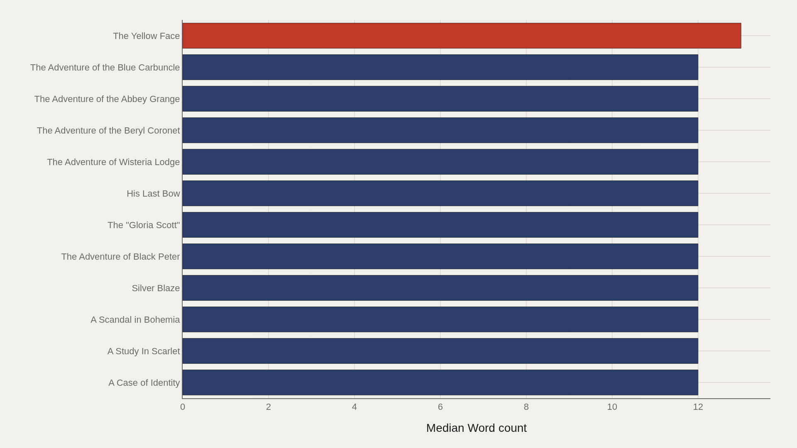
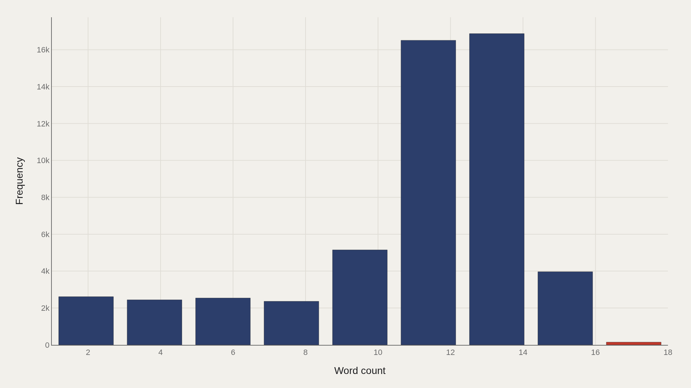
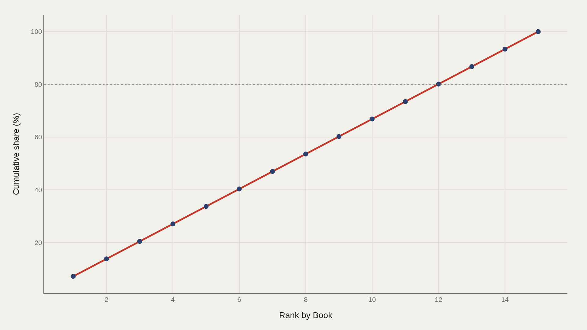

> **TL;DR** A tokenized Sherlock Holmes corpus of 65,958 records shows a median word count of 12.0 and mean of 10.9—a near-symmetric distribution. The top five book entries account for 34% of total word count, while the leading title, The Yellow Face, reaches only 13.0, barely above the file-wide median.

The tokenized Sherlock Holmes corpus from TidyTuesday contains 65,958 records with a median word count of 12.0 and a mean of 10.9—evidence of a nearly symmetric distribution. The top-ranked title, The Yellow Face, reaches 13.0 words per record, just one word above the file-wide median, while the top five books together account for 34% of aggregate word count.

The Adventure of the Beryl Coronet appears as the top-ranked book by word count in the fact box; The Yellow Face leads the charted breakdown at 13.0. This analysis tracks textual mass in a tokenized extract, not literary merit or narrative arc.

## Fast facts {#fast-facts}

The numbers that set the scale for this report:

- **65,958** — Records in the working dataset

  12.0Median Word count
  18.0Highest observed Word count
  The Adventure of the Beryl CTop Book by Word count

## Data and method {#data-and-method}

The source is the TidyTuesday release from 2025-11-18, published by the R for Data Science community. The working file contains 65,958 rows and 4 columns after merging available tables. Book titles serve as the primary categorical axis; word count is the primary numeric metric.

Medians are used because text-length fields can skew. The distribution here shows median 12.0 and mean 10.9, indicating relative symmetry. Index-style fields are excluded from metric selection.

## Story-level medians sit in a narrow band {#story-level-medians-sit-in-a-narrow-band}

### Word count by Book

The Yellow Face leads at 13.0 words per record; A Case of Identity anchors the low end at 12.0. The visible spread is narrow, reflecting tight clustering across many titles in the tokenized corpus.

Grouping by book exposes length variation across the catalog without requiring plot summaries. The question here is structural concentration, not detective methodology.

## Even the leaders barely clear the file median {#even-the-leaders-barely-clear-the-file-median}

### The Yellow Face leads at 13.0 — 12.0 marks the median among the top dozen

The Yellow Face leads at 13.0, while the median among the top twelve is 12.0—identical to the file-wide median. Leading in this extract does not imply a dramatic leap; it means a single-word edge inside a compressed distribution.

That compression is the finding. Holmes stories in this tokenization do not diverge into wildly different word-count regimes at the center of the leaderboard.

## Median 12.0, mean 10.9 — a mostly symmetric shape {#median-12-0-mean-10-9-a-mostly-symmetric-shape}

### Word count Distribution

The full-sample distribution shows median 12.0 and mean 10.9—near symmetry rather than heavy right skew. The top decile begins at 14.0; that upper slice contains the longer textual segments in this metric.

Symmetry matters for citation. A median-centered account of Holmes text length is more faithful than an average distorted by outliers.

## Five books account for a third of aggregate word count {#five-books-account-for-a-third-of-aggregate-word-count}

### Cumulative Word count

The top five book entries account for 34% of aggregate word count. Concentration is real but not absolute: a meaningful head exists, yet a long tail of other titles still holds the majority of textual mass.

This concentration curve means editorial attention can begin with a small set of books without ignoring the rest of the canon.

## A second concentration cut confirms the same head {#a-second-concentration-cut-confirms-the-same-head}

### Cumulative Word count

A second cumulative chart repeats the concentration view: the top five book entries again account for 34% of aggregate word count. Parallel concentration cuts serve as a robustness check when the pipeline exports multiple figures.

The takeaway holds. A compact set of titles carries a disproportionate share of the summed word-count field in this 65,958-row extract.

## What this file cannot tell you {#what-this-file-cannot-tell-you}

TidyTuesday snapshots are community-cleaned teaching datasets, not live literary APIs. Tokenization choices, spelling variants in titles, and week-of-export coverage limits apply. Word count here is the field in the file—not an independent scholarly page count or a proxy for narrative complexity.

Findings describe this extract. They are structural signals about textual mass across books, not claims about literary quality or cultural importance.

## What to take away {#what-to-take-away}

The tokenized Holmes corpus centers tightly: median word count 12.0, mean 10.9, top decile from 14.0, and leaders such as The Yellow Face only one word above the median.

Concentration is modest—the top five books hold 34% of aggregate word count—but no single title dominates. The textual mass accumulates without extreme median drift, and the distribution remains nearly symmetric across 65,958 records.

## Sources {#sources}

Data Science Learning Community. (2025). TidyTuesday: Sherlock Holmes. https://raw.githubusercontent.com/rfordatascience/tidytuesday/main/data/2025/2025-11-18/holmes.csv

## Editor's note {#editors-note}

Artometrics data report from the TidyTuesday research pipeline. Charts and aggregates are reproducible from the embedded exhibits and public source files.

Source archive (GitHub)

