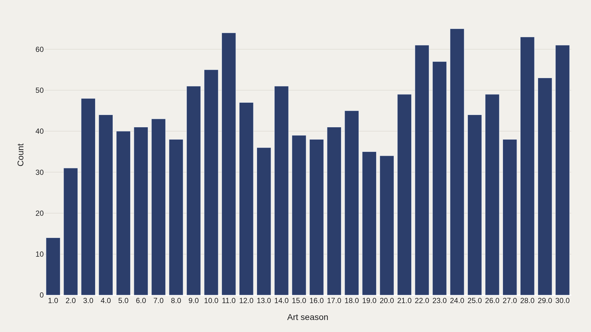
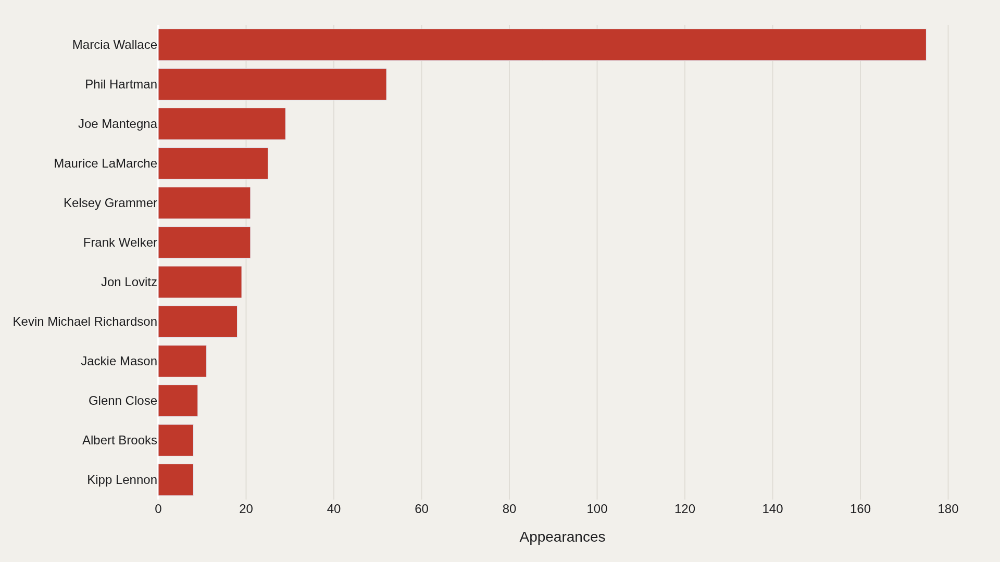
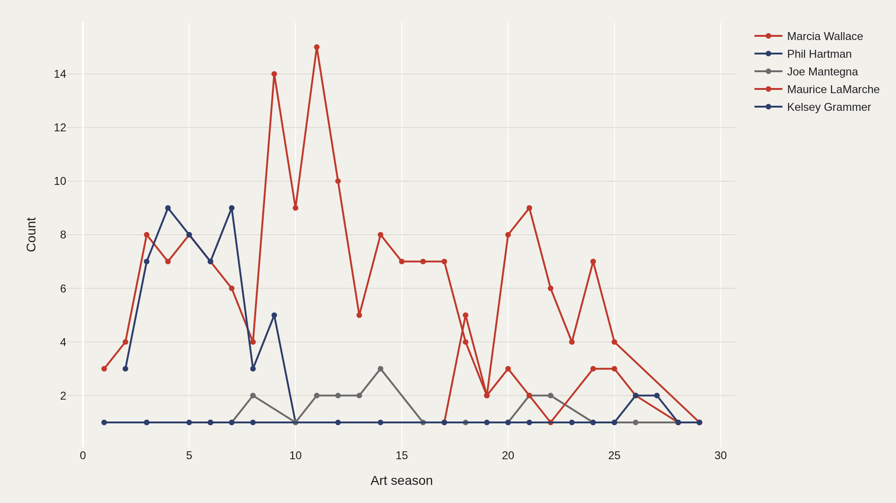
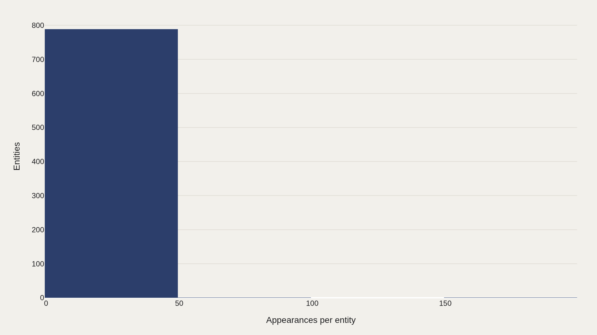
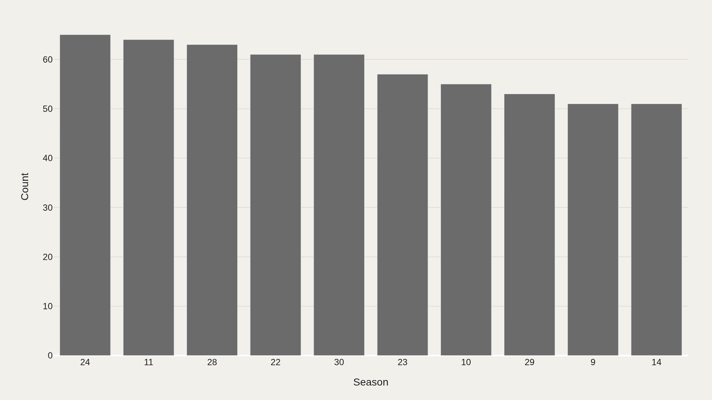

> **TL;DR** Marcia Wallace logged 175 guest appearances across 30 Simpsons seasons in the TidyTuesday dataset—2.7× more than the second-place performer. Season 24 recorded the highest guest density with 65 appearances, and most guest stars appeared only once.

Marcia Wallace logged 175 guest appearances across 30 Simpsons seasons—2.7× more than the second-place performer and the highest count in the TidyTuesday dataset released August 27, 2019.

The snapshot captures 1,381 guest records spanning Seasons 1–30. Season 24 recorded the highest guest density with 65 appearances, while most guests appeared only once.

## Data and method {#data-and-method}

The source is the TidyTuesday release from 2019-08-27 (R for Data Science community). This working file contains 1,381 rows and 7 columns after merging all available CSV/XLSX tables in the week folder.

Charts are exported as Plotly JSON with PNG fallbacks. Medians are used for robustness where distributions skew. Index-style fields (row numbers, sequential IDs) are excluded from metric selection.

## Volume {#volume}

### Records By Period

Activity peaks in Season 24 with 65 records.

Period-level counts reveal when guest-appearance frequency intensified.

## Who sits at the top {#who-sits-at-the-top}

### Top Guest star

Marcia Wallace appears 175 times—the most recurring name in the file.

The top dozen account for a visible share of all 1,381 rows.

## Timeline {#timeline}

### Leaders Over Time

The leading names do not move in lockstep—some fade as others surge.

Tracking counts over time separates sustained presence from one-season spikes.

## Frequency {#frequency}

### Most guest star entities appear only once; a small head revisits repeatedly

Most guest stars appear only once; a small cluster revisits repeatedly.

This power-law shape is typical of guest lists, credits, and catalog-style tables.

## Mix {#mix}

### 24 is the most repeated season in the extract

Season 24 is the most repeated season in the extract.

Secondary dimensions add context when the primary table has no numeric score column.

## What this file cannot tell you {#what-this-file-cannot-tell-you}

Community-cleaned TidyTuesday snapshots are not live APIs. Missing values, spelling variants, and week-of-export coverage limits apply. Merged tables may fan out or duplicate rows when join keys are imperfect.

Findings describe the file on hand—treat them as structural signals about Simpsons guest appearances, not exhaustive truth about the full domain.

## What to take away {#what-to-take-away}

Read as a teaching map, this dataset shows why one metric is rarely enough: leaders, tails, trends, and relationships each answer a different question about guest-appearance patterns.

The best reading is modest: use the chart to sharpen the question, then check the source and limits before turning it into a claim.

## Sources {#sources}

Data Science Learning Community. (2019). TidyTuesday: Simpsons Guest Stars. https://raw.githubusercontent.com/rfordatascience/tidytuesday/main/data/2019/2019-08-27/simpsons-guests.csv

