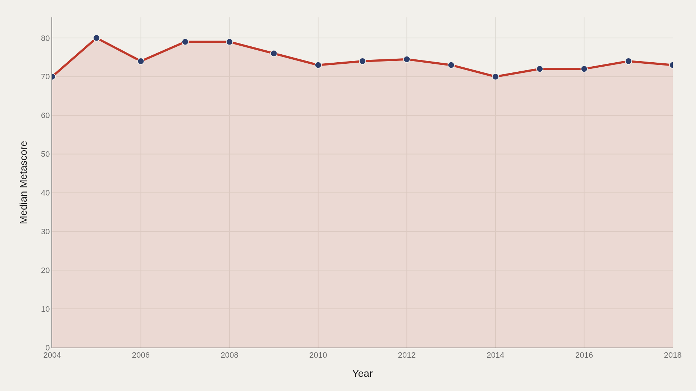
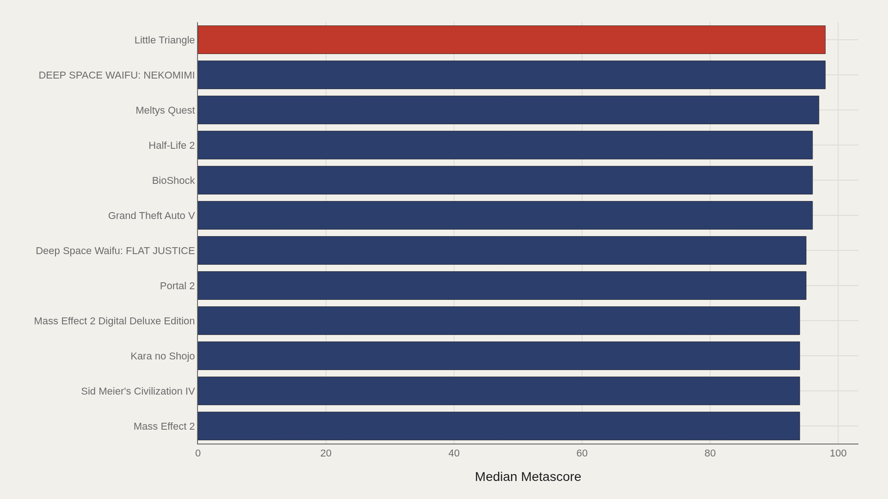
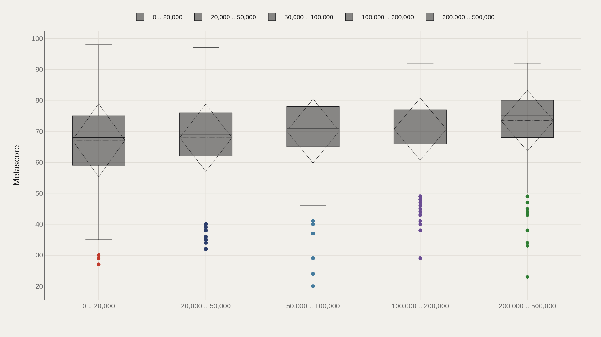
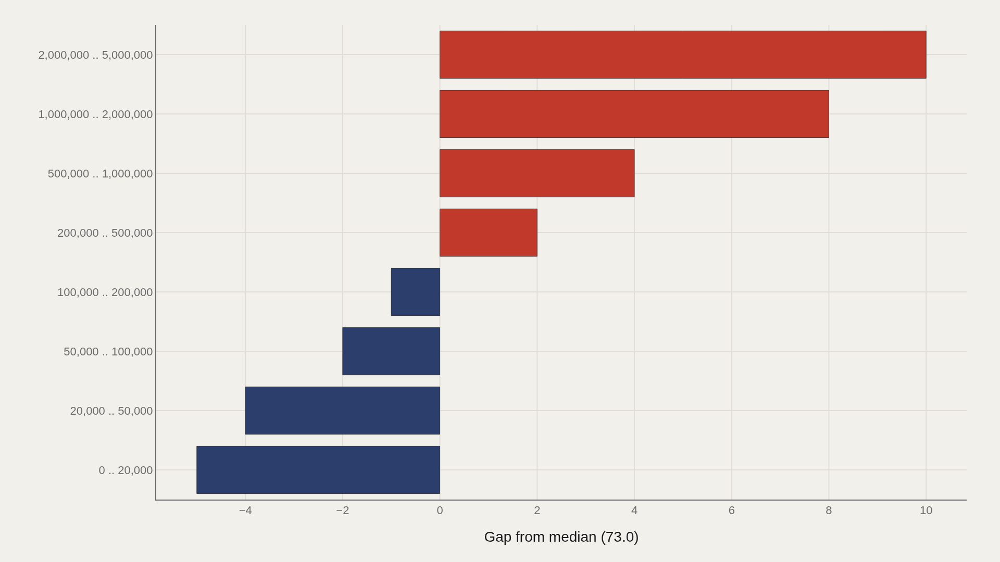
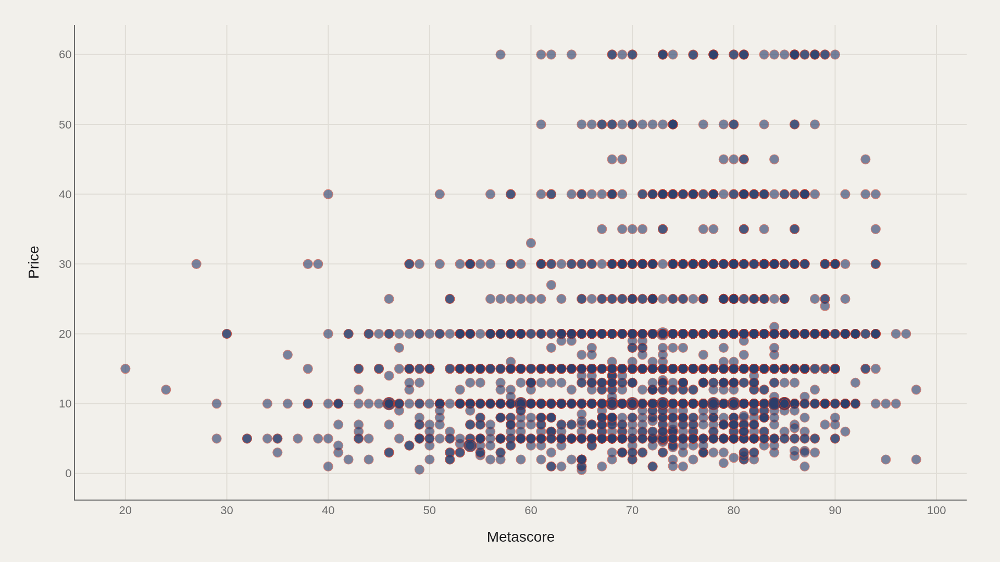

> **TL;DR** 26,688 Steam titles logged between 2004–2018 show median Metascore rising from 70.0 to 73.0. Games with 2–5 million owners score 10 points above the catalog median, while the smallest ownership tier trails by 5 points. Little Triangle leads at 98.0.

Median critic score for Steam titles rose from 70.0 in 2004 to 73.0 by 2018, while games with 2–5 million owners scored 10 points above the catalog median and the smallest-owner tier trailed by 5 points, according to 26,688 titles logged in the Steam Spy extract.

Metascore tracks critical consensus; owner tiers measure commercial reach. The catalog median of 73.0 divides the critically strong from the ordinary. Little Triangle leads at 98.0.

## Data and method {#data-and-method}

The source is the TidyTuesday release from 2019-07-30 (R for Data Science community). The working file contains 26,688 rows and 11 columns after merging available tables. Metascore is the primary metric; owners is the categorical size axis; price appears in the scatter. Medians are used because scores and prices both skew.

## Median Metascore edged up across the store's expansion years {#median-metascore-edged-up-across-the-store-s-expansion-years}

### Median Metascore Over Time

Median Metascore rose from 70.0 at period open to 73.0 at close — landing on the catalog median. The typical scored game ended the window three points higher than it began. A rising median reflects stronger releases, expanded critic coverage of titles receiving scores, or both.

## Little Triangle tops a tightly packed critical elite {#little-triangle-tops-a-tightly-packed-critical-elite}

### Little Triangle leads at 98.0 — 95.5 marks the median among the top dozen

Little Triangle leads at 98.0, while 95.5 marks the median among the top dozen. The elite band compresses near the ceiling — high scores clustered together rather than a lonely outlier. DEEP SPACE WAIFU: NEKOMIMI also appears among notable titles in the ranking rules used in fact boxes.

## Owner tiers carry different Metascore distributions {#owner-tiers-carry-different-metascore-distributions}

### Metascore by Owners

Games with millions of owners are not the same statistical population as the 0–20,000 band that dominates row counts. Boxes show whether Metascore consensus is shared or contested across popularity bands. Volume in the smallest owner bucket is a catalog fact; the boxes reveal how scores spread inside each ownership tier.

## Mid-million owner games clear the median; tiny audiences trail {#mid-million-owner-games-clear-the-median-tiny-audiences-trail}

### Metascore vs median by Owners

The 2,000,000–5,000,000 owners band sits 10.0 above the median; the 0–20,000 band trails by 5.00. Broader ownership tiers sit higher on Metascore relative to the catalog center than the sparsest shelf. That gap is an association, not proof that owners cause scores — but it is a citable structural pattern.

## Metascore and price form a joint market map {#metascore-and-price-form-a-joint-market-map}

### Metascore vs Price

Plotting Metascore against price shows clusters that averages erase — cheap high scores, expensive middling scores, and every bargain or premium pattern between. The scatter answers the storefront question: what combinations of critic score and sticker price actually appear in the 26,688-row extract.

## What this file cannot tell you {#what-this-file-cannot-tell-you}

TidyTuesday snapshots are not live Steam or Metacritic APIs. Missing Metascores, owner-band binning, price currency assumptions, and 2004–2018 coverage limits apply. Findings describe this Steam Spy extract — structural signals about Metascore, owners, and price — not a complete quality ranking of every game ever shipped.

## What to take away {#what-to-take-away}

Median Metascore rose from 70.0 to 73.0 across the 2004–2018 window; Little Triangle leads at 98.0. Games with 2–5 million owners sit 10 points above the catalog median, while the smallest ownership tier trails by 5 points. Metascore–price clusters show how critic standing and sticker price co-occur on the shelf.

## Sources {#sources}

Data Science Learning Community. (2019). TidyTuesday: Video Games Steam Spy. https://raw.githubusercontent.com/rfordatascience/tidytuesday/main/data/2019/2019-07-30/video_games.csv

## Editor's note {#editors-note}

Artometrics data report from the TidyTuesday research pipeline. Charts and aggregates are reproducible from the embedded exhibits and public source files.

Source archive (GitHub)

