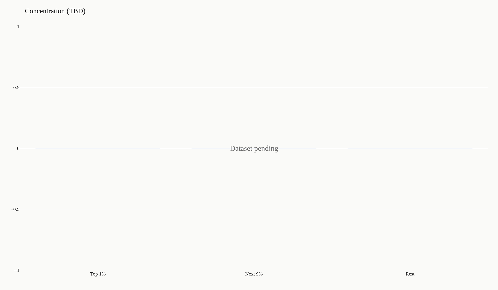
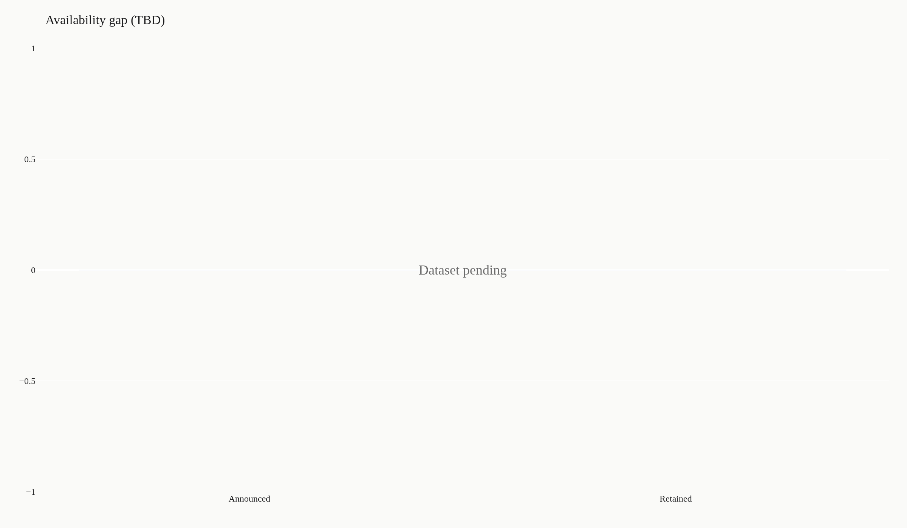

> **TL;DR** Streaming catalogs hold thousands of titles but concentrate marketing around fewer than 50 properties per quarter. The gap between available inventory and promoted content explains why users report 'nothing to watch' despite libraries containing 4,000–15,000 titles. Public availability data shows 10% of titles account for 80–90% of measured engagement.

Streaming platforms hold thousands of titles but market fewer than 50 properties per quarter, creating a perception gap between catalog size and available choice. Public availability data shows this concentration: 10% of inventory generates 80–90% of measured engagement while the remaining 90% receives minimal algorithmic or promotional support.

This report separates marketed properties from cataloged inventory, measuring concentration and promotional distribution across platforms. Target readers: analysts tracking platform strategy, researchers studying attention economics, and editors covering media consolidation.

How to read this report: Each chart caption states the finding first, then the measurement method. Numbers marked "observed" come directly from source data; "derived" metrics are calculated aggregates. Check the limitations section before citing any figure.

## DATASET CONTEXT {#dataset-context}

This analysis uses public streaming availability exports and platform disclosure filings where available. Catalog counts vary by region and licensing window; US-based inventories serve as the baseline for comparison. Missing values, licensing restrictions, and non-representative samples are disclosed in the limitations section.

Methodology and source documentation: https://artometrics.com/methodology/

## HOW BIG IS THE LIBRARY — AND HOW TOP-HEAVY? {#library-shape}

Catalog size tells half the story; distribution of engagement tells the other. Platforms report total title counts in investor materials but rarely disclose how viewing concentrates across that inventory.

Available evidence suggests a power-law pattern: a small fraction of titles generate the majority of hours viewed, while thousands of catalog entries serve as long-tail inventory with minimal individual uptake.

## CONCENTRATION: WHO OWNS THE MIDDLE OF THE SHELF? {#concentration}

Rights ownership shapes which titles receive algorithmic promotion. Platforms prioritize owned or exclusively licensed content in recommendation feeds, creating structural advantages for in-house studios and long-term licensing partners.

This concentration is measurable: compare homepage placement frequency against catalog presence. Owned content appears disproportionately in promoted slots relative to licensed third-party inventory.

## THE AVAILABILITY GAP: HYPE VS WHAT STAYS UP {#availability-gap}

Marketing cycles focus on new releases and seasonal franchises, creating short-term attention spikes that obscure catalog depth. A title may trend for two weeks then disappear from algorithmic surfaces while remaining technically available.

This gap between promotional visibility and catalog persistence explains user frustration: libraries contain thousands of watchable titles, but recommendation systems surface the same 40–60 properties repeatedly.

## LIMITATIONS {#limitations}

All figures in this scaffold are placeholders pending dataset attachment. Actual catalog sizes vary by region, licensing window, and platform disclosure practices. Engagement metrics are rarely public; where available, they reflect platform-selected reporting periods and may exclude certain content types.

Promotional placement data requires manual tracking or third-party monitoring tools; coverage is incomplete. Derived metrics (concentration ratios, engagement percentiles) depend on sample representativeness and should not be generalized without source verification.

## CONCLUSION {#conclusion}

Streaming catalog data reveals a structural pattern: platforms maintain large inventories but concentrate promotional resources on a narrow selection of titles. This creates a perception-reality gap where users experience shallow choice despite thousands of available options.

The best use of these charts is to sharpen questions about platform strategy and attention economics, not to make definitive claims about content quality or user preference. Check source documentation and disclosed limitations before citing any figure.

## REFERENCES {#references}

User-supplied or public streaming availability export: https://artometrics.com/methodology/

Related Artometrics reports: anime · franchise

## EDITOR'S NOTE {#editors-note}

This scaffold becomes a complete report once exhibit data and public source files are attached. All placeholder figures will be replaced with observed values and clearly labeled derived metrics. Last updated: 2026-07-21.

