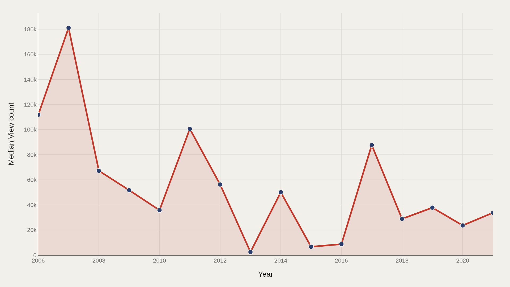
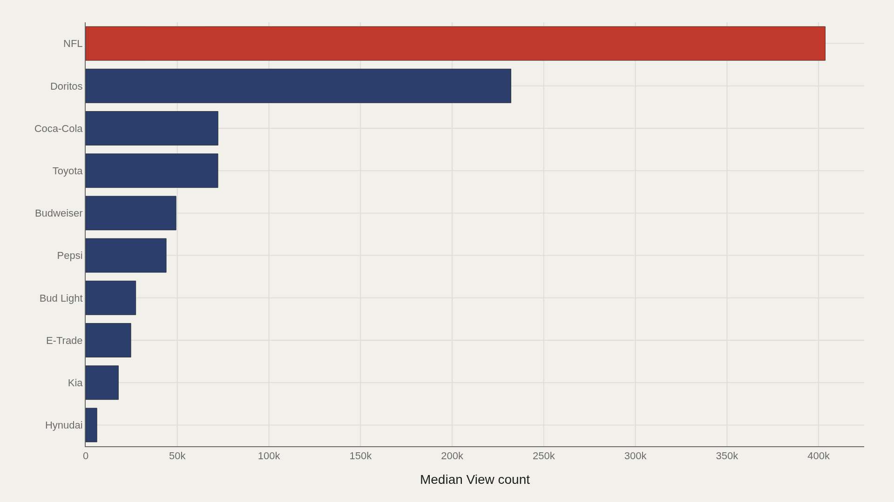
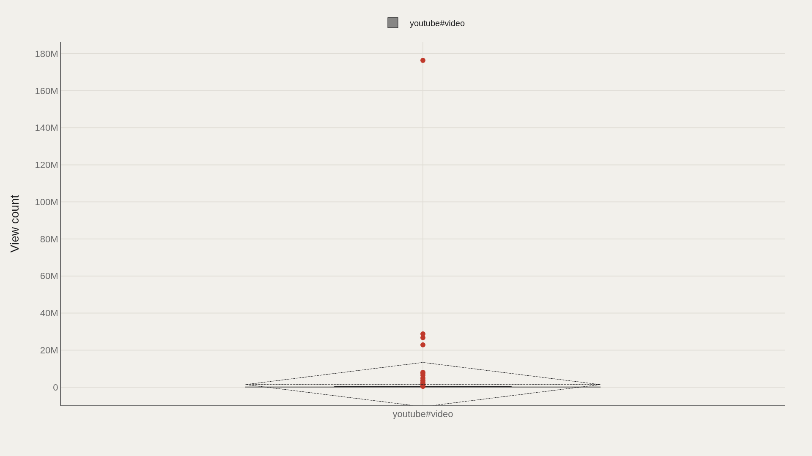
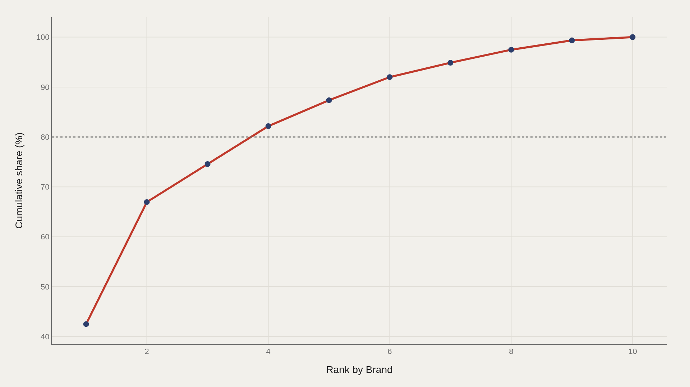
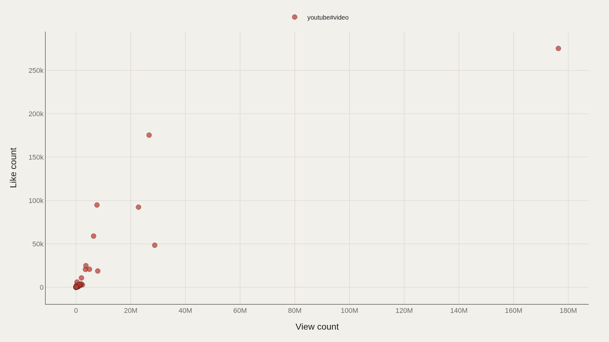

> **TL;DR** Super Bowl commercials live a second life on YouTube. In 247 uploads from 2006–2021, median views fell from 111,814 to 33,766 as the archive grew, while the ceiling hit 176,373,378. Five brands—NFL, Doritos, and three others—account for 87% of aggregate views.

Five brands capture 87% of all post-game Super Bowl ad views on YouTube, according to 247 uploads spanning 2006–2021. Median views fell from 111,814 to 33,766 as the archive expanded, but the ceiling reached 176,373,378—proof that a handful of commercials become folklore while most settle into inventory. NFL leads the top-twelve brand median at 403,641 views; Doritos ranks first in the full-file aggregation.

Post-game streaming attention operates as its own economy. Broadcast buys the first audience; YouTube decides which spots circulate for years. The dataset tracks that second life through trend, brand leaders, format distribution, concentration, and the relationship between views and likes.

## Fast facts {#fast-facts}

The numbers that set the scale for this report:

- **247** — Records in the working dataset

  41,379Median View count
  176,373,378Highest observed View count
  DoritosTop Brand by View count
  2006–2021Year span covered in the file
  youtube#videoMost common Kind

## Data and method {#data-and-method}

The source is the TidyTuesday release from 2021-03-02, maintained by the R for Data Science community. The working file contains 247 rows and 26 columns after merging available tables. View count is the primary metric; like count appears in the scatter analysis; brand and kind are the main categorical dimensions.

Medians are used throughout because ad view counts follow a power-law distribution—a few viral spots dwarf the typical upload. Index fields are excluded so charts describe attention patterns, not row order.

## Median views fell as the archive got denser {#median-views-fell-as-the-archive-got-denser}

### Median View count Over Time

Median view count fell from 111,814 in the earliest period to 33,766 at the end of the span. That decline does not signal deteriorating ad quality—it reflects the archive filling out with more ordinary uploads, pulling the center down while the ceiling remained stratospheric at 176,373,378.

The falling median and the fixed ceiling coexist because attention is power-law distributed: most ads cluster near the median, a few explode into viral territory.

## NFL leads the brand ladder on YouTube views {#nfl-leads-the-brand-ladder-on-youtube-views}

### NFL leads at 403,641 — 46,661 marks the median among the top dozen

NFL leads the top-twelve brands at 403,641 views; the median within that group sits at 46,661. Doritos remains the top brand in the full-file aggregation; the chart isolates the highest performers in this particular cut.

The gap between #1 and the top-dozen median shows how quickly the ladder drops. A few brands own the conversation; most of the competitive set operates closer to tens of thousands than hundreds of thousands.

## Almost everything in the file is a YouTube video {#almost-everything-in-the-file-is-a-youtube-video}

### View count by Kind

Splitting view count by format produces a near-monoculture: youtube#video is the dominant kind. The distribution confirms the archive's platform identity rather than revealing contested formats.

This matters for scope. The dataset tracks post-game internet lives of Super Bowl ads on YouTube, not a complete census of every commercial that aired during the broadcast.

## Five brands hold eighty-seven percent of aggregate views {#five-brands-hold-eighty-seven-percent-of-aggregate-views}

### Cumulative View count

The top five brands account for 87% of aggregate views—a steep Pareto curve. Post-game attention is not distributed evenly; a small group drives the bulk of summed engagement.

Concentration at this level explains why brand strategy obsesses over a handful of breakthrough spots. The long tail exists but does not move the aggregate the way the head does.

## Views and likes travel together — with clusters {#views-and-likes-travel-together-with-clusters}

### View count vs Like count

Plotting view count against like count reveals clusters that a single correlation coefficient would obscure. Some ads convert attention into likes efficiently; others accumulate views without the same approval signal.

The scatter maps how the two engagement measures co-move in this 247-row extract, not a quality ranking.

## What this file cannot tell you {#what-this-file-cannot-tell-you}

TidyTuesday snapshots are community-cleaned archives, not live YouTube APIs. View and like counts are frozen at export; missing values, brand spelling variants, and coverage gaps apply. Merged tables may duplicate or fan out rows when join keys are imperfect.

Findings describe this Super Bowl ads extract and its structural signals, not a comprehensive history of every commercial creative or every platform where ads circulated.

## What to take away {#what-to-take-away}

Post-game Super Bowl attention is concentrated: median views sit at 41,379, the ceiling reaches 176,373,378, and five brands capture 87% of aggregate views.

The falling median from 111,814 to 33,766 reflects archive expansion, not declining ad quality. NFL and Doritos-scale leaders anchor the archive's memory. Views and likes move together in clusters, which is how engagement looks when a few spots become folklore and most settle into inventory.

## Sources {#sources}

Data Science Learning Community. (2021). TidyTuesday: Super Bowl Ads. https://raw.githubusercontent.com/rfordatascience/tidytuesday/main/data/2021/2021-03-02/youtube.csv

## Editor's note {#editors-note}

Artometrics data report from the TidyTuesday research pipeline. Charts and aggregates are reproducible from the embedded exhibits and public source files.

Source archive (GitHub)

