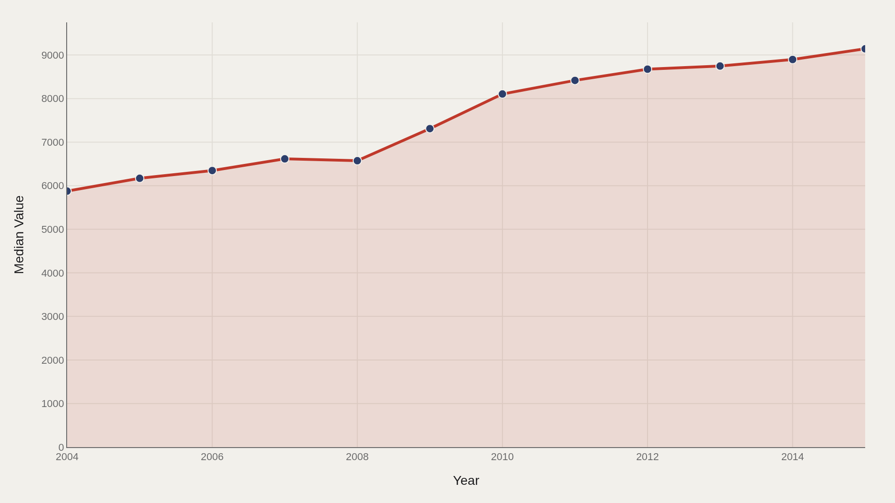
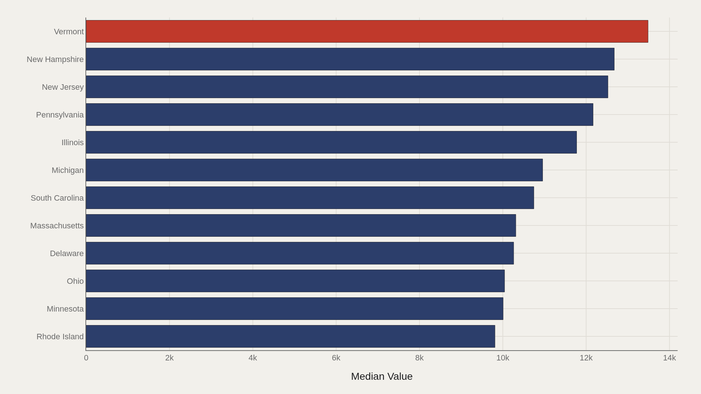
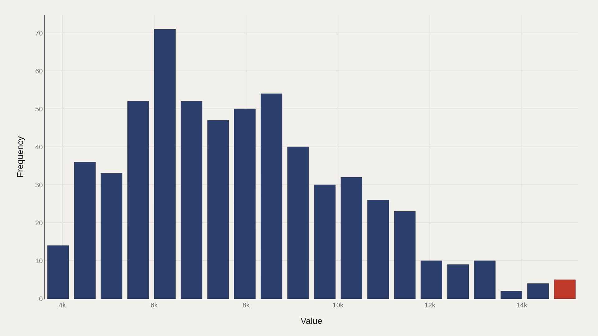
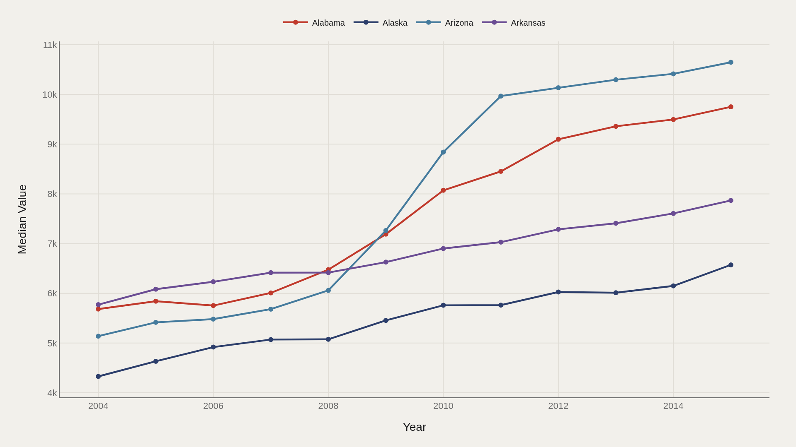
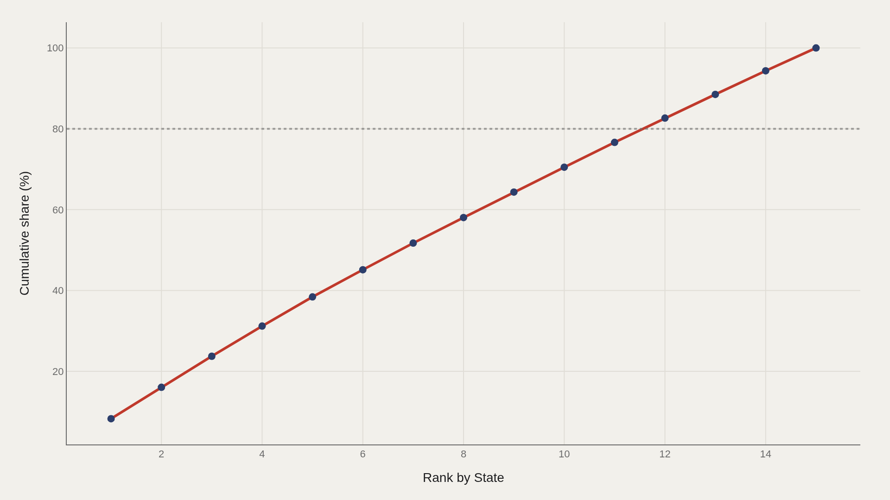

> **TL;DR** Median state tuition rose from $5,876 in 2004 to $9,141 in 2015—a 56% increase—while Vermont led the nation at $13,486. The top decile began at $11,204, and five states accounted for 38% of aggregate tuition value across 600 state-year observations.

Median state tuition rose from $5,876 in 2004 to $9,141 in 2015—a 56% increase—across 600 state-year observations. Vermont led at $13,486, the top decile began at $11,204, and five states held 38% of aggregate tuition value.

The median of $7,607 anchors the distribution. Vermont's lead, the climb from baseline to close, and the $11,204 top-decile threshold all measure distance from that center.

## Data and method {#data-and-method}

The source is the TidyTuesday release from 2018-04-02 (R for Data Science community). The working file contains 600 rows and 3 columns after merging available tables. Value is the tuition metric; state is the entity axis; year spans 2004–2015.

Medians are preferred for skewed price distributions. The file reports a mean of $7,899 against the median of $7,607—relatively close, confirming modest skew.

## Median tuition climbed from the mid-five-thousands to the low-nine-thousands {#median-tuition-climbed-from-the-mid-five-thousands-to-the-low-nine-thousands}

### Median Value Over Time

Median tuition rose from $5,876 in 2004 to $9,141 in 2015. The typical state moved upward across the period, and no year showed a reversal.

A rising median signals shared experience. High-cost states amplify the climb; low-cost states still participate in the upward shift.

## Vermont leads the state ladder in the charted cut {#vermont-leads-the-state-ladder-in-the-charted-cut}

### Vermont leads at 13,486 — 10,850 marks the median among the top dozen

Vermont leads at $13,486; the median among the top dozen states is $10,850. New Hampshire ranks second in the fact-box summary; the leaders chart shows the full numeric ladder.

The gap from first place to the top-dozen median confirms a competitive but elevated upper tier—expensive relative to the file median of $7,607.

## Median and mean sit close; the top decile starts above eleven thousand {#median-and-mean-sit-close-the-top-decile-starts-above-eleven-thousand}

### Median 7,607 vs mean 7,899 — the shape is relatively symmetric

Median $7,607 versus mean $7,899—the distribution is relatively symmetric for a price series. The top decile begins at $11,204; high-tuition states occupy that upper slice.

Near-symmetry at the center does not erase the expensive tail. It confirms the typical state is not distorted by extreme outliers in the average.

## Leading states do not move in lockstep over time {#leading-states-do-not-move-in-lockstep-over-time}

### Top State Over Time

Leader trajectories diverge—some states fade while others surge. Tracking medians over time separates sustained high-price states from one-off spikes.

Side-by-side paths matter when the policy question is whether expensive states stay expensive or the ladder reshuffles.

## Five states account for thirty-eight percent of aggregate value {#five-states-account-for-thirty-eight-percent-of-aggregate-value}

### The top 5 state entries account for 38% of the aggregate value

The top five state entries account for 38% of aggregate tuition value. Concentration is meaningful without being absolute: a visible head and a broader set of states carrying most of the remaining total.

Pareto steepness reminds us that national tuition debates often orbit a minority of high-cost states even when the median tells a quieter story.

## What this file cannot tell you {#what-this-file-cannot-tell-you}

TidyTuesday snapshots are not live College Board or IPEDS APIs. Missing values, state naming variants, and 2004–2015 coverage limits apply. Tuition definitions follow the source file's value field.

Findings describe this extract—structural signals about state price levels and trends—not net-price analysis after aid.

## What to take away {#what-to-take-away}

State tuition rose from $5,876 to $9,141 at the median, centered on $7,607, with an expensive tail beginning at $11,204 in the top decile.

Vermont led at $13,486, five states held 38% of aggregate value, and leader trajectories diverged—a price map of public higher education's mid-2000s to mid-2010s climb.

## Sources {#sources}

Data Science Learning Community. (2018). TidyTuesday: US Tuition Costs. https://raw.githubusercontent.com/rfordatascience/tidytuesday/main/data/2018/2018-04-02/us_avg_tuition.xlsx

## Editor's note {#editors-note}

Artometrics data report from the TidyTuesday research pipeline. Charts and aggregates are reproducible from the embedded exhibits and public source files.

Source archive (GitHub)

