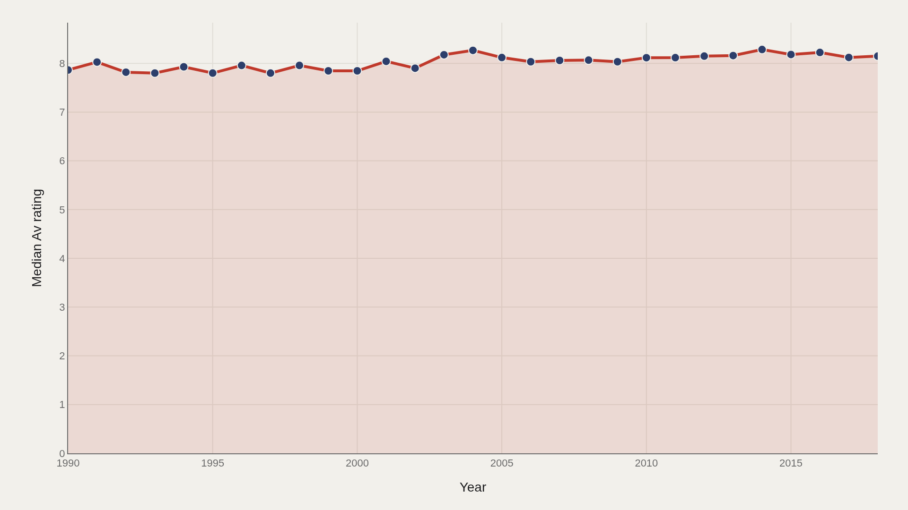
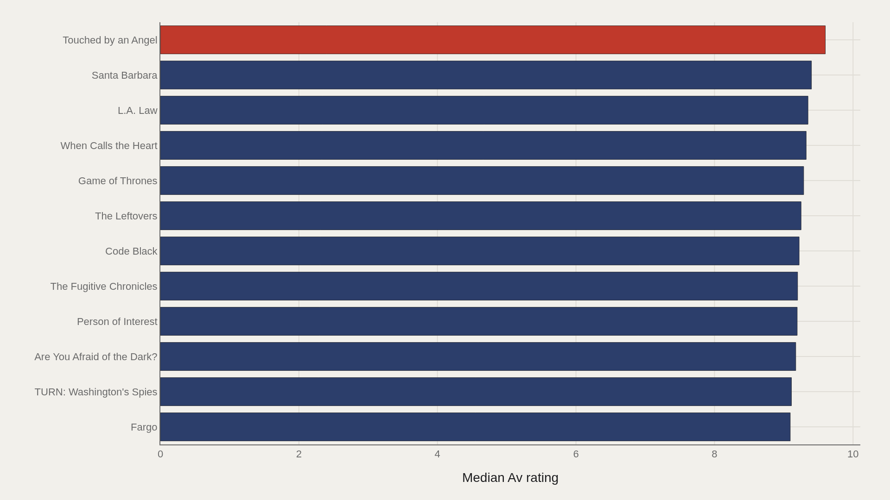
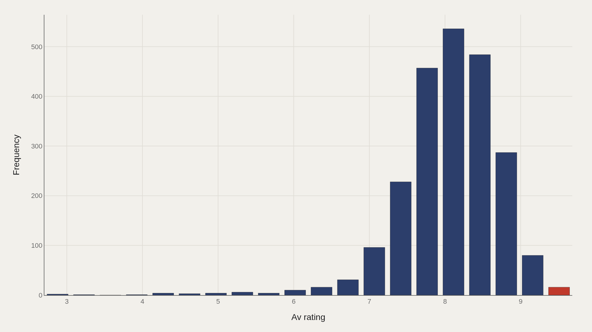
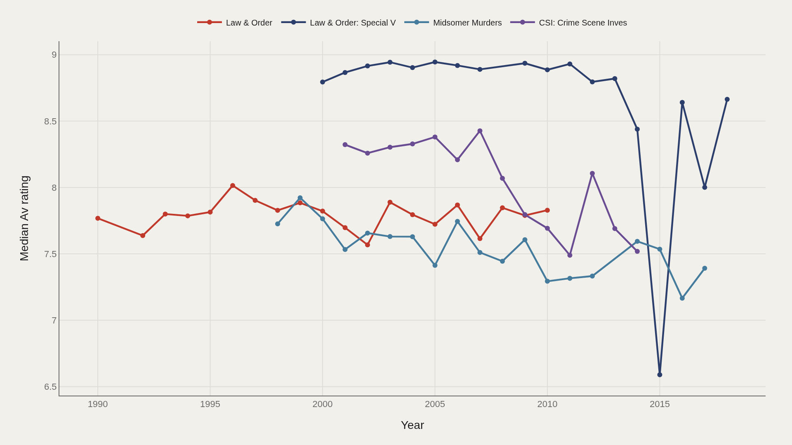
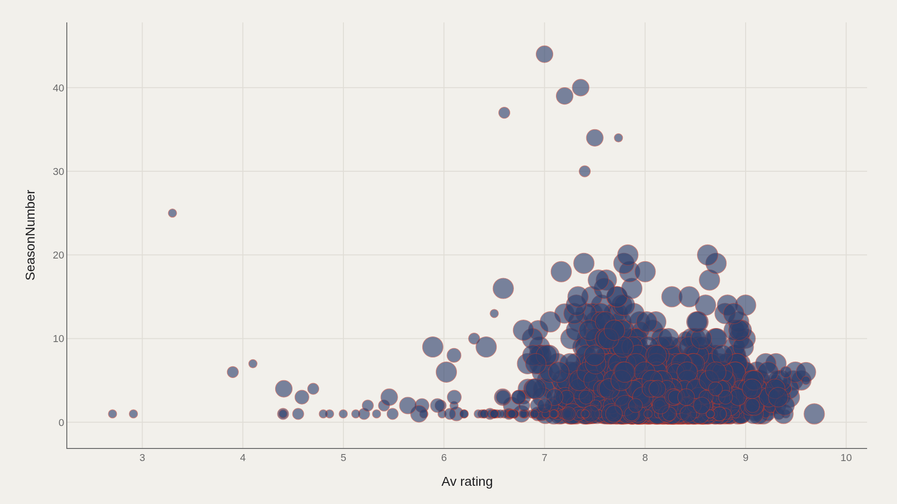

> **TL;DR** The median TV season rating rose from 7.86 to 8.15 between 1990 and 2018—a 0.29-point gain that suggests the "golden age" raised the floor more than it crowned new peaks. Among 2,266 records, the overall median stood at 8.11, while the top decile began at 8.79. Touched by an Angel led at 9.60, but the distribution skewed less sharply than golden-age rhetoric implies.

Median season ratings rose 0.29 points—from 7.86 to 8.15—between 1990 and 2018, raising the typical show's score without the sharp elite-vs-mediocrity split that golden-age rhetoric promised.

The working file holds 2,266 records from 1990–2018. Median average rating is 8.11; the highest observed average is 9.68. Parenthood leads the title ranking in the extract.

## Fast facts {#fast-facts}

The numbers that set the scale for this report:

- **2,266** — Records in the working dataset

  8.11Median Av rating
  9.68Highest observed Av rating
  ParenthoodTop Title by Av rating
  1990–2018Year span covered in the file

## Data and method {#data-and-method}

The source is the TidyTuesday release from 2019-01-08 (R for Data Science community)—the IMDb/Economist TV ratings extract. The working file contains 2,266 rows and 8 columns after merging available tables in the week folder.

Charts export as Plotly JSON with PNG fallbacks. Medians handle skew; season numbers join ratings so longevity can be plotted against score.

## How the pattern changed over time {#how-the-pattern-changed-over-time}

### Median Av rating Over Time

Median average rating rises from 7.86 in the opening period to 8.15 at the close—a 0.29-point climb that describes the typical row, not the headline cases.

The middle of the scoreboard edged upward while prestige TV became a cultural brand. That is not the same shape as an explosion of elite outliers.

## Who sits at the top {#who-sits-at-the-top}

### Touched by an Angel leads at 9.60 — 9.24 marks the median among the top dozen

Touched by an Angel leads at 9.60; 9.24 marks the median among the top dozen. The head of the board is densely packed at the high end.

High averages can reflect passionate rater pools as much as critical consensus. Read the leaders as the file's ceiling, then compare them to the 8.11 median that describes the typical row.

## How the field is spread {#how-the-field-is-spread}

### Av rating Distribution

Median 8.11 versus mean 8.06—the shape is nearly symmetric. The top decile begins at 8.79; that tail is where defining cases live.

A symmetric prestige-TV scoreboard contradicts the thin-elite-versus-wide-mediocrity story. The distribution is tighter than golden-age rhetoric suggests.

## Leader Trends {#leader-trends}

### Top Title Over Time

Leading names do not move in lockstep—some fade as others surge.

Tracking medians over time separates sustained dominance from one-off spikes. A peak season is not the same data shape as a long plateau above 8.

## What moves together {#what-moves-together}

### Av rating vs SeasonNumber

Average rating and season number show clusters that a single summary would erase—early-season highs, late-season drift, and shows that hold the middle across many seasons.

Longevity and quality are related but not identical. The scatter is where that distinction becomes visible.

## What this file cannot tell you {#what-this-file-cannot-tell-you}

Community-cleaned TidyTuesday snapshots are not live APIs. Missing values, spelling variants, and week-of-export coverage limits apply. Merged tables may fan out or duplicate rows when join keys are imperfect.

Findings describe the file on hand—structural signals about prestige-TV ratings through 2018, not a complete canon of the streaming era that followed.

## What to take away {#what-to-take-away}

The median climbed 0.29 points—from 7.86 to 8.15—while the overall middle stayed near 8.11. A raised floor, not a sudden leap. Leaders near 9.6 and a top decile from 8.79 show how much room remains above the typical row.

Read trends, distribution, and season scatter together before treating any single title as proof that critics and audiences agreed.

## Sources {#sources}

Data Science Learning Community. (2019). TidyTuesday: TV Golden Age. https://raw.githubusercontent.com/rfordatascience/tidytuesday/main/data/2019/2019-01-08/IMDb_Economist_tv_ratings.csv

