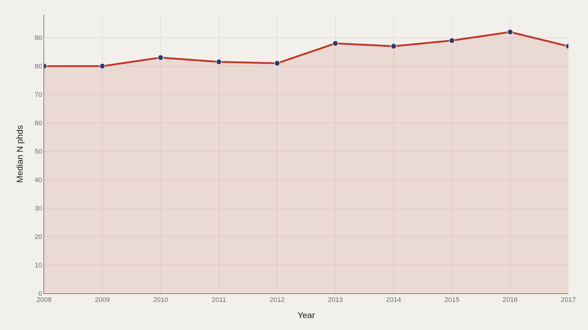
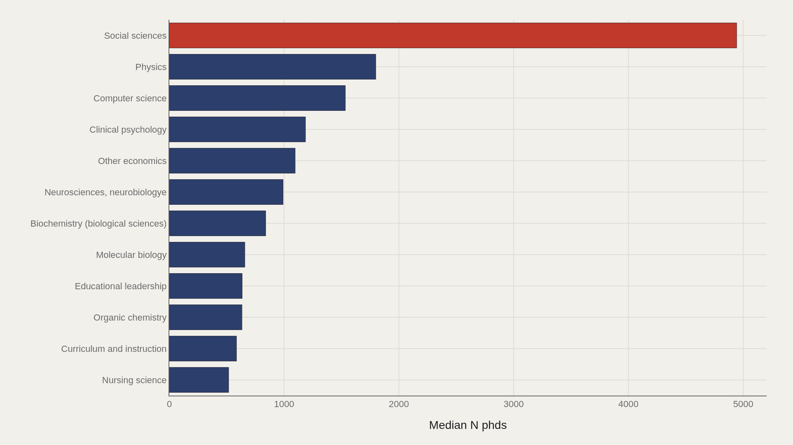
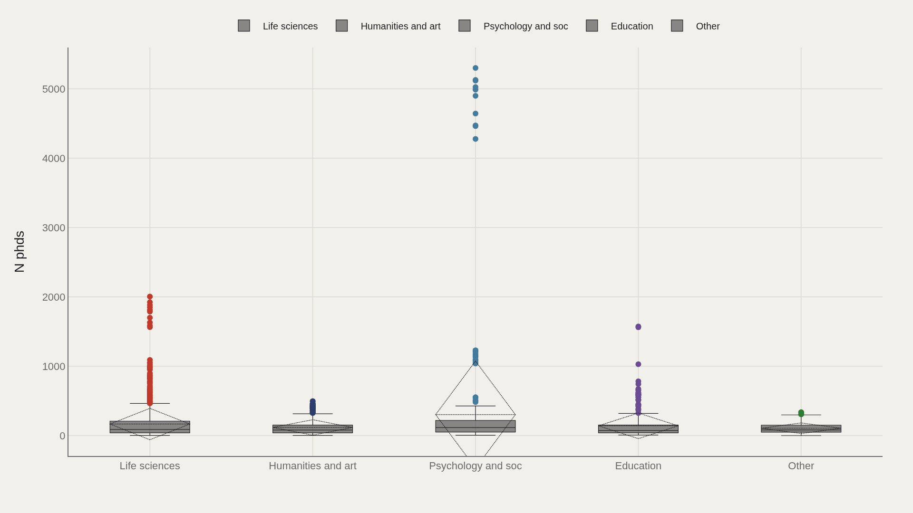
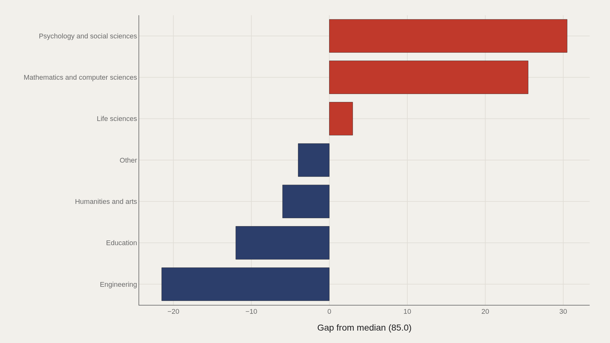
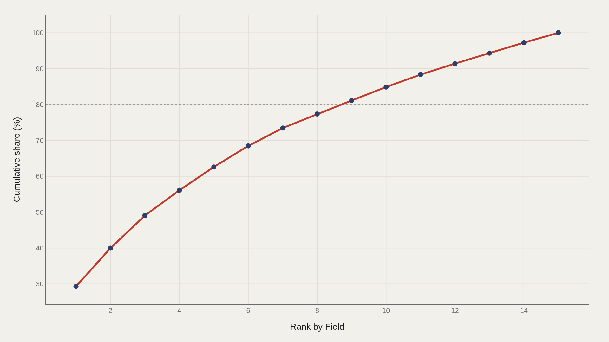

> **TL;DR** Five U.S. doctorate fields produced 63% of all PhDs awarded between 2008 and 2017. Social sciences led at 4,944 degrees; the median field awarded 85. Psychology and social sciences ran 30.5 above the national median; engineering trailed by 21.5.

Five U.S. doctorate fields produced 63% of all PhDs awarded between 2008 and 2017. Social sciences led at 4,944 degrees; the median field awarded 85. Psychology and social sciences ran 30.5 above the national median; engineering trailed by 21.5. Concentration is extreme: the typical program remains small while a handful of disciplines drive aggregate output.

The question is which disciplines grew and which stagnated when doctorate production is measured field by field, year by year. Medians prevent outlier programs from skewing every comparison.

## Fast facts {#fast-facts}

The numbers that set the scale for this report:

- **3,370** — Records in the working dataset

  85.0Median N phds
  5,302Highest observed N phds
  Social sciencesTop Field by N phds
  2008–2017Year span covered in the file
  Life sciencesMost common Broad field

## Data and method {#data-and-method}

The source is the TidyTuesday release from 2019-02-19 (R for Data Science community). The working file contains 3,370 rows and 6 columns after merging available tables. N phds is the primary metric; broad field is the main categorical axis.

Medians are used because field sizes skew. Index-style fields are excluded. Charts track trend, leaders, distribution, gaps to the median, and concentration across fields.

## Median doctorate counts edged upward across the decade {#median-doctorate-counts-edged-upward-across-the-decade}

### Median N phds Over Time

Median output rose from 80 in the opening period to 87 at the close—a modest climb around the file median of 85. The typical field-year produced slightly more doctorates by the end of the window than at the start.

A rising median does not mean uniform growth. Leader fields can surge while smaller programs stall; the trend chart reports the center, not every discipline's path.

## Social sciences lead the field ladder {#social-sciences-lead-the-field-ladder}

### Social sciences leads at 4,944 — 915 marks the median among the top dozen

Social sciences led at 4,944 PhDs in the leaders cut, while 915 marked the median among the top dozen. The gap between first place and the top-dozen median shows how quickly the ladder drops even inside the upper tier.

Life sciences appeared among the broad-field landmarks. The chart makes the numeric gap concrete.

## Broad fields do not share one output band {#broad-fields-do-not-share-one-output-band}

### N phds by Broad field

Category boxes by broad field show whether doctorate counts are shared or contested across disciplinary families. Psychology and social sciences, engineering, life sciences, and others occupy different parts of the distribution.

Boxes are the right tool when fields differ in scale. A single national median of 85 hides those family-level spreads.

## Psychology and social sciences clear the median; engineering trails {#psychology-and-social-sciences-clear-the-median-engineering-trails}

### N phds vs median by Broad field

Psychology and social sciences sat 30.5 above the median; engineering trailed by 21.5. Those signed gaps convert broad-field boxes into distance from the file center.

Trailing the median is not a quality judgment. It is a statement about relative volume in this extract's n phds metric.

## Five fields hold most of the aggregate doctorates {#five-fields-hold-most-of-the-aggregate-doctorates}

### Cumulative N phds

The top five field entries accounted for 63% of aggregate n phds. Concentration is high: a small set of fields drove most of the summed doctorate output in the file.

Steep Pareto curves mean capacity and attention cluster. The long tail of smaller fields still matters for the ecosystem, but it does not dominate the total.

## What this file cannot tell you {#what-this-file-cannot-tell-you}

Community-cleaned TidyTuesday snapshots are not live NSF Survey of Earned Doctorates APIs. Missing values, field-name variants, and 2008–2017 coverage limits apply. Merged tables may fan out or duplicate rows when join keys are imperfect.

Findings describe this U.S. PhDs extract—structural signals about doctorate counts by field—not a full labor-market forecast or ranking of program quality.

## What to take away {#what-to-take-away}

Doctorate output in this file centered on a median of 85, edged up from 80 to 87 over the window, and concentrated heavily: five fields held 63% of aggregate n phds.

Social sciences led the upper ladder, psychology and social sciences sat well above the median, and engineering trailed it—a volume map of disciplines, not a prestige contest.

## Sources {#sources}

Data Science Learning Community. (2019). TidyTuesday: US PhDs Awarded. https://raw.githubusercontent.com/rfordatascience/tidytuesday/main/data/2019/2019-02-19/phd_by_field.csv

## Editor's note {#editors-note}

Artometrics data report from the TidyTuesday research pipeline. Charts and aggregates are reproducible from the embedded exhibits and public source files.

Source archive (GitHub)

