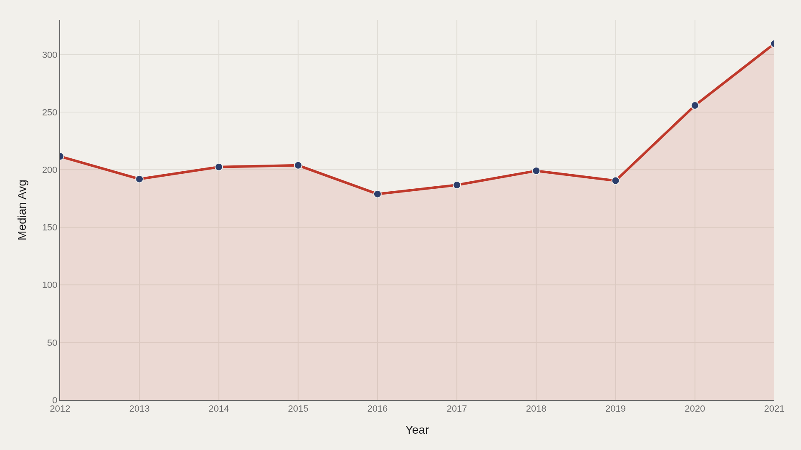
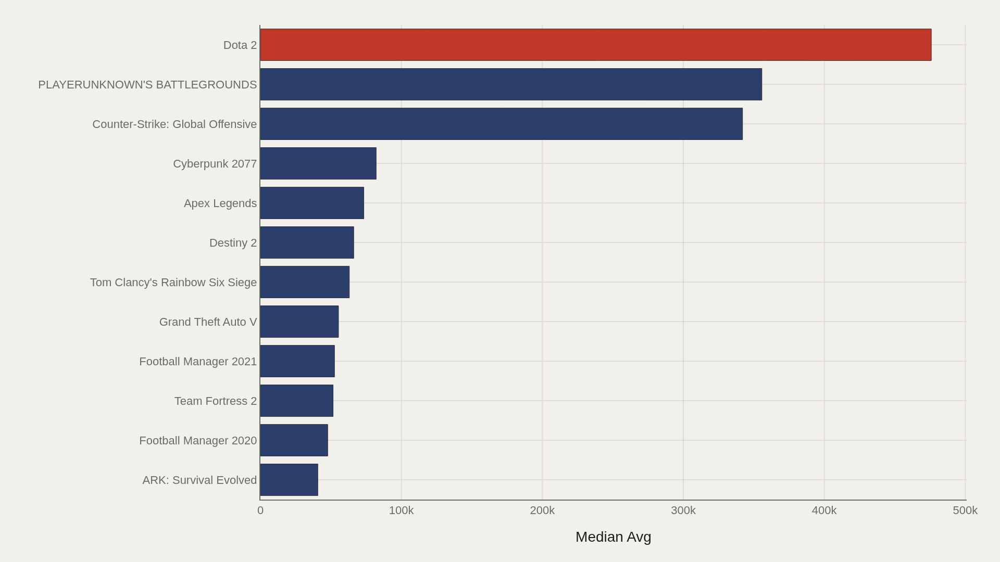
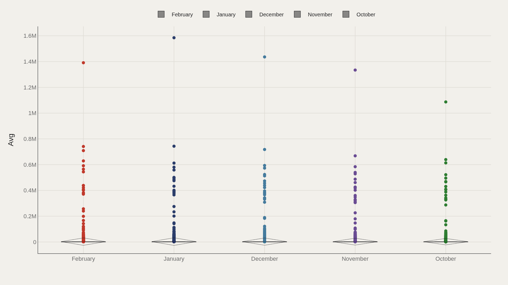
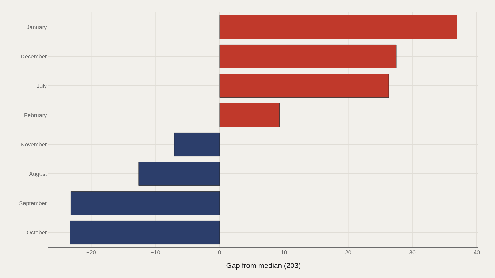
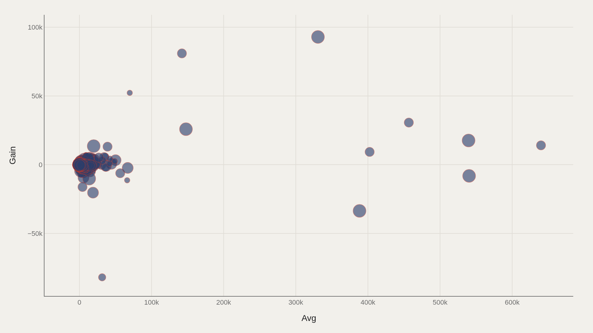

> **TL;DR** The TidyTuesday 2021-03-16 video-games extract contains 83,631 Steam title-months from 2012 through 2021. Median average concurrent players (Avg) rose from 212 to 309, a 46 % climb, while the file median sits at 203. Dota 2 leads at 475,924 Avg; the highest single observation reaches 1,584,887. January runs 36.9 above the median; October trails by 23.3.

Median average concurrent players on Steam rose from 212 to 309 between 2012 and 2021, a 46 % climb that still leaves the typical title-month at 203 in an 83,631-row extract. Dota 2 leads at 475,924 Avg — 7.4 times the top-twelve median — and the file's single highest observation reaches 1,584,887. January runs 36.9 above the median; October trails by 23.3.

The file is the TidyTuesday 2021-03-16 video-games release, merged from community-cleaned Steam player-count snapshots. Charts trace the median's climb, rank the leaders by Avg, map month offsets, and plot Avg against Gain to show how level and change co-occur in a long-tailed market.

## Fast facts {#fast-facts}

The numbers that set the scale for this report:

- **83,631** — Records in the working dataset

  203Median Avg
  1,584,887Highest observed Avg
  PLAYERUNKNOWN'S BATTLEGROUNDTop Gamename by Avg
  2012–2021Year span covered in the file
  FebruaryMost common Month

## Data and method {#data-and-method}

The source is the TidyTuesday release from 2021-03-16, published by the R for Data Science community. The working file contains 83,631 rows and 8 columns after merging available tables. Avg is the primary metric; Gain appears in scatter analysis; month and game name are categorical axes.

Medians replace means because player counts follow a power-law distribution. Index fields are excluded from aggregation.

## Median concurrency climbed across the decade {#median-concurrency-climbed-across-the-decade}

### Median Avg Over Time

Median Avg rises from 212 at the series open to 309 at the close, crossing above the file median of 203 midway through the period. The 46 % gain reflects either platform growth, survivor bias among tracked titles, or both.

The chart reports the center's path. Individual titles distribute around that median in ways the trend line does not capture.

## Dota 2 leads a top tier that drops off fast {#dota-2-leads-a-top-tier-that-drops-off-fast}

### Dota 2 leads at 475,924 — 64,656 marks the median among the top dozen

Dota 2 leads at 475,924 Avg, 7.4 times the top-twelve median of 64,656. The gap from first to the elite-tier median defines the live-service economy: a few titles sustain city-scale populations; the rest of the top dozen are large but operate in a different order of magnitude.

The file's highest single Avg — 1,584,887, appearing in the PLAYERUNKNOWN'S BATTLEGROUNDS record set — sits above even the charted leaders, marking the extreme ceiling of the distribution.

## Months carry different concurrency distributions {#months-carry-different-concurrency-distributions}

### Avg by Month

Box plots by month reveal whether Avg spreads uniformly or clusters around distinct medians across the calendar. Seasonal launches, holidays, and school schedules can shift who is online.

February's frequency in the file is a coverage fact, not a player-count claim; the boxes measure dispersion within each month, not record volume.

## January clears the median; October trails {#january-clears-the-median-october-trails}

### Avg vs median by Month

January sits 36.9 above the file median; October trails by 23.3. Those signed offsets convert the calendar into a comparable scale against the center, revealing structural month effects in this extract.

The offsets are not proof of a universal gaming season — coverage dates, launch windows, and sample composition all shape the pattern — but they are concrete enough to cite when asking when concurrency runs hot or cold in this snapshot.

## Avg and Gain form a joint cloud of winners and churn {#avg-and-gain-form-a-joint-cloud-of-winners-and-churn}

### Avg vs Gain

Plotting Avg against Gain reveals clusters that medians erase: high average with stable gain is a different audience story from high average with volatile gain, and low average with positive gain signals a trajectory invisible in rank tables.

The scatter maps how level and change co-occur across the 83,631 title-months, showing the joint distribution that single-metric summaries cannot capture.

## What this file cannot tell you {#what-this-file-cannot-tell-you}

Community-cleaned TidyTuesday snapshots are not live SteamCharts APIs. Missing values, title variants, and 2012–2021 coverage limits apply. Merged tables may fan out or duplicate rows when join keys are imperfect, inflating counts.

Avg and Gain are the metrics as defined in the source tables. Findings describe concurrency structure in this extract, not complete commercial P&L for every title or the full Steam catalog.

## What to take away {#what-to-take-away}

The file median of 203 Avg anchors an 83,631-row distribution that rose from 212 to 309 at the median between 2012 and 2021, a 46 % climb. Dota 2 leads at 475,924, 7.4 times the top-twelve median, and the single highest observation reaches 1,584,887.

January sits 36.9 above the median; October trails by 23.3. Avg–Gain scatter plots show how level and momentum travel together in a long-tailed live-service market where a few titles capture city-scale audiences and the typical game serves hundreds.

## Sources {#sources}

Data Science Learning Community. (2021). TidyTuesday: Video Games. https://raw.githubusercontent.com/rfordatascience/tidytuesday/main/data/2021/2021-03-16/sliced-tidytuesday.csv

## Editor's note {#editors-note}

Artometrics data report from the TidyTuesday research pipeline. Charts and aggregates are reproducible from the embedded exhibits and public source files.

Source archive (GitHub)

