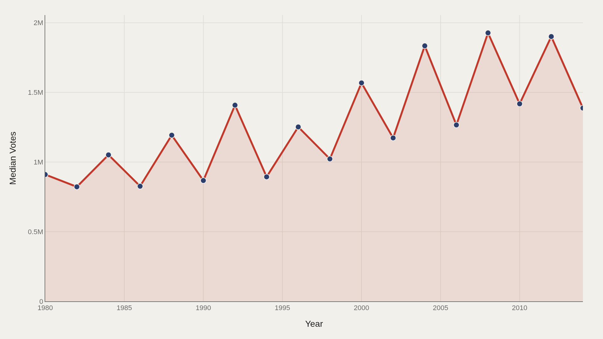
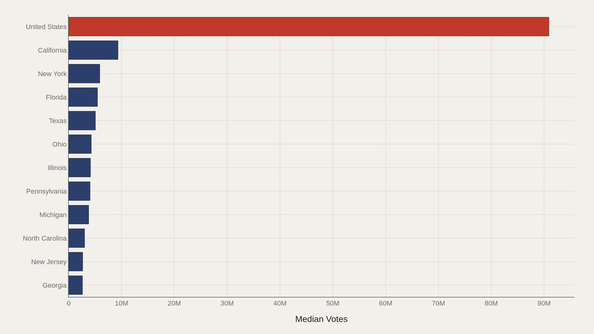
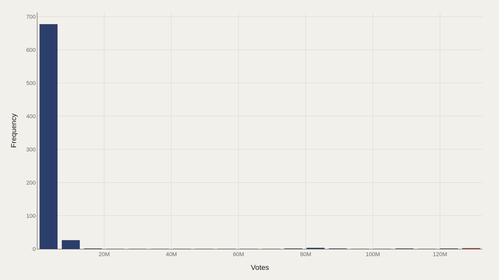
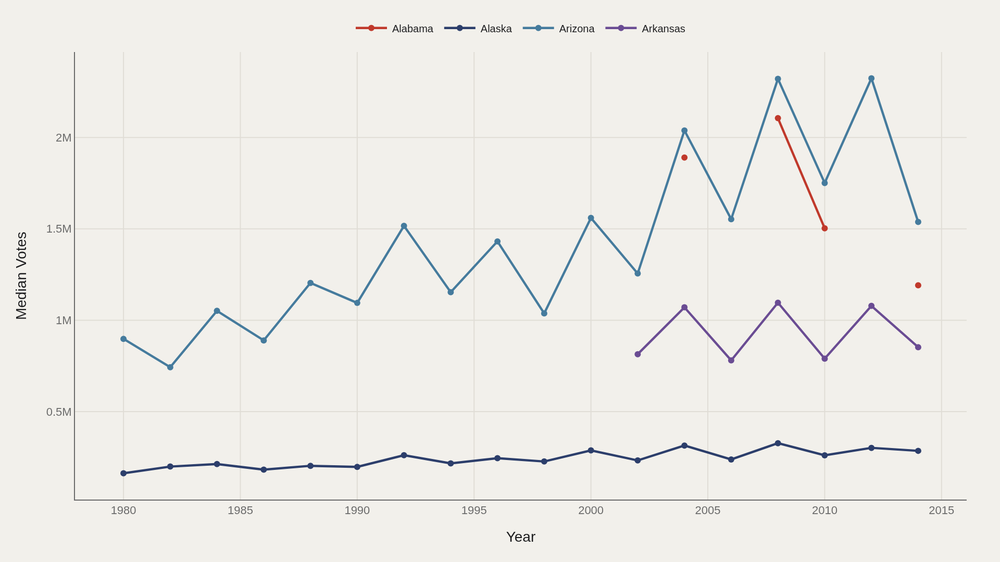
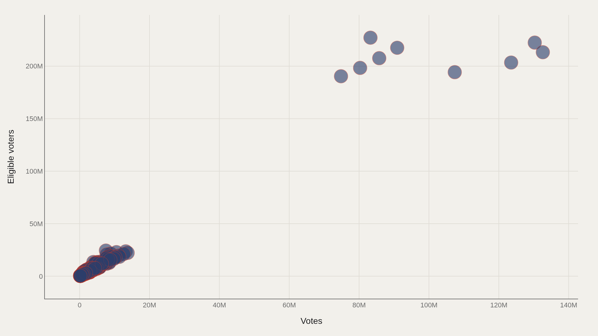

> **TL;DR** National turnout reached 132,609,063 in 2014 while the median state recorded 1,170,867 votes, according to 936 election records from 1980–2014. The national aggregate appears as a separate entity in the dataset, sitting 113 times higher than the typical state. Median state turnout rose 52% from 910,290 to 1,387,622 over the period.

National turnout reached 132,609,063 in 2014 while the median state recorded 1,170,867 votes, according to 936 election records from 1980–2014. The national aggregate appears as a separate entity in the dataset, sitting 113 times higher than the typical state.

Five charts separate trend, leaders, distribution shape, state trajectories, and the relationship between votes cast and eligible voters. The median of 1,170,867 divides smaller states below from larger electorates and national totals above.

## Data and method {#data-and-method}

The source is the TidyTuesday release from 2018-10-09 (R for Data Science community). The working file contains 936 rows and 7 columns after merging available tables. Votes is the primary metric; eligible voters appears in the scatter plot; state and national totals form the entity axis.

Median turnout is the central measure because vote totals are right-skewed: mean of 3,074,280 versus median of 1,170,867. Large states and the national aggregate pull the average upward.

## Median votes rose across three decades of elections {#median-votes-rose-across-three-decades-of-elections}

### Median Votes Over Time

Median state turnout rose 52% from 910,290 in 1980 to 1,387,622 in 2014. Population growth, eligibility expansion, and election-type composition all contribute to the upward trend.

The rising median provides context for state-level comparisons: leader states and national totals amplify the trend, while smaller jurisdictions track within the shifting distribution.

## The United States total dwarfs the state ladder {#the-united-states-total-dwarfs-the-state-ladder}

### United States leads at 90,912,015 — 4,209,538 marks the median among the top dozen

The national aggregate averages 90,912,015 votes across the period, while the median among the top dozen states sits at 4,209,538. The national row represents the sum of all state turnout, not a peer comparison.

The peak of 132,609,063 reflects this national-scale aggregation. Individual state rankings occur far below that ceiling.

## A right-skewed distribution with a heavy upper tail {#a-right-skewed-distribution-with-a-heavy-upper-tail}

### Median 1,170,867 vs mean 3,074,280 — the shape is right-skewed

Median state turnout of 1,170,867 sits below the mean of 3,074,280 because large states and national totals create a long right tail. The top decile begins at 4,659,000, separating high-volume states from the rest.

Right skew explains why turnout analysis requires medians and rates rather than raw averages alone.

## Leading states reshuffle across election cycles {#leading-states-reshuffle-across-election-cycles}

### Top State Over Time

State trajectories diverge over time: some maintain high turnout while others surge or fade. Tracking individual states separates sustained volume from cycle-specific spikes.

Presidential versus midterm composition within the dataset can shift the state ladder even when the overall median rises.

## Votes scale with eligible voters — in clusters {#votes-scale-with-eligible-voters-in-clusters}

### Votes vs Eligible voters

Votes cast rise with eligible-voter pools, but the scatter plot reveals clusters that averages obscure. Larger eligibility produces larger turnout, yet the pattern's texture shows variation in how tightly that relationship holds across states and years.

The joint distribution captures turnout as a rate problem without requiring a calculated rate column: eligibility and votes move together, and the clusters show where exceptions occur.

## What this file cannot tell you {#what-this-file-cannot-tell-you}

TidyTuesday snapshots are community-cleaned extracts, not live election records. Missing values, jurisdiction-naming variants, and 1980–2014 coverage limits apply. National and state rows coexist in ways that require care when ranking.

Findings describe this voter-turnout extract — structural patterns in vote totals — not a complete model of registration law, suppression, or mobilization.

## What to take away {#what-to-take-away}

Median state turnout rose 52% from 910,290 to 1,387,622 between 1980 and 2014, while the national aggregate reached 132,609,063 at its peak. Vote totals are right-skewed around the median of 1,170,867, with the top decile beginning at 4,659,000.

State rankings shift across election cycles, and votes track eligible-voter pools in clusters — a volume atlas of American elections across 35 years.

## Sources {#sources}

Data Science Learning Community. (2018). TidyTuesday: US Voter Turnout. https://raw.githubusercontent.com/rfordatascience/tidytuesday/main/data/2018/2018-10-09/voter_turnout.csv

## Editor's note {#editors-note}

Artometrics data report from the TidyTuesday research pipeline. Charts and aggregates are reproducible from the embedded exhibits and public source files.

Source archive (GitHub)

