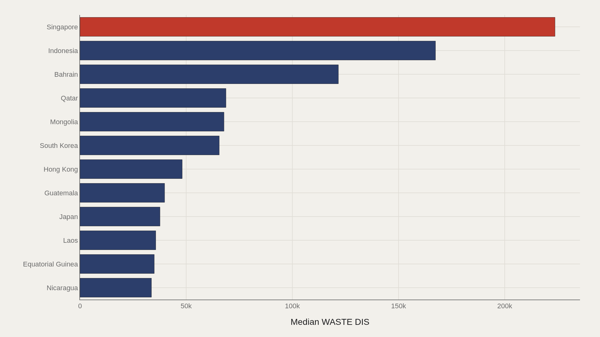
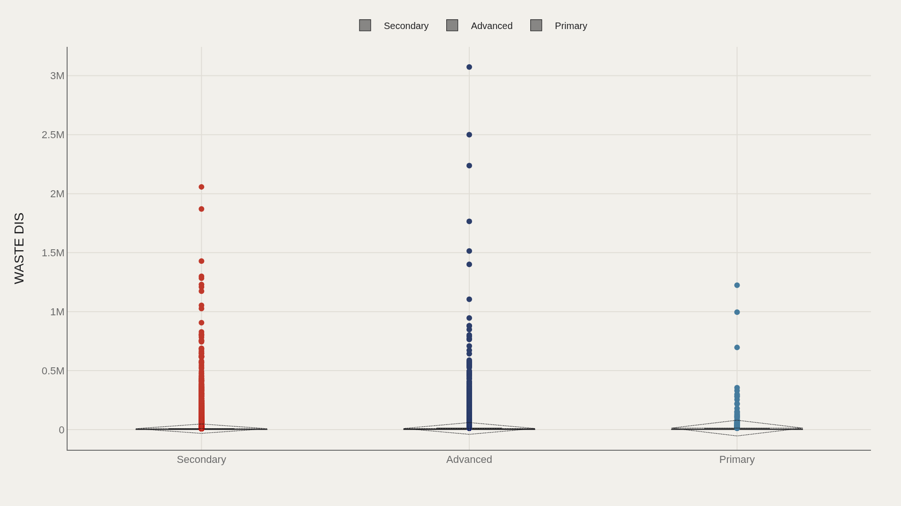
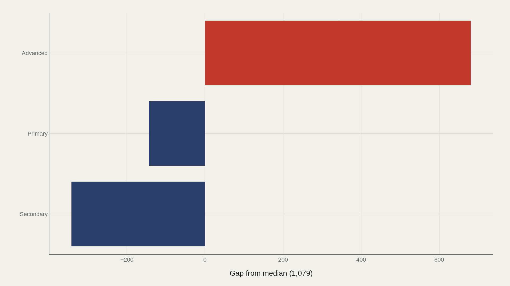
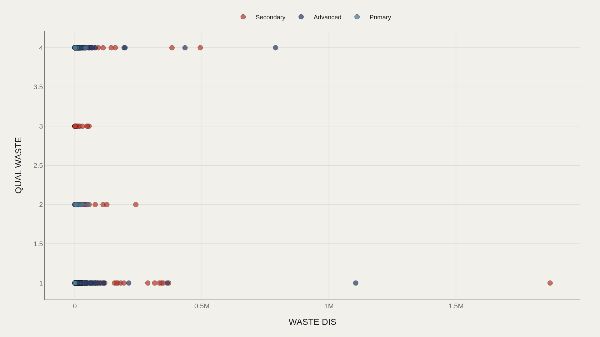

> **TL;DR** Median wastewater discharge across 58,502 facilities is 1,079 m³/day; Singapore's plants average 223,683, while one U.S. facility exceeds 3 million. Secondary treatment dominates headcount, but advanced plants run 681 m³/day above the median—a mix of technology tier and urban scale.

Median wastewater discharge across 58,502 facilities is 1,079 m³/day; Singapore's plants average 223,683, while one U.S. facility exceeds 3 million—a 2,800× spread that maps density, infrastructure investment, and the uneven geography of treatment reporting.

The TidyTuesday extract from September 2022 covers 58,502 plants worldwide. Median waste discharge (WASTE DIS) is 1,079 m³/day; the maximum exceeds 3,073,754. The United States leads aggregate discharge due to reporting volume, while Secondary treatment is the most common level label by count.

Scale without treatment tier is incomplete: a large plant with advanced filtration is a different civic asset from a large plant stuck at primary or secondary standards.

## Data and method {#data-and-method}

The source is the TidyTuesday release from 2022-09-20 (R for Data Science community). The working file contains 58,502 rows and 25 columns after merging country, treatment level, discharge, and quality fields.

Medians handle skew from a handful of enormous plants. Charts export as Plotly JSON with PNG fallbacks. Status labels—operational, proposed, decommissioned—matter: not every row is an active facility.

## Discharge by country {#breakdown}

### WASTE DIS by COUNTRY

Country rollups place high-intensity systems in view. Singapore leads near 223,683 m³/day on average plant discharge, while Nicaragua sits near 33,649—a reminder that averages mix plant size, urban concentration, and reporting coverage.

The United States leads aggregate discharge by facility count, not per-plant intensity. Large federations with many logged plants dominate totals even when median plants elsewhere run bigger.

## Who sits at the top {#who-sits-at-the-top}

### Singapore leads at 223,683 — 56,849 marks the median among the top dozen

Among the top dozen countries by intensity, Singapore leads at 223,683 m³/day, and the median of that group is 56,849—far above the file-wide median of 1,079.

Dense city-states and highly instrumented reporting systems rise on these lists. The ranking reflects what gets measured and attributed as much as what flows through pipes.

## Treatment levels spread discharge {#how-the-field-is-spread}

### WASTE DIS by LEVEL

Category boxes by treatment level—secondary, advanced, and related labels—show whether discharge norms are shared or split across tiers. Secondary dominates headcount; advanced plants can dominate intensity.

The civic stakes: upgrading level without changing plant counts can shift environmental outcomes more than building another median-sized secondary facility.

## Who beats the median — and who trails {#who-beats-the-median-and-who-trails}

### WASTE DIS vs median by LEVEL

Advanced treatment sits 681 m³/day above the median; Secondary trails by 342. The direction fits only if advanced plants are often larger urban facilities, not merely cleaner ones.

Level labels encode technology and city scale. Reading the gap as a pure quality ranking without plant-size context overfits the moral and underfits the engineering.

## Discharge and quality fields {#what-moves-together}

### WASTE DIS vs QUAL WASTE

Plotting waste discharge against quality scores reveals clusters that averages erase. Some plants combine high discharge with strong quality marks; others pair modest discharge with weaker flags.

The scatter is where big and good stop being synonyms. Infrastructure policy needs both axes: capacity to serve population, and treatment quality sufficient for receiving water.

## What this file cannot tell you {#what-this-file-cannot-tell-you}

Community-cleaned TidyTuesday snapshots are not live APIs. Missing values, spelling variants, and uneven national reporting apply. Proposed or non-operational plants can sit beside active ones if status filters are imperfect.

Discharge units and quality fields are HydroWASTE-derived attributes in the release—not a substitute for local permit databases or real-time effluent monitoring.

## What to take away {#what-to-take-away}

Wastewater is a skewed industry: median discharge near 1,079 m³/day, extremes above three million, and country totals dominated by large reporting systems such as the United States.

The citable distinction is treatment level versus size. Secondary is common; advanced sits 681 m³/day above the median; quality and discharge together decide whether a plant is merely large or actually protective.

## Sources {#sources}

