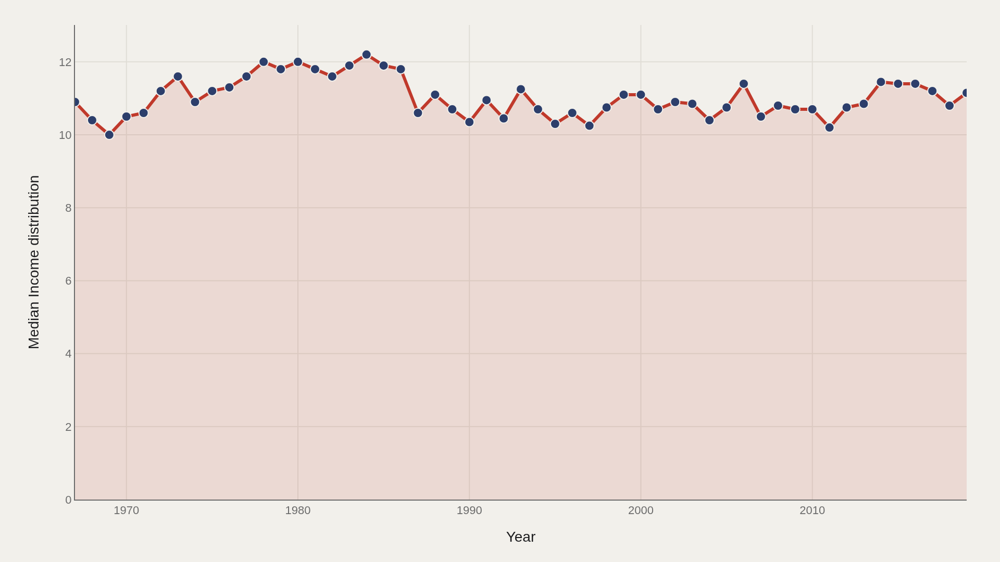
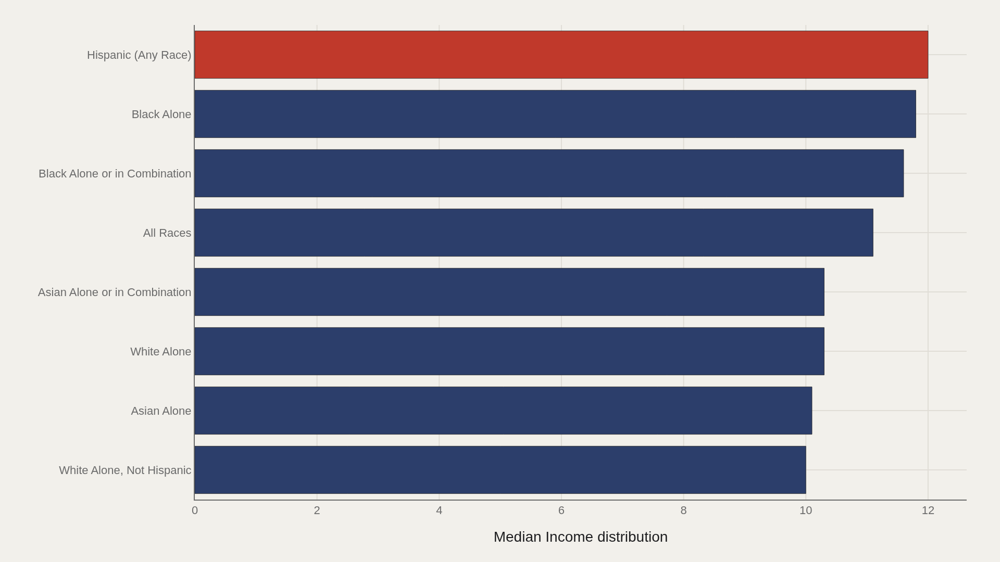
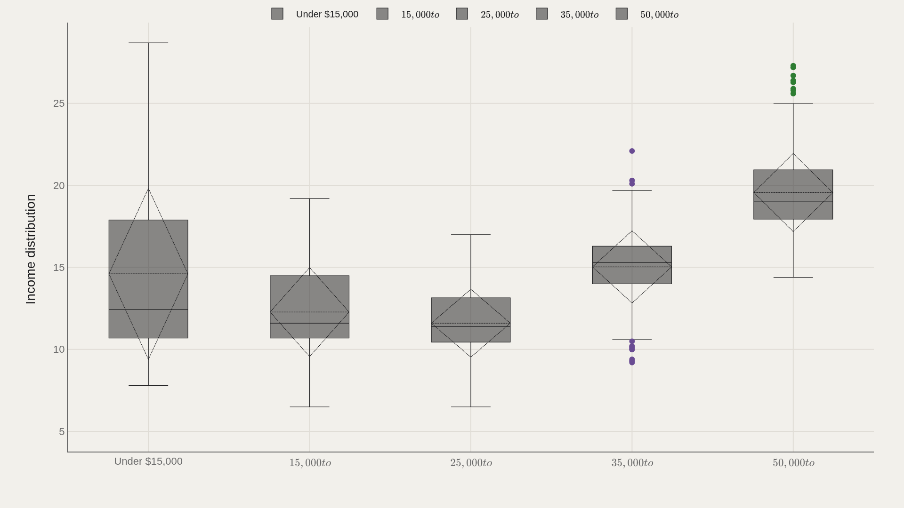
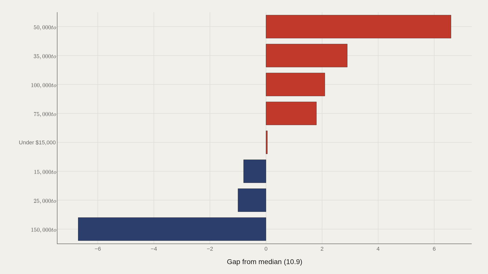
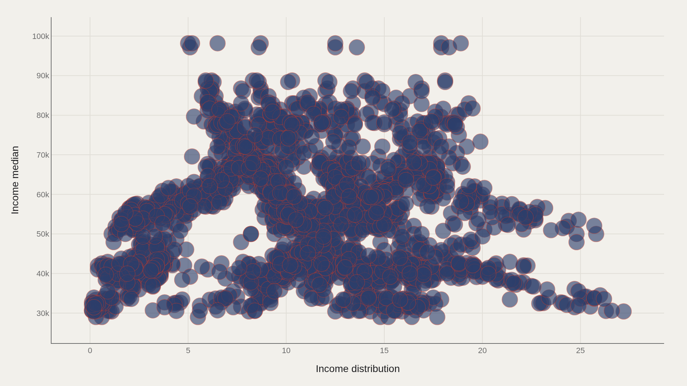

> **TL;DR** Analysis of 2,916 Census records from 1967–2019 shows median income share held at 10.9%, rose to 11.2% by 2019, while middle brackets ($50,000–$74,999) captured 6.6 points above the median and top brackets ($150,000–$199,999) trailed by 6.7 points.

Middle-income households captured a larger slice of total income than the median, while top earners held less. Across 2,916 Census records from 1967 to 2019, the median income share was 10.9%; households earning $50,000–$74,999 sat 6.6 points above that mark, and those earning $150,000–$199,999 trailed by 6.7 points.

The data track how the median drifted, which race categories led, how each dollar bracket compared to the center, and how income share correlated with median household income. The calibration point is 10.9% — the midpoint of the share field in this extract.

## Fast facts {#fast-facts}

The numbers that set the scale for this report:

- **2,916** — Records in the working dataset

  10.9Median Income distribution
  27.2Highest observed Income distribution
  Black AloneTop Race by Income distribution
  1967–2019Year span covered in the file
  Under $15,000Most common Income bracket

## Data and method {#data-and-method}

The source is the TidyTuesday release from 2021-02-09 (R for Data Science community). The working file contains 2,916 rows and 10 columns after merging available tables in the week folder. Income distribution is the primary metric; race and income bracket are categorical axes; income median appears in the scatter.

Medians are used for robustness across skewed economic series. Index-style fields are excluded from metric selection.

## The median income-distribution marker drifted upward {#the-median-income-distribution-marker-drifted-upward}

### Median Income distribution Over Time

Median income distribution rose from 10.9 in the opening period to 11.2 at the close — a 0.3 percentage-point increase across the 52-year window. The center of this field moved higher, though not by orders of magnitude.

Modest median drift can coexist with large bracket-level gaps. The trend chart reports the center; the gap chart reports the structure underneath.

## Hispanic (Any Race) leads the charted race ladder {#hispanic-any-race-leads-the-charted-race-ladder}

### Hispanic (Any Race) leads at 12.0 — 10.7 marks the median among the top dozen

Hispanic (Any Race) leads at 12.0, while 10.7 marks the median among the top dozen race categories in this cut. Black Alone remains a fact-box landmark for the ranking rule used there; the leaders chart makes the numeric top of this aggregation explicit.

The ladder is tight near the center of the file — leaders sit close to the overall median of 10.9 rather than in a different statistical universe.

## Income brackets carve different distribution bands {#income-brackets-carve-different-distribution-bands}

### Income distribution by Income bracket

Category boxes by income bracket show whether the income-distribution field is shared or contested across dollar bands. Under $15,000 is the most common bracket label by frequency; the boxes ask how the metric spreads inside each band.

Bracket structure is the skeleton of inequality analysis in this file. A single median of 10.9 hides those band-level differences.

## Mid brackets clear the median; high brackets trail in this cut {#mid-brackets-clear-the-median-high-brackets-trail-in-this-cut}

### Income distribution vs median by Income bracket

$50,000 to $74,999 sits 6.60 above the median; $150,000 to $199,999 trails by 6.70. Those signed gaps are among the starkest bracket contrasts in the extract.

Trailing or leading the median here is a statement about the income-distribution field's values by bracket, not a casual claim about who is "richer" in narrative terms. Cite the signed distances as structural offsets.

## Distribution values and income medians form joint clusters {#distribution-values-and-income-medians-form-joint-clusters}

### Income distribution vs Income median

Plotting income distribution against income median shows clusters that averages erase. Race-year points co-locate in patterns that a single summary cannot hold.

The scatter is relational: it shows how the two income fields move together across the 1967–2019 extract.

## What this file cannot tell you {#what-this-file-cannot-tell-you}

Community-cleaned TidyTuesday snapshots are not live Census microdata APIs. Missing values, race and bracket labeling choices, and 1967–2019 coverage limits apply. Merged tables may fan out or duplicate rows when join keys are imperfect.

Findings describe this wealth-and-income extract — structural signals about the income-distribution field — not a complete wealth account including assets and debt.

## What to take away {#what-to-take-away}

Income distribution in this file centers on 10.9, edges up to 11.2 at the median, and still shows sharp bracket gaps — mid bands above the median, top dollar bands trailing in this metric's signed distances.

Race ladders and the distribution–median scatter add group and joint structure. Together they map concentration and composition without reducing fifty years of income data to a single slogan.

## Sources {#sources}

Data Science Learning Community. (2021). TidyTuesday: Wealth and Income. https://raw.githubusercontent.com/rfordatascience/tidytuesday/main/data/2021/2021-02-09/income_distribution.csv

## Editor's note {#editors-note}

Artometrics data report from the TidyTuesday research pipeline. Charts and aggregates are reproducible from the embedded exhibits and public source files.

Source archive (GitHub)

