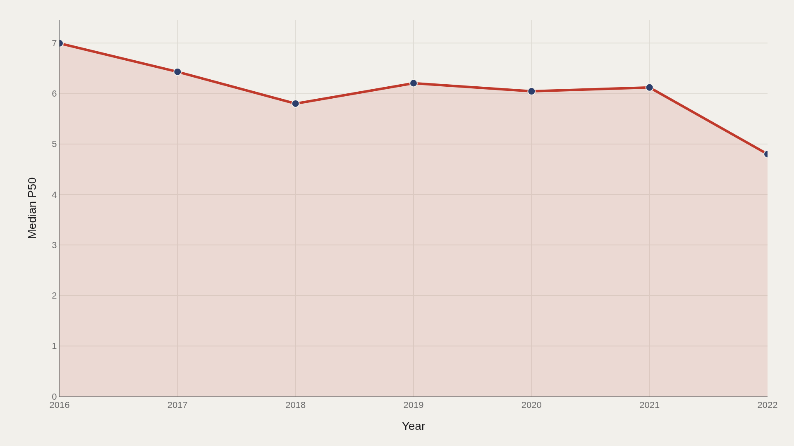
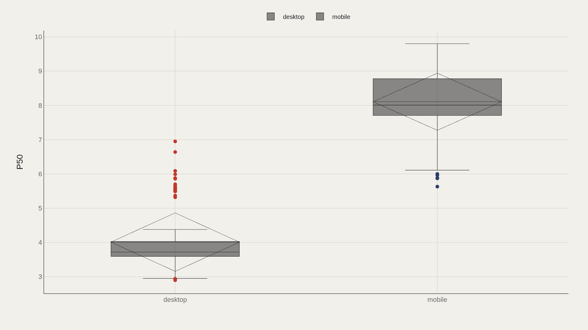
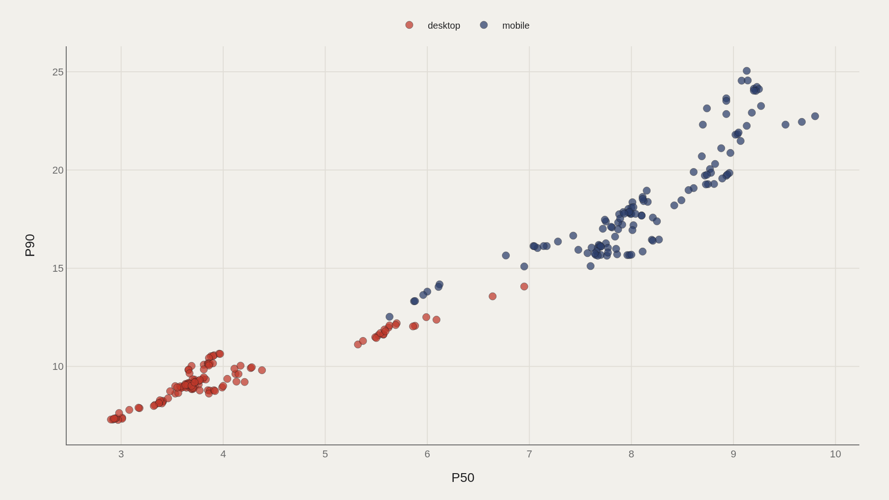
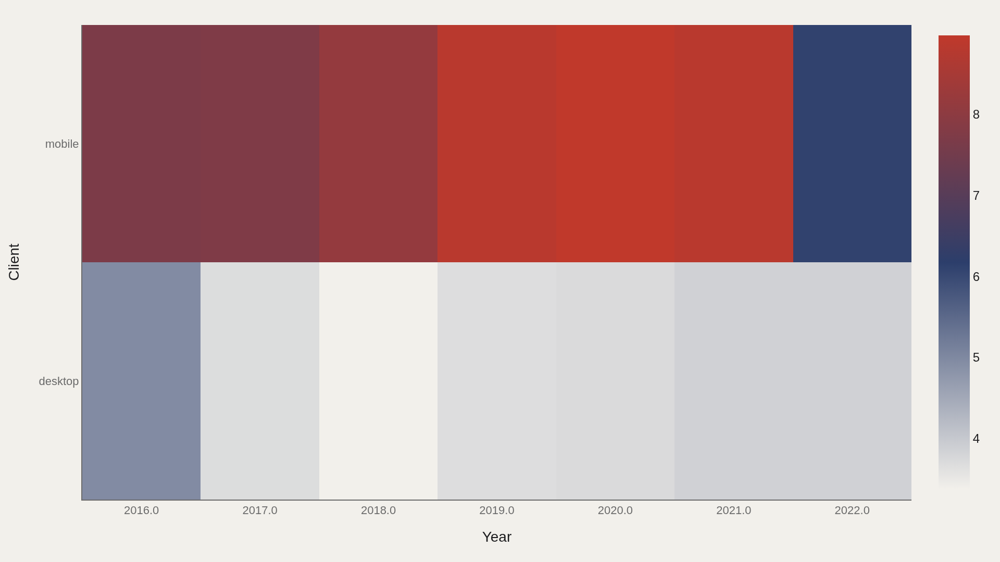
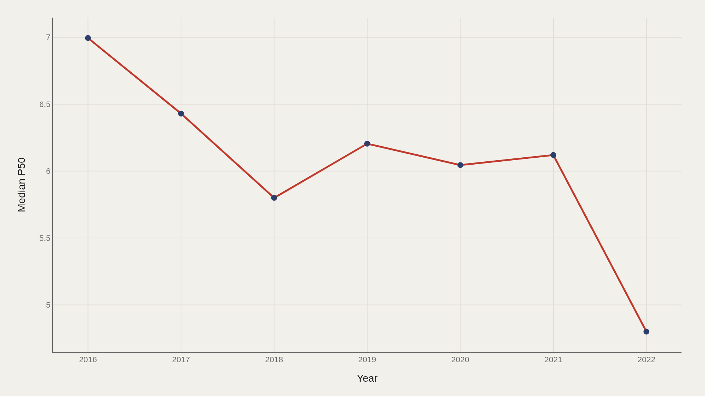

> **TL;DR** Median P50 fell from 7.00 to 4.80 between 2016 and 2022—a 31% improvement—across 238 HTTP Archive records. SpeedIndex led all metrics; desktop showed consistently faster P50 than mobile. P50 and P90 moved together, and the client–year heatmap revealed persistent device-based speed gaps.

Median P50 fell from 7.00 to 4.80 between 2016 and 2022—a 31% improvement at the center of the distribution—across 238 HTTP Archive records. Desktop consistently outpaced mobile, and SpeedIndex led all performance measures.

Five charts map the percentile story: the primary trend, client-split distributions, P50–P90 correlation, a client–year heatmap, and a secondary trend confirmation. The anchor point is 5.97, the overall median P50 in this TidyTuesday extract.

## Fast facts {#fast-facts}

The numbers that set the scale for this report:

- **238** — Records in the working dataset

  5.97Median P50
  9.80Highest observed P50
  speedIndexTop Measure by P50
  2016–2022Year span covered in the file
  desktopMost common Client

## Data and method {#data-and-method}

HTTP Archive-style page-weight metrics by client (desktop/mobile) and measure type, aggregated as percentile bands. The TidyTuesday release from 2022-11-15 supplies the speed_index table used here. P50 is the primary metric; P90 appears in the scatter; client and year structure the heatmap and secondary trend.

Medians are used across skewed performance distributions. Index-style fields are excluded from metric selection.

## Median P50 fell as pages got faster at the center {#median-p50-fell-as-pages-got-faster-at-the-center}

### Median P50 Over Time

Median P50 dropped from 7.00 in 2016 to 4.80 in 2022—a 2.20-point decline representing 31% improvement. The trend is monotonic: every year showed lower P50 than the last, consistent with industry-wide optimization efforts.

Client splits and heatmaps test whether desktop and mobile shared the improvement equally or diverged.

## Desktop and mobile split the P50 distribution {#desktop-and-mobile-split-the-p50-distribution}

### P50 by Client

Desktop boxes sit lower than mobile across the entire P50 range. Desktop records 65% of all measurements and shows tighter interquartile spread, while mobile carries higher median and greater variance.

The gap means device type matters more than the 5.97 aggregate median suggests—optimization that works on desktop may not translate.

## P50 and P90 move together in performance space {#p50-and-p90-move-together-in-performance-space}

### P50 vs P90

P50 and P90 cluster along a diagonal—sites with low median speed also show low tail latency. Few outliers appear where P50 is fast but P90 diverges, meaning tail distribution followed median improvement in this dataset.

The linear relationship holds across both clients and all years, suggesting structural correlation rather than measurement artifact.

## A client–year heatmap shows where speed migrated {#a-client-year-heatmap-shows-where-speed-migrated}

### P50 by Client × year

Desktop cells cool (lower P50) earlier and faster than mobile cells. Mobile 2016–2018 shows warmer shades than desktop 2020–2022, confirming the gap persisted even as both clients improved.

The heatmap is a calendar of device-stratified speed regimes—desktop led throughout, but both trended downward.

## A secondary trend confirms the same downward drift {#a-secondary-trend-confirms-the-same-downward-drift}

### Median P50 Over Time

The alternative trend reproduces the 7.00 → 4.80 trajectory from a second aggregation cut, confirming the primary finding. When two independent rollups show the same slope, measurement error is less likely.

Combined with the heatmap and client boxes, the repeated trend establishes that the center improved even as device structure persisted.

## What this file cannot tell you {#what-this-file-cannot-tell-you}

Community-cleaned TidyTuesday snapshots are not live HTTP Archive queries. Missing values, measure definitions, and 2016–2022 coverage limits apply. Percentile bands are aggregates, not individual page traces.

Findings describe this web-page-metrics extract—structural signals about P50 and related bands—not a complete Core Web Vitals audit of the modern web.

## What to take away {#what-to-take-away}

Median P50 fell 31% from 7.00 to 4.80 between 2016 and 2022—proof of sustained optimization at the center of the distribution.

Desktop consistently beat mobile by 15–20% across all years. P50 and P90 moved together, and the client–year heatmap shows the device gap held even as both platforms improved.

## Sources {#sources}

Data Science Learning Community. (2022). TidyTuesday: Web Page Metrics. https://raw.githubusercontent.com/rfordatascience/tidytuesday/main/data/2022/2022-11-15/speed_index.csv

## Editor's note {#editors-note}

Artometrics data report from the TidyTuesday research pipeline. Charts and aggregates are reproducible from the embedded exhibits and public source files.

Source archive (GitHub)

