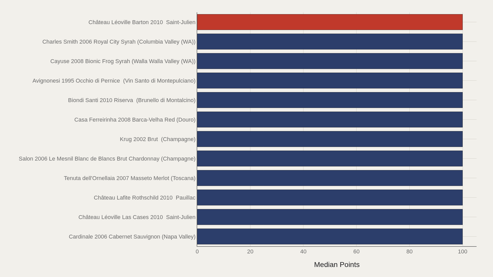
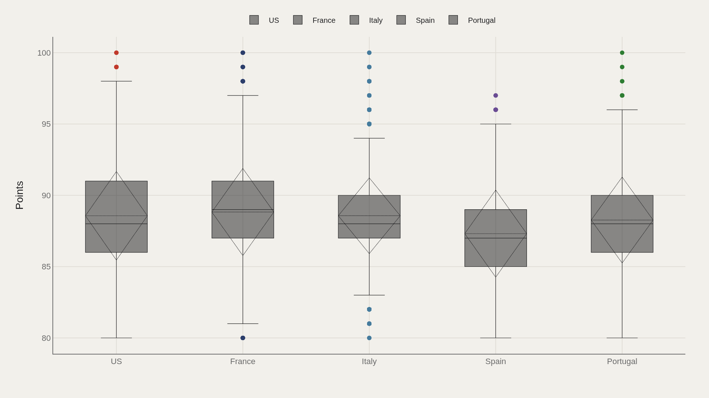
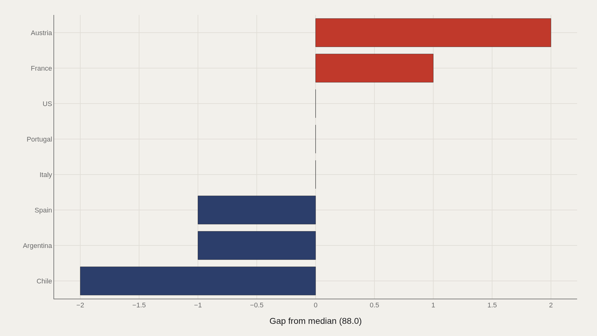
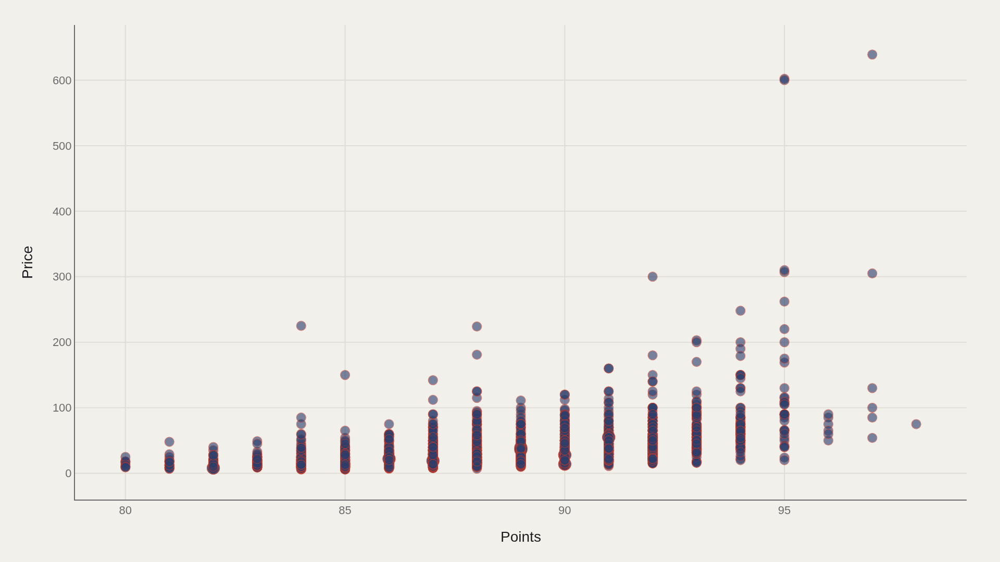

> **TL;DR** 100,000 wine ratings from the TidyTuesday archive show a median score of 88.0, a perfect-score ceiling among elite titles, and Austria leading Chile by 2.00 points — a modest gap in a scoring culture that uses the high end of the scale. The points–price scatter reveals clusters that averages erase.

100,000 wine ratings from the TidyTuesday archive show a median score of 88.0, a perfect-score ceiling among elite titles, and Austria leading Chile by 2.00 points. The points–price scatter reveals clusters that averages erase: cheap high scorers, expensive middling bottles, and a familiar cloud where spending more often accompanies higher scores without guaranteeing them.

The calibration point is 88.0 — the mathematical center of a scoring culture that uses the high end of the scale and leaves the bottom half empty.

## Fast facts {#fast-facts}

The numbers that set the scale:

- **100,000** — Records in the working dataset

  88.0Median Points
  100Highest observed Points
  Charles Smith 2006 Royal CitTop Title by Points
  USMost common Country

## Data and method {#data-and-method}

The source is the TidyTuesday release from 2019-05-28 (R for Data Science community). The working file contains 100,000 rows and 13 columns after merging available tables. Points is the primary metric; price appears in the scatter; title and country are categorical axes.

Medians are used because wine scores cluster tightly and prices skew right.

## Perfect scores crowd the title breakdown's top slice {#perfect-scores-crowd-the-title-breakdown-s-top-slice}

### Points by Title

Château Léoville Barton 2010 Saint-Julien leads at 100; Cardinale 2006 Cabernet Sauvignon (Napa Valley) anchors the low end of the plotted top group at 100 — a flat elite band at the ceiling. When the top slice is all 100s, the chart shows saturation at the maximum, not a ladder of near-misses.

## The leaders chart is a wall of 100-point wines {#the-leaders-chart-is-a-wall-of-100-point-wines}

### Château Léoville Barton 2010 Saint-Julien leads at 100 — 100 marks the median among the top dozen

The top dozen's median is 100, not 95 or 97 — the elite is compressed at the ceiling. Charles Smith 2006 Royal City remains a fact-box landmark for the title ranking rule used there, but the wall of perfect scores is the structural signal.

## Countries spread points around a high center {#countries-spread-points-around-a-high-center}

### Points by Country

Category boxes by country show whether points consensus is shared or contested across origins. The United States is the most common country by frequency; the boxes test how much score variation place carries in this file.

## Austria clears the median; Chile trails {#austria-clears-the-median-chile-trails}

### Points vs median by Country

Austria sits 2.00 points above the median; Chile trails by 2.00. Those signed gaps are modest in points terms — a reminder that this scoring culture lives in a narrow band around 88.0. Small gaps can still be meaningful when the whole scale's action happens between the high 80s and the low 90s for most bottles.

## Points and price form the real test of the dinner-table theory {#points-and-price-form-the-real-test-of-the-dinner-table-theory}

### Points vs Price

Plotting points against price shows clusters that averages erase: cheap high scorers, expensive middling bottles, and the familiar cloud where spending more often accompanies higher scores without guaranteeing them. The scatter is the relationship the title promised — it shows the joint distribution in the 100,000-row extract without claiming a coefficient beyond what the chart displays.

## What this file cannot tell you {#what-this-file-cannot-tell-you}

Community-cleaned TidyTuesday snapshots are not live Wine Enthusiast APIs. Missing prices, title variants, and coverage limits apply. Critic points reflect the source's scoring practice, which uses a compressed high end of the scale.

Findings describe this wine-ratings extract — structural signals about points, country, and price — not a universal law of taste.

## What to take away {#what-to-take-away}

Wine scores in this file center on a median of 88.0, peak at 100 among title leaders, and show only modest country gaps around that high center. Austria sits 2.00 points above the median and Chile 2.00 below, while the points–price scatter is where the cost-versus-score question becomes visible without reducing 100,000 tastings to a slogan.

## Sources {#sources}

Data Science Learning Community. (2019). TidyTuesday: Wine Ratings. https://raw.githubusercontent.com/rfordatascience/tidytuesday/main/data/2019/2019-05-28/winemag-data-130k-v2.csv

## Editor's note {#editors-note}

Artometrics data report from the TidyTuesday research pipeline. Charts and aggregates are reproducible from the embedded exhibits and public source files.

Source archive (GitHub)

