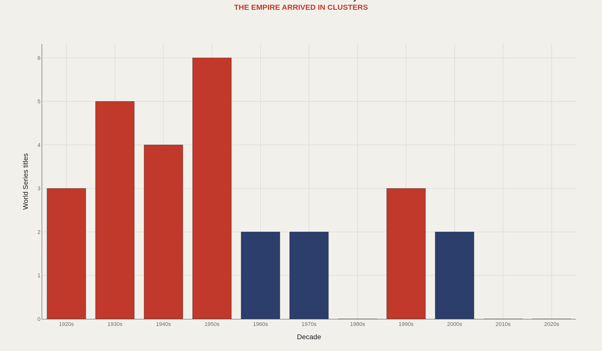
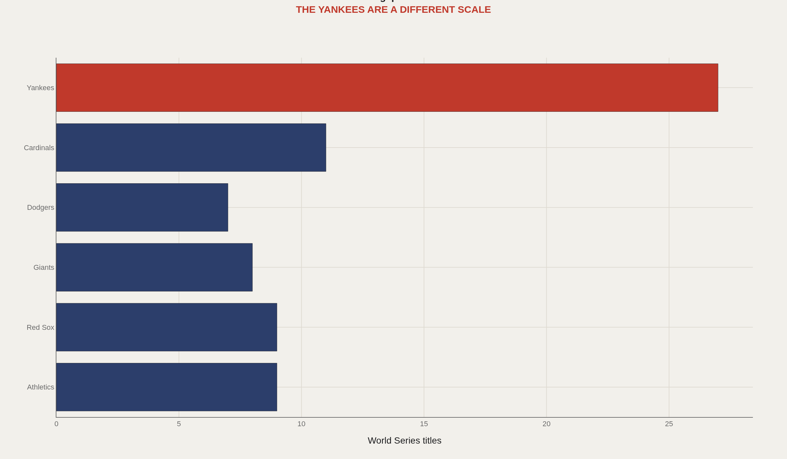
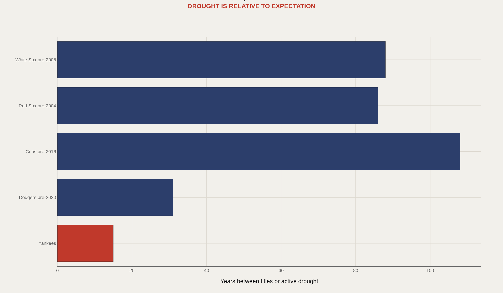
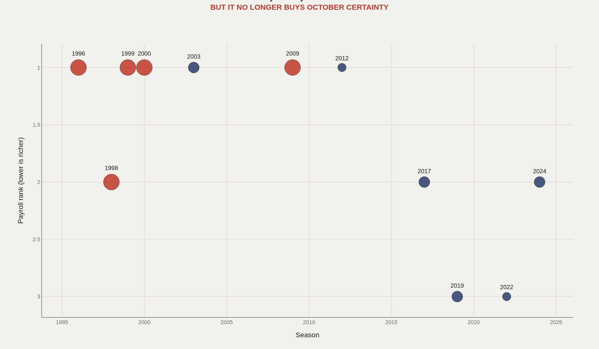
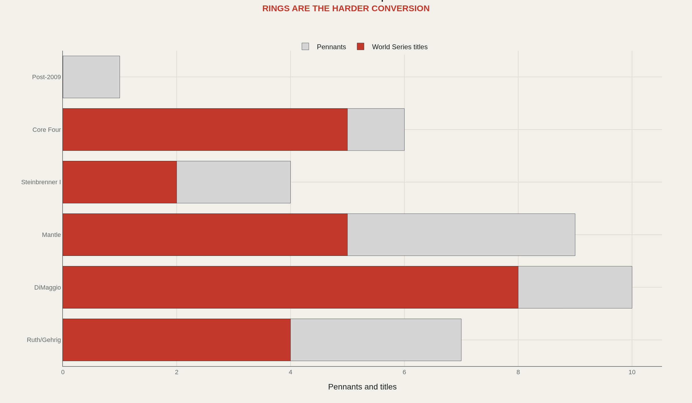

> **TL;DR** Twenty-seven World Series titles distorted the measurement system around the Yankees—winning became an operating requirement, not an achievement. The franchise still spends at the top of the league, but conversion collapsed: five championships from 1996–2009 set a modern efficiency standard that hasn't been met in the 15 seasons since.

Twenty-seven World Series titles distorted the measurement system around the New York Yankees—winning stopped being an achievement and became an operating requirement. The franchise still spends at the top of the league, but the last championship arrived in 2009, and conversion collapsed.

This analysis examines the Yankees' championship clustering by decade, the gap between New York and other historic franchises, the relative scale of the current drought, payroll rank against postseason outcomes, and pennant-to-ring conversion across eras.

Forty American League pennants form the deepest postseason archive in baseball. The fifteen-year drought entering 2025 is historically short—it only feels like institutional malfunction because Yankee time is compressed. The Core Four era (1996–2009) produced five titles and set a modern efficiency standard that hasn't been matched since.

The charts below treat the Yankees as baseball's benchmark: clustering patterns that built the empire, the scale gap versus other clubs, drought context, payroll-to-October conversion, and pennant finishing rates across franchise eras.

## The numbers behind the story {#fast-facts}

- **27** — World Series championships, the most in Major League Baseball

  40American League pennants, the deepest October archive in the sport
  2009Most recent World Series title
  15Active title drought entering 2025
  5Titles from the Core Four era, 1996-2009
  1923First Yankee championship, the Ruth-era ignition point

## The empire arrived in bursts, not as a permanent climate {#banner-clusters}

The Yankees are remembered as a permanent empire, but the banners arrived in clusters. The 1930s, 1940s, and 1950s compounded after the 1923 Ruth ignition. Later decades managed the expectation that surplus created.

Franchise identity here is not merely winning—it's clustering so dense that ordinary contention reads as decline.

## New York does not lead baseball—it defines the ranking {#the-empire-gap}

The Yankees do not lead baseball by a normal margin. They occupy a separate category—not the best team in a ranking, but the institution that defines it.

The real question is whether the Yankees are still a peer competitor or a standard of measurement other clubs are scored against.

## Fifteen years only feels endless in Yankee time {#drought-is-relative}

Fifteen years is not historically large—it only feels enormous because Yankee time is compressed. Other franchises waited lifetimes; New York experiences a decade and a half as institutional malfunction.

Expectation changes the meaning of the same number. Drought length is absolute; drought pain is relative to the archive.

## Capital remains elite; conversion no longer is {#money-and-october}

The post-1990s Yankees still spend like an empire. What changed is conversion. Payroll rank remains elite; championship output does not. The Core Four's five titles from 1996 to 2009 set the modern efficiency standard the franchise hasn't refreshed.

Capital is necessary but no longer rare enough to guarantee separation. That is the modern front-office problem in pinstripes.

## The old Yankees finished; later eras preserved the myth {#pennants-to-rings}

The old Yankees converted pennants into titles with terrifying efficiency. The later story is messier: enough appearances to preserve mythology, not enough rings to refresh it.

The dynasty was not just talent—it was conversion under pressure, the ability to turn October access into flags before variance intervened.

## The monopoly on conversion is gone {#conclusion}

The Yankees are still rich, still relevant, and still structurally advantaged. The data does not say the empire is dead—it says the monopoly on conversion is gone.

That is the modern Yankee paradox: the franchise remains baseball's reference point even when it is no longer baseball's final boss. Benchmarks outlast champions—until the next cluster of banners resets the scale.

## Data and method {#dataset-context}

Championship and pennant counts, payroll rankings, and historical season records come from Baseball Reference, Lahman historical tables, Retrosheet summaries, and Forbes valuations. The focus is institutional scale—franchise identity, era structure, and conversion—not play-by-play win modeling.

Baseball professionals measure conversion: money into wins, wins into postseason chances, chances into flags. Fans feel the gap between mythology and the current roster. Both conversations belong on the same page.

## References {#references}

Baseball Reference. New York Yankees Franchise History.

Lahman, S. Lahman Baseball Database.

Forbes. MLB Team Valuations, historical rankings.

Retrosheet and Baseball Almanac championship/pennant records.

Related Artometrics reports: Dodgers · Padres · Giants.

## Editor's note {#editors-note}

Championship and pennant counts follow Baseball Reference franchise totals. Payroll ranks are editorial summaries from public salary tables, not competitive-balance-tax payrolls. Era buckets are interpretive groupings for chart legibility.

